# 操作系统复习

> 本复习文档依据课程 PPT 课件（第 1~12 章）系统整理，内容覆盖操作系统引论、进程管理、处理机调度与死锁、进程同步、存储器管理、虚拟存储器、I/O 系统、文件管理、磁盘存储器管理、多处理机操作系统、虚拟化与云计算、保护与安全。每章按"概念 → 机制 → 算法 → 对比 → 要点"组织，配有对比表格、算法代码、公式与状态图，便于考前复习。

## 目录

1. [第一章：操作系统引论](#第一章操作系统引论)
2. [第二章：进程的描述与控制](#第二章进程的描述与控制)
3. [第三章：处理机调度与死锁](#第三章处理机调度与死锁)
4. [第四章：进程同步](#第四章进程同步)
5. [第五章：存储器管理](#第五章存储器管理)
6. [第六章：虚拟存储器](#第六章虚拟存储器)
7. [第七章：输入/输出系统](#第七章输入输出系统)
8. [第八章：文件管理](#第八章文件管理)
9. [第九章：磁盘存储器管理](#第九章磁盘存储器管理)
10. [第十章：多处理机操作系统](#第十章多处理机操作系统)
11. [第十一章：虚拟化和云计算](#第十一章虚拟化和云计算)
12. [第十二章：保护和安全](#第十二章保护和安全)
13. [附：考试要点速查](#附考试要点速查)

---

## 第一章：操作系统引论

### 操作系统的定义与地位

计算机系统从底向上可分为五个层次：**硬件、操作系统、系统程序、应用程序、用户**。操作系统（Operating System, OS）处于硬件之上、其余软件之下，向上为用户和程序提供服务，向下管理和控制硬件资源。

常见定义（综合多种表述）：

> 操作系统是一直运行在计算机上的程序（通常称为**内核 Kernel**），它管理和控制计算机系统中的硬件及软件资源，合理地组织计算机工作流程，改善人机界面，为用户提供功能强大、使用方便、可扩展的运行环境，从而在计算机与用户之间起到**接口（Interface）**的作用。

从两个角度理解 OS 的本质：

- **用户的角度**：OS 是用户和计算机硬件之间的接口。
- **系统的角度**：OS 是计算机系统资源的管理者（资源管理器）。

### 操作系统的目标

| 目标 | 含义 |
| ---- | ---- |
| 方便性（Convenience） | 通过命令、系统调用或 GUI 操纵计算机，方便用户使用 |
| 有效性（Efficiency） | 提高系统资源利用率，提高系统吞吐量 |
| 可扩充性（Scalability） | 易于增加新的功能模块，与 OS 结构紧密相关 |
| 开放性（Openness） | 遵循世界标准规范，特别是开放系统互连 OSI |

### 操作系统的作用

#### 1. 作为用户与硬件之间的接口

提供三类使用方式：

- **命令方式**：如 UNIX、DOS 命令（联机用户接口）。
- **系统调用方式**：程序接口（API），供程序员编程使用。
- **GUI 方式**：图形用户界面，如 Windows、Linux 桌面。

#### 2. 作为计算机系统资源的管理者

管理四大类资源：**处理机管理、存储器管理、I/O 设备管理、文件管理**。

#### 3. 实现对计算机资源的抽象

- **裸机（Bare Machine）**：无任何软件的纯硬件计算机系统。
- **虚拟机（Virtual Machine）**：覆盖了软件的机器，向用户提供一个对硬件操作的抽象模型，逐层扩充后使用更方便。

OS 为应用提供的计算资源抽象：

| 物理资源 | 抽象 | 特点 |
| -------- | ---- | ---- |
| CPU | 进程 / 线程 | 数量不受物理 CPU 限制 |
| 内存 | 虚拟内存 | 大小不受物理内存限制 |
| I/O 设备 | 统一抽象为文件 | 提供统一接口 |

此外 OS 还为应用提供**线程间同步**（如 pthread_mutex，比用户自旋锁更高效）和**进程间通信**（如 pipe，比 loopback 网络通信更高效、语义更丰富）。

### 推动操作系统发展的主要动力

1. 不断提高计算机资源利用率
2. 方便用户
3. 器件的不断更新换代
4. 计算机体系结构的不断发展
5. 不断提出的新的应用需求

---

### 操作系统的发展过程

完整脉络：**无 OS（人工操作 → 脱机 I/O）→ 单道批处理 → 多道批处理 → 分时系统 → 实时系统 →（微机 / 嵌入式 / 网络 / 分布式 OS）**。

#### 重要里程碑

| 年份 | 系统 | 意义 / 人物 |
| ---- | ---- | ---------- |
| 1956 | GM-NAA I/O | 首个批处理 OS（运行于 IBM 704，Patrick & Mock） |
| 1964 | OS/360 | 首个通用 OS，首次将 OS 与计算机分离（架构师 Amdahl，项目经理 Brooks《人月神话》） |
| 1964 | Multics | 分时、文件系统、动态链接（Corbató，1990 图灵奖） |
| 1969 | UNIX | Shell、层次化文件系统（Thompson & Ritchie，1983 图灵奖） |
| 1973 | Xerox Alto | 第一个图形化 OS，首次用鼠标（Thacker，2009 图灵奖） |
| 1983 | Mac OS (Lisa) | GUI 商业化（乔布斯访 Xerox PARC 后） |
| 1985 | Windows 1.0 | 微软图形界面 OS |
| 1991 | Linux | 最流行的开源 OS（Linus Torvalds） |

#### 1. 单道批处理系统

- **处理过程**：作业一个接一个连续处理（成批装入，自动顺序运行）。
- **缺点**：内存中只有一道作业，CPU 与 I/O 设备串行工作，系统资源得不到充分利用。

#### 2. 多道批处理系统

引入**多道程序设计技术**：内存中同时存放多道程序，宏观上并行、微观上交替运行。当一道程序进行 I/O 时，CPU 转去执行另一道程序，从而提高资源利用率和吞吐量。

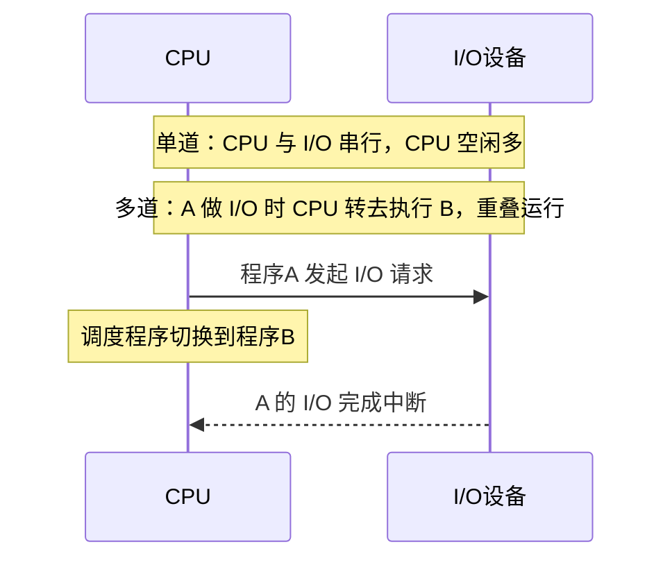

优缺点：

| 优点 | 缺点 |
| ---- | ---- |
| 资源利用率高 | 平均周转时间长 |
| 系统吞吐量大 | 无交互能力（用户不能直接干预） |

需要解决的关键问题：处理机争用、内存分配与保护、I/O 设备分配、文件组织与管理、作业管理、用户与系统接口。这些正是 OS 各功能模块的由来。

#### 3. 分时系统（Time-Sharing System）

**引入动机**：满足用户**人机交互**和**共享主机**（感觉独占）的需求，这是批处理系统做不到的。

> 分时系统：在一台主机上连接多个带显示器和键盘的终端，同时允许多个用户共享主机资源，每个用户都可通过自己的终端以**交互方式**使用计算机。

实现中的关键问题及对策：

- **及时接收**：设置多路卡、命令缓冲区。
- **及时处理**：作业**直接进入内存**（而非外存后备队列），并采用**时间片轮转**运行方式。

分时系统的四大特征：

| 特征 | 含义 |
| ---- | ---- |
| 多路性 | 多台终端同时连接一台主机分时使用 |
| 独立性 | 各终端用户彼此独立，感觉独占主机 |
| 及时性 | 用户请求能在很短时间内（1~3 秒）获得响应 |
| 交互性 | 用户可通过终端与系统进行广泛的人机对话 |

#### 4. 实时系统（Real-Time System）

> 实时系统：系统能**及时响应**外部事件请求，在**规定时间内**完成对该事件的处理，并控制所有实时任务协调一致地运行。

- **最主要特征**：实时性（及时性 + 高可靠性）。
- **应用类型**：工业（武器）控制系统、信息查询系统、多媒体系统、嵌入式系统。

实时任务分类：

- 按是否周期性：**周期性实时任务** / **非周期性实时任务**。
- 按截止时间要求：**硬实时任务（HRT，必须满足截止期）** / **软实时任务（SRT，偶尔超时可接受）**。

#### 多道批处理 vs 分时 vs 实时

| 维度 | 多道批处理 | 分时 | 实时 |
| ---- | ---------- | ---- | ---- |
| 主要目标 | 吞吐率、资源利用率 | 交互性、响应时间 | 实时性（截止期） |
| 多路性 | — | 多终端共享 | 多路采集 / 控制 |
| 独立性 | — | 各终端独立 | 各任务独立 |
| 及时性 | 不要求 | 秒级响应（1~3s） | 严格截止时间 |
| 交互性 | 无 | 强 | 一般弱 |
| 可靠性 | 一般 | 一般 | **高（HRT 必须）** |

#### 5. 其他类型操作系统

- **微机操作系统**：单用户单任务（CP/M、MS-DOS）→ 单用户多任务（Windows 95/98）→ 多用户多任务（Solaris、Linux、Windows NT/Server）。
- **嵌入式 OS**：用于为特定功能设计、有实时限制的嵌入式系统；特点是**内核小、系统精简、可配置、高实时性**（如 μC/OS-II、嵌入式 Linux、VxWorks、Android、iOS）。
- **网络 OS**：在网络环境下管理网络资源、实现数据通信与资源共享；特征含硬件独立性、接口一致性、资源透明性、系统可靠性、执行并行性（如 UNIX、Linux、Windows NT/Server）。
- **分布式 OS**：配置在分布式系统（多处理机紧密耦合系统）上的公用 OS，将多台计算机整合为单一强大的系统共同完成任务；功能 = 单机 OS + 网络 OS + 通信/资源/进程管理（如万维网、鸿蒙 OS）。

> 网络 OS 与分布式 OS 的区别：网络 OS 各节点**独立自治**、资源使用需明确指定位置；分布式 OS 对用户**透明**，作业可被自动分配到任意节点执行。

---

### 操作系统的基本特征

四大基本特征：**并发（Concurrence）、共享（Sharing）、虚拟（Virtual）、异步（Asynchronism）**。其中**并发与共享是最基本的特征，二者互为存在条件**。

#### 1. 并发（Concurrency）

- **并行性（Parallel）**：两个或多个事件在**同一时刻**发生（需多 CPU 等硬件支持）。
- **并发性（Concurrent）**：两个或多个事件在**同一时间间隔内**发生。
- 在单处理机系统中，宏观上多道程序同时运行，微观上各程序**交替执行**。
- 为使程序能并发执行，必须为每个程序建立**进程（Process，又称任务）**——系统中能独立运行、作为资源分配基本单位的活动实体。

> 程序是静态实体，不能并发；引入进程是为了实现并发。

#### 2. 共享（Sharing）

系统中的资源可供内存中多个并发执行的进程共同使用。两种共享方式：

| 方式 | 含义 | 实例 |
| ---- | ---- | ---- |
| 互斥共享 | 同一时间仅允许一个进程访问（**临界资源**），用完释放后他人才可用 | 打印机、磁带机 |
| 同时共享 | 允许同一时间（宏观）多个进程访问 | 磁盘、可重入代码 |

#### 3. 虚拟（Virtuality）

虚拟是一种管理技术，**把物理上的一个实体变成逻辑上的多个对应物，或把多个物理实体变成逻辑上的一个对应物**，目的是为用户提供易用、高效的环境。

| 技术 | 复用方式 | 实例 |
| ---- | -------- | ---- |
| 时分复用 | 一个物理资源分时给多个逻辑对象 | 虚拟处理机、虚拟设备（SPOOLing 把一台独占设备变成多台虚拟设备） |
| 空分复用 | 把物理空间逻辑划分 | 虚拟存储器（主存+辅存 → 逻辑上一个大存储器） |
| 多路复用 | 频分/时分把一个信道变多个 | 虚拟信道 |
| 窗口技术 | 一个物理屏幕 → 多个虚拟屏幕 | GUI 多窗口 |

#### 4. 异步（Asynchronism）

异步性也称随机性、不确定性：在多道程序环境下，进程的执行**走走停停**，其推进速度、执行次序和执行时间都是不可预知的。

> 同一组进程多次运行，其执行序列可能不同（第一次 P1→P2→P3，第二次 P2→P1→P3）。

异步性可能导致与时间有关的错误。OS 必须保证：**只要运行环境相同，同一进程多次运行都得到完全相同的结果（可再现性）**，这通过**同步（Synchronization）**机制实现——协调并发进程，使其按预定顺序访问共享资源，避免竞争条件（Race Condition）。

---

### 操作系统的运行环境

#### 硬件支持与启动过程

- **指令**：由 CPU 执行的最小单位。
- **程序**：平时存放在外存。
- **执行程序**：必须先调入内存才能执行。
- **引导程序（Bootstrap）**：位于固件（如 ROM/BIOS），开机时负责**定位 OS 内核并将其加载到内存**。
- **事件驱动**：OS 的运行由硬件中断或软件中断（异常）引起。

#### 操作系统内核（Kernel）

内核是 OS 最核心的部分，**常驻内存，通常与硬件紧密相关**。功能分两类：

- **支撑功能**：
  - **中断处理**：内核最基本的功能，OS 由中断驱动。
  - **时钟管理**：提供时间、计时、时间片等。
  - **原语操作**：由若干条指令组成、用于完成某一功能的程序段；具有**原子性**——要么全做、要么全不做，执行过程不可分割、不可中断。
- **资源管理功能**：进程（处理机）管理、存储器管理、设备管理。

#### 处理机的双重工作模式

由硬件提供**模式位（Mode bit）**区分当前运行的是用户代码还是内核代码：

| 模式 | 别名 | 模式位 | 可执行指令 | 可访问空间 |
| ---- | ---- | ------ | ---------- | ---------- |
| 内核态 | 管态 / 系统态 / 核心态 | 0 | 包括特权指令在内的一切指令 | 用户空间 + 系统空间 |
| 用户态 | 目态 | 1 | 只能执行非特权指令 | 仅用户空间 |

> 系统调用会将运行模式从用户态切换到内核态，完成服务后将结果返回用户态。

#### 特权指令与非特权指令

| 类别 | 运行模式 | 说明 | 举例 |
| ---- | -------- | ---- | ---- |
| 特权指令 | 内核态 | 误用可能导致系统崩溃，故对用户态禁止 | 启动外部设备、设置系统时钟、关中断、切换执行状态、I/O 指令 |
| 非特权指令 | 用户态 | 应用程序使用，仅能访问用户空间 | 普通算术/逻辑运算、访存 |

防止应用程序运行异常对系统造成破坏。

#### 中断与异常

> 操作系统是**中断驱动**的：OS 总在等待某个事件发生，事件总是由中断或异常引起。

| 类型 | 来源 | 说明 |
| ---- | ---- | ---- |
| 中断（Interrupt） | 外部、由**硬件**引起 | 与当前指令无关，如 I/O 完成、时钟中断（异步） |
| 异常 / 陷阱（Trap / Exception） | 内部、由**软件**引起 | ① 出错（除零、无效存储访问）；② 用户程序的特定请求（执行 OS 服务，即系统调用） |

#### 用户态 → 内核态切换的三种途径

1. **系统调用**（自愿，用户程序主动请求服务）。
2. **中断**（外部事件，如 I/O 完成、时钟）。
3. **异常 / 陷阱**（程序运行中的内部错误，如缺页、除零）。

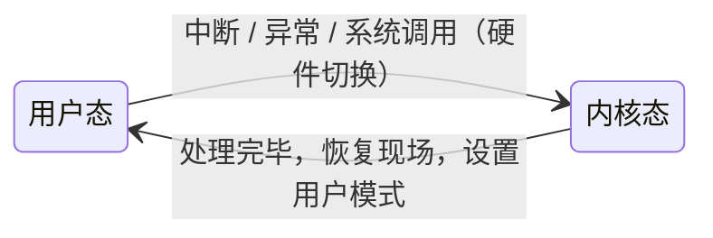

---

### 操作系统的主要功能

| 功能 | 主要任务 | 子功能 |
| ---- | -------- | ------ |
| 处理机管理 | 管理 CPU，组织进程运行 | 进程控制、进程同步、进程通信、调度 |
| 存储器管理 | 管理内存空间 | 内存分配与回收、内存保护、地址映射、内存扩充 |
| 设备管理 | 完成 I/O 请求，提高 CPU 与设备利用率 | 缓冲管理、设备分配、设备处理（驱动） |
| 文件管理 | 管理文件信息 | 文件存储空间管理、目录管理、读写管理与保护 |
| 用户接口 | 提供使用计算机的手段 | 联机/脱机用户接口、GUI、程序接口（系统调用） |

#### 处理机管理功能

- **进程控制**：创建进程、撤销（终止）进程、状态转换。
- **进程同步**：协调进程运行，常用**信号量机制**。
- **进程通信**：直接通信、间接通信。
- **调度**：**作业调度**（高级）、**进程调度**（低级）。

#### 存储器管理功能

- **内存分配与回收**：静态/动态分配。
- **内存保护**：确保每个用户程序仅在自己的内存空间运行，绝不允许访问 OS 的程序和数据。
- **地址映射**：逻辑地址 → 物理地址转换。
- **内存扩充**：借助**虚拟存储技术**（请求调入功能 + 置换功能），从逻辑上扩充内存。

#### 设备管理功能

主要任务：①完成用户 I/O 请求；②提高 CPU 与 I/O 设备利用率。

- **缓冲管理**：缓冲区机制，缓和 CPU 与设备速度不匹配。
- **设备分配**：按策略分配设备。
- **设备处理**：设备驱动程序，实现 CPU 与设备控制器之间的通信。

#### 文件管理功能

- **文件存储空间的管理**：分配与回收外存空间。
- **目录管理**：实现按名存取。
- **文件的读/写管理和保护**：控制读写、防止未授权访问。

#### 操作系统与用户之间的接口

- **用户接口**：
  - 联机用户接口：命令行方式（交互）。
  - 脱机用户接口：批处理，使用作业说明书（作业控制语言 JCL）。
  - 图形用户接口（GUI）。
- **程序接口**：由一组**系统调用**组成，是程序取得 OS 服务的唯一途径。

#### 现代操作系统的新功能

- **系统安全**：认证技术、密码技术、访问控制技术、反病毒技术。
- **网络功能与服务**：网络通信、资源管理、应用互操作。
- **支持多媒体**：接纳控制技术、实时调度、多媒体文件存储。

---

### 操作系统的结构设计

#### 设计背景与权衡

构建复杂系统必须考虑内部结构，因为不同目标常存在冲突、不同需求需要权衡（如"瓦萨号"沉船、IBM Workplace 项目失败的教训）。

- **系统目标**：易设计实现、易维护、灵活性、可靠性、高效性。
- **用户目标**：方便使用、易学习、功能齐全、安全、流畅。

#### 重要设计原则：策略与机制分离

| 概念 | 含义 | 特性 | 举例（调度） |
| ---- | ---- | ---- | ------------ |
| 策略（Policy） | 要做什么 | 相对动态 | 调度算法：Round-robin、EDF |
| 机制（Mechanism） | 怎么做 | 相对静态 | 调度队列、调度实体、调度中断处理 |

> 分离的好处：OS 仅通过调整策略即可适应不同应用需求，降低复杂性。

#### 各种结构对比

| 结构 | 思想 | 优点 | 缺点 | 实例 |
| ---- | ---- | ---- | ---- | ---- |
| 简单（整体）结构 | 无结构，一组过程的集合 | 接口直接、效率较高 | 内部复杂混乱、难维护、难理解 | MS-DOS、早期 UNIX |
| 模块化结构 | 按功能划分模块并规定接口（模块-接口法），现代多用可加载内核模块 | 提高正确性/可理解性/可维护性、可并行开发、可动态加载 | 模块间接口与依赖较复杂 | Linux、macOS X、Solaris、Windows |
| 分层式结构 | 划分若干层，高层仅依赖紧邻底层（0 层为硬件，N 层为用户） | 易保证正确性、易维护、易扩充 | 系统效率低（跨层调用多） | THE、Multics |
| 宏内核（Monolithic） | 内核集中控制所有资源，整合文件系统/内存/驱动/调度/IPC | 性能好、生态成熟、长期优化沉淀 | 模块无强隔离 → 安全性/可靠性差、实时性难保证、过于庞大阻碍创新 | Linux、传统 UNIX |
| 微内核（Microkernel） | 最小化内核，将多数功能移到用户态"服务"，模块间用消息传递通信 | 易扩展、易移植、更可靠、更安全（进程级隔离）、更健壮 | 性能差（函数调用变 IPC）、生态欠缺 | Mach、Minix |
| 混合内核（Hybrid） | 宏内核 + 微内核结合，把需性能的模块放回内核态 | 兼顾性能与可靠 | 结构折中、较复杂 | macOS/iOS（Mach + BSD）、Windows NT |
| 外核（Exokernel） | 内核不提供进程/虚存等抽象，只做物理资源的隔离与复用，应用自管理硬件 | 灵活、性能好、应用可深度定制 | 编程复杂 | Aegis |

宏内核难以满足的场景：向上向下伸缩（KB~TB）、硬件异构性、功能安全（Linux 无法通过 ASIL-D 汽车安全认证）、信息安全（单点错误殃及全系统、大量 CVE）、确定性时延（Linux 实时补丁合并历经 10+ 年）。

> 微内核的性能瓶颈：宏内核中模块交互是**函数调用（约 30 cycles）**，而微内核变成**同步进程间调用（约 4500 cycles）**，开销相差约百倍。

---

### 系统调用（System Call）

> 系统调用：运行在**用户空间**的程序向操作系统**内核**请求需要更高权限运行的服务，是用户程序与 OS 之间的接口，也是用户程序取得 OS 服务的**唯一途径**。程序接口由一组系统调用组成。

#### 调用过程（程序员视角）

1. 应用程序调用**库函数**（如 `getchar()`）进行封装。
2. 库函数执行**陷入指令 / 访管指令**（如 `SVC #0`、`int 0x80`、`syscall`），由用户态切换到内核态。
3. 内核根据调用号执行对应的服务例程。
4. 执行完毕，返回用户态，并将结果返回给用户程序。

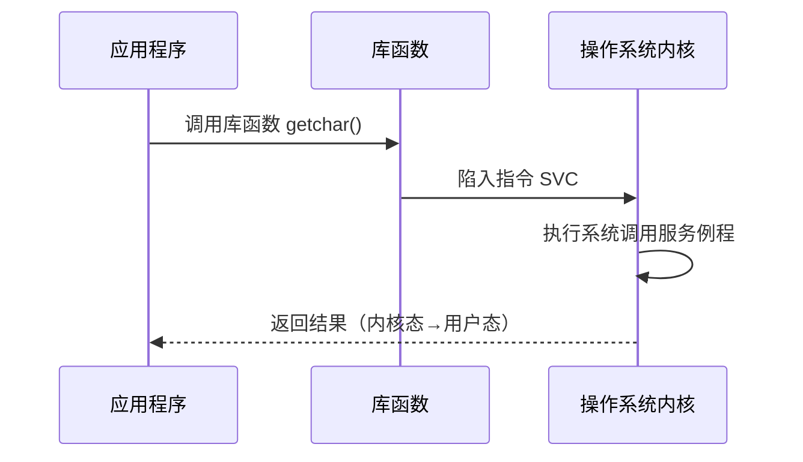

#### 系统调用的类型

| 类型 | 功能 |
| ---- | ---- |
| 进程控制类 | 创建/终止进程、获取/设置进程属性、等待某事件出现 |
| 进程通信类 | 用于进程之间的通信 |
| 文件操纵类 | 打开/关闭文件、创建/删除文件、读写文件 |
| 设备管理类 | 申请/释放设备、设备 I/O 重定向、获取/设置设备属性 |
| 信息维护类 | 获取系统/文件的时间信息、OS 版本、当前用户、空闲内存与磁盘等 |

> 区分：**系统调用**运行在内核态、是 OS 提供的服务入口；**库函数**运行在用户态，是对系统调用的封装（有些库函数不涉及系统调用）。

---

### 附：UNIX 系统结构（实例）

UNIX 特点：内核短小精悍、可移植性好、树形文件系统、统一看待外设与文件、I/O 重定向与管道、良好用户接口、开放式、强大的软件开发环境与丰富实用程序。

UNIX 系统分三级：**用户级、核心级、硬件级**。内核是机器硬件的第一层扩展，构成第一层虚拟机，通过**系统调用界面**对外服务。内核四大子系统：

| 子系统 | 主要功能 |
| ------ | -------- |
| 文件子系统 | 管理文件：空闲空间管理、分配/回收存储空间、存取控制、搜索文件、提供系统调用服务 |
| 进程控制子系统 | 进程的创建、调度、进程间通信、进程间同步控制（含存储管理、进程通信、进程调度） |
| 设备管理子系统 | 完成进程与外设间数据交换（字符设备管理、块设备管理） |
| 存储管理子系统 | 管理内存空闲空间、交换区空间、虚拟存储空间 |

---

### 本章高频考点

- 操作系统的定义、目标（方便/有效/可扩充/开放）、作用（接口/资源管理者/资源抽象）。
- 发展历程：单道批处理 → 多道批处理 → 分时 → 实时，及**多道批处理/分时/实时三者对比**。
- 多道程序设计技术的思想与优缺点。
- **四大基本特征**：并发、共享、虚拟、异步，及并发与共享互为条件。
- 并发 vs 并行、互斥共享 vs 同时共享、时分复用 vs 空分复用。
- 双重工作模式、特权指令 vs 非特权指令、内核态 vs 用户态。
- 中断 vs 异常、用户态→内核态切换的三种途径、OS 是中断驱动的。
- 内核组成：支撑功能（中断/时钟/原语）+ 资源管理功能；原语的原子性。
- OS 五大功能及各自子功能。
- 结构设计：策略与机制分离；**简单/模块化/分层/宏内核/微内核/混合/外核** 七种结构的思想、优缺点与实例对比。
- 系统调用的概念、过程（陷入指令切换模式）、类型，及与库函数的区别。


---

## 第二章：进程的描述与控制

### 程序的顺序执行与并发执行

#### 前趋图（Precedence Graph）

前趋图是一个**有向无循环图（DAG，Directed Acyclic Graph）**，用于描述进程（或程序段）之间执行的先后顺序。

- 结点（Node）：表示一个进程或程序段
- 有向边（Edge）：表示两者之间的**前趋关系**，记作 $\rightarrow$
- 前趋关系：$P_i \rightarrow P_j$ 表示 $P_i$ 必须在 $P_j$ 开始之前完成

#### 程序的顺序执行

一个较大的程序通常由若干程序段组成。程序在执行时，必须按照某种先后次序逐个执行，仅当前一操作执行完后，才能执行后继操作。

以输入（$I$）、计算（$C$）、打印（$P$）为例，顺序执行的前趋关系为：

$$I_i \rightarrow C_i \rightarrow P_i$$

> 顺序执行严格按序，每个程序段独占资源、不受外界干扰。

#### 程序的并发执行

采用**多道程序技术**，将多个程序同时装入内存，使之并发运行，以提高资源利用率和系统吞吐量。

对多个作业 $i=1,2,\dots,n$ 而言，并发执行的前趋关系为：

$$I_i \rightarrow C_i,\quad I_i \rightarrow I_{i+1},\quad C_i \rightarrow P_i,\quad C_i \rightarrow C_{i+1},\quad P_i \rightarrow P_{i+1}$$

示例程序段：

```
S1: a := x + 2
S2: b := y + 4
S3: c := a + b
S4: d := c + b
```

其前趋关系为：$S_1 \rightarrow S_3$、$S_2 \rightarrow S_3$、$S_3 \rightarrow S_4$（$S_1$ 与 $S_2$ 之间无依赖，可并发）。

#### 顺序执行 vs 并发执行的特征对比

| 特征 | 顺序执行 | 并发执行 |
| ---- | -------- | -------- |
| 顺序性（Sequentiality） | 严格按序，前一操作完成才执行后继 | 间断性（执行—暂停—执行），相互制约 |
| 封闭性（Closeness） | 独占全机资源，结果不受外界影响 | 失去封闭性，共享资源，执行状态受外界因素影响 |
| 可再现性（Reproducibility） | 有，环境与初值相同则结果相同 | 不可再现，相同初值可能产生不同结果 |

> **间断性**：并发程序之间相互制约，呈现"执行——暂停执行——执行"的活动规律。
> **失去封闭性**：多个程序共享全机资源，某程序的执行状态会受其他程序的影响。
> **不可再现性**：程序经多次执行后，即使执行环境和初始条件都相同，得到的结果却可能各不相同。

#### 不可再现性举例

设循环程序 A 和 B 共享一个变量 $N$，二者以不同速度运行。假定某时刻 $N = n$：

```
程序A:           程序B:
  ...              ...
  N := N + 1;      print(N);
  ...              N := 0;
```

`N := N + 1` 相对于 `print(N)` 和 `N := 0` 的执行时机不同，结果各异：

| 执行时机 | N 的值 | print 输出 | 执行后 N |
| -------- | ------ | ---------- | -------- |
| 在 print 和 N:=0 **之前** | $n+1$ | $n+1$ | $0$ |
| 在 print 和 N:=0 **之后** | $n$ | $n$ | $1$ |
| 在 print 和 N:=0 **之间** | $n$ | $n$ | $0$（写入后被 N:=0 覆盖前为 n+1） |

> 结论：并发执行**失去了可再现性**，必须借助同步机制加以保证。

---

### 进程的描述

#### 进程的定义

进程是程序的运行过程，是系统进行**资源分配和调度的一个独立单位**。为了描述和控制进程，系统为每个进程配置一个专门的数据结构——**进程控制块（PCB，Process Control Block）**，它与进程一一对应。

几种典型定义：

- 进程是程序的一次执行。
- 进程是一个程序及其数据在处理机上顺序执行时所发生的活动。
- 进程是程序在一个数据集合上运行的过程，它是系统进行资源分配和调度的一个独立单位。

#### 进程的特征

| 特征 | 英文 | 含义 |
| ---- | ---- | ---- |
| 动态性（最基本特征） | Dynamic | 进程是程序的一次执行，有创建、活动、暂停、终止的生命周期 |
| 并发性 | Concurrence | 多个进程实体在一段时间内同时运行 |
| 独立性 | Independence | 进程是能独立运行、独立获得资源、独立调度的基本单位 |
| 异步性 | Asynchronism | 各进程按各自独立的、不可预知的速度向前推进 |

#### 进程与程序的区别

| 维度 | 进程 | 程序 |
| ---- | ---- | ---- |
| 本质 | 程序的一个实例、一次执行 | 进程的代码部分 |
| 状态 | 活动的、动态的 | 静态的 |
| 存储位置 | 在内存中 | 在外存中 |
| 生命期 | 有生命周期 | 可长期保存 |
| 标志 | 有 PCB | 无 PCB |

#### 进程的组成（进程实体）

进程实体（进程映像）由三部分组成：

| 组成部分 | 作用 |
| -------- | ---- |
| 程序段 | 进程要执行的代码，描述进程需完成的功能 |
| 数据段 | 程序运行时加工处理的原始数据、中间/最终结果、临时变量与工作区 |
| 进程控制块 PCB | 描述进程的基本情况与运行状态，是进程存在的唯一标志 |

---

### 进程的状态及转换

#### 三种基本状态

| 状态 | 英文 | 含义 |
| ---- | ---- | ---- |
| 就绪态 | Ready | 已具备运行条件，只要获得 CPU 即可立即执行；多个就绪进程组成**就绪队列** |
| 执行态 | Running | 已获得 CPU 正在执行（单处理机只有一个进程处于此态，多处理机可有多个） |
| 阻塞态 | Blocked | 正在执行的进程因发生某事件（如请求 I/O、申请缓冲空间）暂时无法继续执行，OS 把处理机分配给其他就绪进程；按阻塞原因设置多个**阻塞队列** |

#### 三态模型


> 注意：阻塞态不能直接转换为执行态，必须先经过就绪态；就绪态也不会直接转为阻塞态。

#### 五态模型（增加创建态与终止态）

- **创建态（New）**：申请一个空白 PCB → 填写 PCB → 分配资源 → 设置就绪状态并插入就绪队列。
- **终止态（Terminated）**：等待 OS 善后处理 → 收回 PCB。

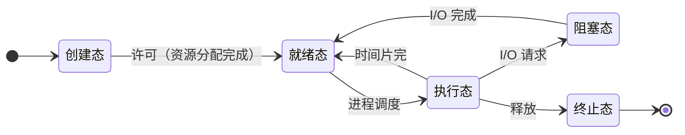

#### 七态模型（引入挂起状态）

引入**挂起（Suspend）**后，进程被换出到外存。状态进一步细分为：

- 活动就绪 ↔ 静止就绪（就绪挂起）
- 活动阻塞 ↔ 静止阻塞（阻塞挂起）

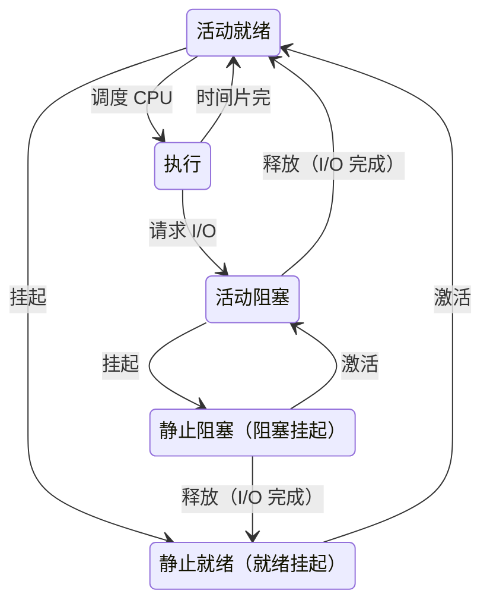

---

### 进程控制块 PCB

PCB 是进程的一部分，是操作系统中**最重要的记录型数据结构**，是**进程存在的唯一标志**，常驻内存。

#### PCB 的作用

- 作为独立运行基本单位的标志；
- 能实现间断性运行方式；
- 提供进程管理所需要的信息；
- 提供进程调度所需要的信息；
- 实现与其他进程的同步与通信。

#### PCB 包含的信息

| 类别 | 内容 |
| ---- | ---- |
| 进程标识符 | 内部标识符（PID）、外部标识符（用户给定） |
| 处理机状态 | 通用寄存器、PC、PSW、栈指针等（用于现场保护与恢复） |
| 进程调度信息 | 进程状态、优先级、调度所需的其他参数、等待的事件 |
| 进程控制信息 | 程序与数据的地址、同步与通信机制、资源清单、链接指针 |

#### PCB 的组织方式

| 方式 | 说明 | 特点 |
| ---- | ---- | ---- |
| 线性方式 | 所有 PCB 顺序排列在一张线性表中 | 简单，但查找时需遍历整张表，效率低 |
| 链接方式 | 相同状态的 PCB 用链接指针链成队列（执行指针、就绪队列指针、阻塞队列指针、空闲队列指针） | 按状态成队列，便于调度时查找 |
| 索引方式 | 按状态分别建立索引表（就绪索引表、阻塞索引表），表项指向对应 PCB | 通过索引快速定位，查找效率高 |

---

### 进程控制

进程控制是进程管理中**最基本的功能**，一般由 OS 内核中的**原语（Primitive）**实现。原语是若干指令组成的、执行期间不可分割的原子操作。主要包括：进程创建、进程终止、进程阻塞与唤醒、进程挂起与激活。

#### 进程创建（Create）

进程具有**层次结构**，可用**进程图（Process Graph）**——描述进程家族关系的有向树来表示父子关系。

引起进程创建的事件：用户登录、作业调度、提供服务、应用请求。

创建过程：

1. 申请空白 PCB；
2. 分配所需资源；
3. 初始化 PCB；
4. 将新进程插入就绪队列。

#### 进程终止（Termination）

引起进程终止的事件：正常结束、异常结束、外界干预。

终止过程：

1. 根据被终止进程的标识符，从 PCB 集合中检索出其 PCB，读出该进程的状态；
2. 若该进程正处于执行状态，立即终止其执行，并置调度标志为真（指示终止后重新调度）；
3. 若该进程还有子孙进程，应将其所有子孙进程予以终止；
4. 将该进程所拥有的全部资源归还给其父进程或系统；
5. 将被终止进程的 PCB 从所在队列中移去。

#### 进程的阻塞与唤醒

| 原语 | 触发事件 | 主要过程 |
| ---- | -------- | -------- |
| 阻塞 `Block()` | 请求共享资源失败、等待某操作完成、新数据尚未到达、等待新任务到达 | 停止执行 → 状态由执行改为阻塞 → 将 PCB 插入阻塞队列 |
| 唤醒 `Wakeup()` | 所等待的资源到达、事件完成 | 从阻塞队列中移出 → 状态由阻塞改为就绪 → 将 PCB 插入就绪队列 |

> 进程的阻塞是进程自身的一种**主动行为**；而唤醒是其他进程的行为。`Block` 和 `Wakeup` 必须**成对使用**，否则进程将永远阻塞。

#### 进程的挂起与激活

| 原语 | 说明 |
| ---- | ---- |
| 挂起 `Suspend()` | 将进程换出到外存，PCB 状态改为静止（挂起）状态 |
| 激活 `Active()` | 将进程从外存调回内存，状态改为活动就绪或活动阻塞 |

---

### 进程通信

进程通信（IPC，Inter-Process Communication）是指进程之间的信息交换。

#### 低级通信 vs 高级通信

| 类型 | 含义 | 特点 |
| ---- | ---- | ---- |
| 低级进程通信 | 用于进程的同步与互斥（如信号量 PV） | 效率低、通信对用户不透明 |
| 高级进程通信 | 以较高效率传送大量数据 | 使用方便、能高效传送大量数据 |

#### 高级通信的四种类型

**1. 共享存储器系统（Shared-Memory System）**

- 基于共享数据结构的通信方式（效率低）
- 基于共享存储区的通信方式（高级，进程将共享区映射到自己地址空间）

**2. 管道通信（Pipe）**

管道是用于连接一个读进程和一个写进程、以实现它们之间通信的一个**共享文件**，又名 pipe 文件。

管道机制必须提供三方面协调能力：**互斥、同步、判断对方是否存在**。

**3. 消息传递系统（Message Passing System）**

- 直接通信方式
- 间接通信方式（通过信箱）

**4. 客户机-服务器系统（Client-Server System）**

- 套接字（Socket）
- 远程过程调用（RPC，Remote Procedure Call）和远程方法调用（RMI，Remote Method Invocation，Java）

#### 消息传递的实现方式

**直接通信方式**：发送/接收进程显式指明对方。

```
发送原语: send(receiver, message)
接收原语: receive(sender, message)
```

**间接通信方式**：通过**信箱（Mailbox）**作为中间媒介完成。

```
发送原语: send(mailbox, message)
接收原语: receive(mailbox, message)
```

- 信箱结构：包含信箱头与信箱体，可存放若干消息。
- 信箱类型：**私用邮箱、公共邮箱、共享邮箱**。

#### Linux 进程通信方式

Linux 支持的 IPC 机制：**管道、共享内存、信号、信号量、消息队列、套接字**。

**无名管道（Unnamed Pipe）实例**：用 `pipe()` 创建，仅用于父子进程间通信。

```c
#define INPUT  0
#define OUTPUT 1
void main() {
    int file_descriptors[2];
    pid_t pid;                          /* 定义子进程号 */
    char buf[256];
    int returned_count;
    pipe(file_descriptors);             /* 创建无名管道 */
    if ((pid = fork()) == -1) {         /* 创建子进程 */
        printf("Error in fork\n");
        exit(1);
    }
    if (pid == 0) {                     /* 子进程：写数据，关闭读端 */
        close(file_descriptors[INPUT]);
        write(file_descriptors[OUTPUT], "test data", strlen("test data"));
        exit(0);
    } else {                            /* 父进程：读数据，关闭写端 */
        close(file_descriptors[OUTPUT]);
        returned_count = read(file_descriptors[INPUT], buf, sizeof(buf));
        printf("%d bytes received: %s\n", returned_count, buf);
    }
}
```

**有名管道（Named Pipe / FIFO）实例**：用 `mkfifo("myfifo", rw)` 或 `mknod myfifo p` 创建，无亲缘关系的进程也能使用。

```c
#include <stdio.h>
#include <unistd.h>
void main() {
    FILE *in_file, *out_file;
    int count = 1;
    char buf[80];
    in_file = fopen("mypipe", "r");     /* 读有名管道 */
    while ((count = fread(buf, 1, 80, in_file)) > 0)
        printf("received from pipe: %s\n", buf);
    fclose(in_file);
    out_file = fopen("mypipe", "w");    /* 写有名管道 */
    sprintf(buf, "this is test data for the named pipe example.\n");
    fwrite(buf, 1, 80, out_file);
    fclose(out_file);
}
```

---

### 线程的基本概念

#### 引入进程与引入线程的目的

| 时间线 | 概念 | 目的 |
| ------ | ---- | ---- |
| 60 年代中期 | 提出进程概念 | 使多个程序并发执行，提高资源利用率及系统吞吐量 |
| 80 年代中期 | 提出线程概念 | 减少程序并发执行时所付出的时空开销，使 OS 具有更好的并发性 |
| 90 年代后 | 多处理机系统引入线程 | 适用于 SMP（对称多处理）结构的计算机系统 |

传统进程的两个基本属性（未引入线程之前）：

- 进程是一个可拥有资源的独立单位；
- 进程是一个可独立调度和分派的基本单位。

引入线程之后，二者**分离**：

- **进程**是拥有资源的基本单位（传统进程称为**重型进程**）；
- **线程**是调度和分派的基本单位（又称**轻型进程**）。

#### 进程 vs 线程的比较

| 维度 | 进程 | 线程 |
| ---- | ---- | ---- |
| 调度的基本单位 | 传统 OS 中是基本单位 | 引入线程后是调度和分派的基本单位；同进程内线程切换不引起进程切换，跨进程线程切换才引起进程切换 |
| 并发性 | 进程间可并发 | 进程间、同一进程内的多个线程间均可并发 |
| 拥有资源 | 拥有资源的基本单位 | 本身基本不拥有资源，仅有保证独立运行的少量资源；可共享所属进程的资源 |
| 独立性 | 强 | 同一进程内不同线程间独立性远低于进程间 |
| 系统开销 | 创建/撤销/切换开销大 | 开销远小于进程；同进程线程间同步与通信更简单 |
| 支持多处理机 | 单进程一般运行于一个处理机 | 同一进程的多个线程可分配到多个处理机并行执行 |

#### 线程的状态与控制块

线程状态：**执行态、就绪态、阻塞态**，其状态转换与进程状态转换一样。

**线程控制块（TCB，Thread Control Block）** 包含：线程标识符、一组寄存器、线程运行状态、优先级、线程专有存储区、信号屏蔽、堆栈指针。

---

### 线程的实现

#### 三种实现方式

| 方式 | 实现位置 | 优点 | 缺点 |
| ---- | -------- | ---- | ---- |
| 内核支持线程 KST（Kernel-Supported Threads） | 内核空间，借助系统调用 | 多处理机系统中内核可同时调度同一进程的多个线程；一个线程阻塞时内核可调度其他线程；线程切换快、开销小；内核本身可采用多线程提高效率 | 对用户线程切换而言开销较大（需陷入内核） |
| 用户级线程 ULT（User-Level Threads） | 用户空间，借助中间系统（运行时库） | 线程切换不需转入内核；调度算法可进程专用；实现与 OS 平台无关 | 系统调用的阻塞问题（一个线程阻塞导致整个进程阻塞）；多线程应用不能利用多处理机进行多重处理 |
| 组合方式 | 用户级线程映射到内核支持线程 | 综合上述两者优势 | 实现复杂 |

#### ULT 与 KST 的三种映射模型

| 模型 | 映射关系 | 优点 | 缺点 | 例子 |
| ---- | -------- | ---- | ---- | ---- |
| 一对一 | 每个 ULT 映射到一个 KST | 并发性好，一个线程阻塞别的线程仍可执行；可在多核上并行 | 创建 ULT 需创建 KST，效率较差；线程管理成本高、需切换到核心态、开销大 | Windows 95/98/NT/XP/2000、Linux、Solaris 9+、OS/2 |
| 多对一 | 多个 ULT 映射到一个 KST，每次仅一个线程进行映射 | 线程切换在用户空间完成，无需切换核心态，系统开销小、效率高 | 一个线程的阻塞系统调用会导致整个进程阻塞，并发度不高；不能在多核上并行 | Solaris Green Threads、GNU Portable Threads |
| 多对多 | 多个 ULT 映射为相等或更少数目的 KST，OS 可创建足够多的 KST | 兼顾并发性与开销，较为灵活 | 实现最复杂 | Solaris 9 以前版本、带 ThreadFiber 开发包的 Windows NT/2000 |

> **一对一**：并发能力强但开销大；**多对一**：高效但一个阻塞全进程阻塞；**多对多**：折中方案，灵活性最高。


---

## 第三章：处理机调度与死锁

### 处理机调度的层次

调度的实质是按某种算法从一组等待资源（主要是处理机）的对象中选择一个分配资源。按调度发生的层次，可分为高级、中级、低级三种调度。

| 调度层次 | 别名                  | 调度对象            | 调度频率     | 主要功能                                       | 适用系统                 |
| -------- | --------------------- | ------------------- | ------------ | ---------------------------------------------- | ------------------------ |
| 高级调度 | 作业调度 / 长程调度   | 作业（外存→内存）   | 低           | 决定后备队列中哪些作业调入内存、创建进程、分配资源 | 多道批处理系统           |
| 中级调度 | 内存调度 / 中程调度   | 进程（内存↔外存）   | 中           | 即"对换"功能，将进程换出/换入，提高内存利用率   | 引入对换技术的系统       |
| 低级调度 | 进程调度 / 短程调度   | 进程（就绪→执行）   | 高（最频繁） | 按算法决定就绪队列中哪个进程获得处理机          | 多道批处理、分时、实时OS |

> **作业**：用户在一次任务过程中要求计算机所做全部工作的总称。中级调度（对换）的具体实现将在第5章存储器管理中介绍。

### 进程调度的任务、机制与方式

#### 进程调度的任务

1. 保存处理机的现场信息
2. 按某种算法选取进程
3. 把处理器分配给进程

#### 进程调度机制（调度程序的三部分）

- **排队器**：将就绪进程插入相应的就绪队列
- **分派器**：将选定的进程移出就绪队列
- **上下文切换器**：进行新旧进程之间的上下文切换

#### 进程调度的方式

- **非抢占方式（Non-preemptive）**：一旦把处理机分配给某进程，便让其一直执行，直至该进程完成或发生某事件被阻塞时，才把处理机分配给其他进程。决不允许抢占已分配出去的处理机。实现简单、系统开销小，但难以满足紧迫任务要求。
- **抢占方式（Preemptive）**：允许调度程序根据某种原则去暂停某个正在执行的进程，将处理机重新分配给另一进程。现代OS广泛采用。

抢占必须遵循一定的原则：

| 原则         | 说明                                                     |
| ------------ | -------------------------------------------------------- |
| 优先权原则   | 允许优先权高的新到进程抢占当前进程的处理机               |
| 短作业优先原则 | 短作业（进程）可以抢占当前较长作业（进程）的处理机       |
| 时间片原则   | 各进程按时间片运行，一个时间片用完便停止该进程并重新调度 |

### 调度算法的目标

| 系统类型     | 主要目标                                   |
| ------------ | ------------------------------------------ |
| 共同目标     | 资源利用率、公平性、平衡性、策略强制执行   |
| 批处理系统   | 平均周转时间短、系统吞吐量高、处理机利用率高 |
| 分时系统     | 响应时间快、均衡性                         |
| 实时系统     | 截止时间的保证、可预测性                   |

### 调度评价指标

- **CPU 利用率**：

$$\text{CPU 利用率} = \dfrac{\text{CPU 有效工作时间}}{\text{CPU 有效工作时间} + \text{CPU 空闲等待时间}}$$

- **系统吞吐量（Throughput）**：单位时间内系统完成的作业数。

- **周转时间（Turnaround Time）**：从作业提交给系统开始，到作业完成为止的时间间隔。

$$T_i = \text{完成时间} - \text{提交（到达）时间}$$

- **平均周转时间**：

$$\bar{T} = \dfrac{1}{n}\sum_{i=1}^{n} T_i$$

- **带权周转时间（Weighted Turnaround Time）**：周转时间 $T_i$ 与系统为之服务时间 $T_{si}$ 之比。

$$W_i = \dfrac{T_i}{T_{si}} = \dfrac{\text{周转时间}}{\text{服务时间}}$$

- **平均带权周转时间**：

$$\bar{W} = \dfrac{1}{n}\sum_{i=1}^{n}\dfrac{T_i}{T_{si}}$$

- **等待时间（Waiting Time）**：进程在就绪队列中等待调度的所有时间之和。

$$\text{等待时间} = \text{周转时间} - \text{运行（服务）时间}$$

- **响应时间（Response Time）**：从用户通过键盘提交请求开始，直到系统首次显示出处理结果为止的一段时间。是分时系统的重要指标。

> 带权周转时间恒 $\geq 1$，越接近 1 说明作业等待时间越短、服务质量越好。

### 调度算法

> 说明：FCFS、SJF、PR 既可用于作业调度，也可用于进程调度；RR、多级队列、多级反馈队列主要用于进程调度。

#### 1. 先来先服务 FCFS（First-Come First-Served）

- 按作业（进程）到达就绪队列的先后顺序进行服务。
- 非抢占式。既适合作业调度，也适合进程调度。
- **优点**：公平、实现简单。
- **缺点**：对短作业不利（短作业被长作业堵塞）；不利于 I/O 繁忙型作业；平均周转时间通常较长。

#### 2. 短作业优先 SJF / 最短剩余时间优先 SRTN

- **对作业**：从后备队列中选择若干估计运行时间最短的作业。
- **对进程**：关联每个进程下次运行的 CPU 区间长度，调度最短的进程。
- 两种模式：
  - **非抢占式 SJF**：当前进程完成后，从就绪队列中选剩余/估计运行时间最短者。
  - **抢占式（SRTN，最短剩余时间优先）**：当有比当前进程剩余时间更短的进程到达时发生抢占。
- **优点**：SJF 是最优的——对一组指定进程而言，它给出最短的平均等待时间，比 FCFS 有明显改进。
- **缺点**：
  1. 只能估算运行时间（估值不准确），故通常用于作业调度；
  2. 对长作业不利，可能导致长作业**饥饿**；
  3. 采用 SJF 人-机无法实现交互；
  4. 完全未考虑作业的紧迫程度。

#### 3. 优先级调度算法 PR（Priority）

- 每个进程都有一个优先数（整数）。**默认：小的优先数具有高优先级。**
- 基于作业/进程的紧迫程度由外部赋予优先级，按优先级调度。目前主流 OS 调度算法。
- 既可用于作业调度，也可用于进程调度。HRRN 本质上也是一种优先级调度算法。

| 维度       | 类型     | 说明                                                         |
| ---------- | -------- | ------------------------------------------------------------ |
| 是否抢占   | 非抢占式 | 当前进程主动放弃处理机后再调度                               |
|            | 抢占式   | 高优先级新进程到达即抢占（平均周转时间通常更优）             |
| 优先级类型 | 静态优先级 | 创建时确定，运行期间不变。简单、开销小；但不精确，低优先级进程可能长期得不到调度 |
|            | 动态优先级 | 创建时赋初值，随进程推进或等待时间增加而改变                 |

一般优先级规则：系统进程 > 用户进程；前台进程 > 后台进程；操作系统更偏好 I/O 型进程（I/O 繁忙型），与之相对的是计算型进程（CPU 繁忙型）。

- **优点**：实现简单，考虑了进程的紧迫程度；灵活，可模拟其它算法。
- **存在问题**：**饥饿**——低优先级进程可能永远得不到运行。
- **解决方法**：**老化（Aging）**——随进程等待时间的延长逐步提高其优先数。

> 抢占式优先级示例（P1~P4 到达 0/2/4/5，运行 7/4/1/4，优先数 3/2/1/2）平均周转时间为 7，优于对应非抢占式的 8，体现抢占式在响应紧迫任务上的优势。

#### 4. 高响应比优先 HRRN（Highest Response Ratio Next）

既考虑作业的等待时间，又考虑作业的运行时间，是对 FCFS 和 SJF 的折中。

$$R_p = \dfrac{\text{等待时间} + \text{要求服务时间}}{\text{要求服务时间}} = 1 + \dfrac{\text{等待时间}}{\text{要求服务时间}}$$

- 非抢占式，多用于作业调度。每次调度前计算各作业响应比，选最高者。
- 等待时间相同：运行时间越短，优先级越高（类似 SJF）。
- 运行时间相同：等待时间越长，优先级越高（类似 FCFS）。
- 长作业可随等待时间增加而提高响应比，最终得到服务，**避免饥饿**。
- **缺点**：每次调度前都需计算响应比，增加系统开销。

#### 5. 时间片轮转 RR（Round-Robin）

专为分时系统设计，类似 FCFS 但增加了抢占。

- 就绪队列按 FCFS 排队，为每个进程分配不超过一个时间片 $q$ 的 CPU 时间。
- 时间片用完后该进程被抢占并插入就绪队列末尾，循环执行。
- 若就绪队列有 $n$ 个进程、时间片为 $q$，则每个进程每次得到不超过 $q$ 的成块 CPU 时间，且任一进程的等待时间不会超过 $(n-1)q$。

时间片大小的确定需考虑：系统对响应时间的要求、就绪队列中进程数目、系统的处理能力。

| 时间片 $q$ | 特性                                       |
| ---------- | ------------------------------------------ |
| $q$ 太大   | 退化为 FCFS                                |
| $q$ 太小   | 上下文切换频繁，切换开销过大               |
| 一般准则   | $q / 10 > $ 进程上下文切换时间（即 $q > 10 \times$ 切换时间） |

> RR 能让各进程得到及时响应，但其平均周转时间通常比 SJF 长。

#### 6. 多级队列调度算法（Multilevel Queue）

- 设置多个就绪队列，每个队列可采用不同的调度算法。
- 队列之间也有优先级，进程一旦进入某队列便固定其中，不能在队列间移动。

#### 7. 多级反馈队列 MFQ（Multilevel Feedback Queue）

针对"短进程优先类算法仅照顾短进程而忽略长进程，且需预知进程长度"的局限而设计。设置多级就绪队列，**各级队列优先级从高到低、时间片从小到大**。

调度规则：

1. 新进程到达时先进入第 1 级队列，按 FCFS 排队等待分配时间片；
2. 若用完时间片进程仍未结束，则进入下一级队列队尾；若已在最下级队列，则重新放回最下级队列队尾（最下级队列内部常按 RR 调度）；
3. 仅当较高优先级队列均空时，才调度本级队列的进程；
4. 抢占式：若新进程进入更高级队列，可抢占当前进程。

- **优点**：
  - 进程能在不同队列间移动；
  - 不必事先知道各种进程所需的执行时间；
  - 可满足各种类型进程的需要（短作业、长作业、I/O 型兼顾），综合性能优秀。

> MFQ 示例（P1/P2/P3 到达 0/1/5，运行 8/4/1，时间片随级别为 1→2→4）运行次序：
> `P1(1) → P2(1) → P1(2) → P2(1) → P3(1) → P2(2) → P1(4) → P1(1)`（括号内为该次运行时长）。

#### 8. 基于公平原则的调度算法

强调性能保证而非优先运行，主要面向用户的公平性：

- **保证性能调度算法**：保证处理机分配的公平性，使每个进程获得 $1/n$ 的处理机时间。
- **保证公平调度算法**：使所有用户获得相同的处理机时间或时间比例。

#### 调度算法对比

| 算法   | 是否可抢占 | 适用             | 优点                   | 缺点                   | 是否会饥饿   |
| ------ | ---------- | ---------------- | ---------------------- | ---------------------- | ------------ |
| FCFS   | 否         | 作业 / 进程      | 公平、简单             | 不利短作业、I/O 型     | 否           |
| SJF    | 两种模式   | 作业（多） / 进程 | 平均等待 / 周转时间最优 | 估值难、长作业不利     | 是           |
| 优先级 | 两种模式   | 作业 / 进程      | 灵活、考虑紧迫程度     | 低优先级可能饥饿       | 是           |
| HRRN   | 否         | 作业（多）       | 兼顾长短，避免饥饿     | 每次需计算响应比、开销大 | 否           |
| RR     | 是         | 进程（分时）     | 公平、响应及时         | 平均周转较长、切换开销 | 否           |
| 多级队列 | 是       | 进程             | 分类管理               | 队列间不可移动、不灵活 | 可能         |
| MFQ    | 是         | 进程             | 综合性强、无需预知时间 | 实现复杂               | 否（一般）   |

> 折中思想：FCFS 公平、SJF 周转优、RR 响应快、优先级灵活——MFQ 是对它们的综合权衡，得到平衡且表现优秀的算法。

### 实时调度

实时调度针对实时任务，每个实时任务都联系着一个**截止时间（Deadline）**。

#### 实时任务分类

- 按性质：**硬实时（HRT，Hard Real-Time）** vs **软实时（SRT，Soft Real-Time）**。
- 按到达规律：**周期性** vs **非周期性**。

#### 实现实时调度的基本条件

1. **提供必要的信息**：就绪时间、开始截止时间和完成截止时间、处理时间、资源要求、优先级；
2. **系统处理能力强**：单/多处理机系统均须满足任务集的可调度性，避免过载；
3. **采用抢占式调度机制**：对中断有快速响应能力、快速的任务分派能力（HRT 任务中广泛采用抢占式调度）；
4. **采用快速切换机制**：快速中断响应、快速任务分派。

#### 实时调度算法分类

| 分类依据   | 类型                                                         |
| ---------- | ------------------------------------------------------------ |
| 任务性质   | HRT 调度算法、SRT 调度算法                                   |
| 调度方式   | 非抢占式调度算法、抢占式调度算法                             |

| 算法                       | 响应时间          | 适用场合                 |
| -------------------------- | ----------------- | ------------------------ |
| 非抢占式轮转调度           | 数秒至数十秒      | 要求不太严格的实时控制   |
| 非抢占式优先调度           | 数秒至数百毫秒    | 有一定要求的实时控制     |
| 基于时钟中断的抢占式优先级 | 几十毫秒至几毫秒  | 大多数实时系统           |
| 立即抢占的优先级调度       | 几毫秒至几百微秒  | 有严格时间要求的实时系统 |

#### 最早截止时间优先 EDF（Earliest Deadline First）

- 根据任务的截止时间确定优先级，**截止时间越早，优先级越高**。
- 既可用于抢占式调度，也可用于非抢占式调度。
- 非抢占式调度多用于非周期实时任务；抢占式调度多用于周期实时任务。

#### 最低松弛度优先 LLF（Least Laxity First）

根据任务的紧急程度（松弛度）确定优先级，**松弛度越低（越紧急），优先级越高**，主要用于抢占式调度。

$$\text{松弛度} = \text{必须完成时间} - \text{其本身的运行（剩余）时间} - \text{当前时间}$$

> 例：任务 A 每 20 ms 执行一次、执行 10 ms；任务 B 每 50 ms 执行一次、执行 25 ms。在每个时刻比较 A、B 的松弛度，调度松弛度最低者，从而保证两周期任务均不错过截止时间。

#### 优先级倒置（Priority Inversion）

采用优先级调度和抢占方式时可能产生优先级倒置：**高优先级进程被低优先级进程延迟或阻塞**。

典型场景（优先级 P1 > P2 > P3）：

```
P1: ... P(mutex); cs1; V(mutex)
P2: ... 长时间运行的普通代码 ...
P3: ... P(mutex); cs3; V(mutex)
```

P3 持有 mutex 时被 P1 抢占，P1 因申请 mutex 被阻塞；此时中等优先级的 P2 抢占 P3 长期运行，导致高优先级 P1 被"倒置"地长期阻塞。

解决方法：

- **优先级继承（Priority Inheritance）**：当低优先级进程持有高优先级进程所需资源时，临时将其优先级提升为高优先级进程的优先级，待释放资源后恢复。
- **优先级天花板（Priority Ceiling）**：为每个资源设定一个优先级天花板（=可能访问它的最高优先级），进程持有资源期间其优先级提升到该天花板。
- 也可规定：低优先级进程进入临界区后，其占用的处理机不允许被抢占。

### Linux 进程调度

- **默认调度算法：完全公平调度 CFS（Completely Fair Scheduler）。**
- 基于**调度器类（scheduler class）**：允许不同的、可动态添加的调度算法并存，每个类有特定优先级。总调度器按调度器类的优先顺序依次调度，类内部使用所选策略调度。
- 调度器类默认优先级顺序：**Stop_Task > Real_Time > Fair（CFS）> Idle_Task**。

| 进程类型 | 调度策略          | 说明                                                         |
| -------- | ----------------- | ----------------------------------------------------------- |
| 普通进程 | SCHED_NORMAL（CFS）| CPU 运行时间与友好值（nice，-20 ~ +19）有关，**数值越低优先级越高** |
| 实时进程 | SCHED_FIFO        | 处于可执行状态就一直执行，直到自己阻塞或主动放弃 CPU         |
| 实时进程 | SCHED_RR          | 与 FIFO 类似，但耗尽时间片后须接受重新调度（带时间片轮转）   |

> 实时进程优先级高于普通进程。

---

### 死锁概述

#### 死锁的定义

> **死锁（Deadlock）**：指多个进程在运行过程中因争夺资源而造成的一种僵局。当进程处于这种僵持状态时，若无外力作用，这些进程都将永远不能再向前推进。
>
> 等价表述：一组等待的进程，其中每一个进程都持有资源，并且等待着由这个组中其他进程所持有的资源。

#### 资源的分类

| 分类维度 | 类型           | 含义与示例                                                         |
| -------- | -------------- | ---------------------------------------------------------------- |
| 使用方式 | 可重用性资源   | 一次只能分配给一个进程，不可共享，遵循"请求→使用→释放"（大部分资源）|
|          | 可消耗性资源   | 由进程动态创建和消耗（如进程间通信的消息）                         |
| 能否抢占 | 可抢占性资源   | 获得后可被其他进程或系统抢占（如 CPU、主存）                       |
|          | 不可抢占资源   | 分配后不能强行收回，只能由进程用完后自行释放（如打印机、磁带机）   |

#### 死锁产生的原因

1. **竞争不可抢占性资源**：数量不足以满足诸进程需要时，进程因争夺而陷入僵局（如两进程交叉以写方式打开两个共享文件）。
2. **竞争可消耗性资源**：如进程间消息通信。若各进程"先接收后发送"（receive 在 send 之前），互相等待对方发送的消息，会产生死锁；若"先发送后接收"则不会。
3. **进程推进顺序不当**：进程推进顺序合法则可顺利完成，推进顺序非法（进入不安全区域）则引起死锁。

#### 产生死锁的四个必要条件

| 条件                            | 含义                                                         |
| ------------------------------- | ----------------------------------------------------------- |
| **互斥条件**（Mutual Exclusion）| 一段时间内某资源只能被一个进程占用                           |
| **请求和保持**（Hold and Wait）| 一个至少持有一个资源的进程，又请求获得其他进程持有的额外资源 |
| **不可抢占**（No Preemption）   | 资源只有当持有它的进程完成任务后，才自由地释放               |
| **循环等待**（Circular Wait）   | 存在进程-资源循环等待环 $\{P_0, P_1, \dots, P_n\}$          |

循环等待：$P_0$ 等待 $P_1$ 占有的资源，$P_1$ 等待 $P_2$ 占有的资源，…，$P_{n-1}$ 等待 $P_n$ 占有的资源，$P_n$ 等待 $P_0$ 占有的资源。

> 这四个条件**必须同时满足**才会发生死锁；破坏其中任意一个即可预防死锁。

#### 处理死锁的方法

| 方法           | 英文              | 思想                                       | 代价 / 备注                      |
| -------------- | ----------------- | ------------------------------------------ | -------------------------------- |
| 鸵鸟策略       | Ostrich Algorithm | 忽略问题，假装从未出现死锁                  | 实现简单，多数 OS 采用（含 UNIX）|
| 死锁预防       | Prevention        | 破坏四个必要条件中的一个或几个             | 确保不进入死锁，但资源利用率低   |
| 死锁避免       | Avoidance         | 资源动态分配时防止系统进入不安全状态       | 确保不进入死锁，有运行时开销     |
| 死锁检测与解除 | Detection & Recovery | 允许死锁发生，及时检测并解除             | 允许进入死锁状态，事后恢复       |

> 死锁预防与死锁避免都能"确保系统永远不会进入死锁状态"；区别在于：预防是事先施加静态限制（破坏必要条件），避免是在分配时动态判断安全性。

### 死锁预防

破坏四个必要条件中的一个或几个。其中**互斥条件是共享资源所必须的，不仅不能改变还应加以保证**，故一般只破坏后三个条件。

#### 破坏"请求和保持"条件

保证进程申请资源时没有占有其他资源。

- **一次性申请（静态分配）**：要求进程在执行前一次性申请全部所需资源，只有当它没有占有任何资源时才可分配。
  - 缺点：资源利用率低，可能出现饥饿。
- **改进**：进程只获得运行初期所需资源即开始运行，其后在运行过程中逐步释放已分配且用毕的资源，然后再请求新资源。

#### 破坏"不可抢占"条件

- **方案 1**：若一个进程的申请没有实现，它要释放所有已占有的资源，待以后需要时重新申请。
- **方案 2**：当某进程需要的资源被其他进程占有时，由操作系统协助将该资源强行剥夺（一般需考虑各进程优先级）。

缺点：

1. 实现比较复杂；
2. 释放已获得的资源可能造成前一阶段工作失效，故一般只适用于易保存和恢复状态的资源（如 CPU）；
3. 反复申请和释放资源会增加系统开销、降低吞吐量；
4. 采用方案 1 时，只要暂时得不到某资源就要放弃已获资源，反复发生会导致进程饥饿。

#### 破坏"循环等待"条件

对所有资源类型进行线性排序并赋予不同序号，要求进程**按序号递增顺序申请资源**。

> 例：$F(R_1)=1,\ F(R_2)=5,\ F(R_3)=10,\ F(R_4)=15$。进程需先请求低序号资源；若已持有高序号资源 $R_4$ 而想请求低序号的 $R_3$，则须先释放 $R_4$。这样不可能形成循环等待环。

缺点：

1. 不方便增加新设备（可能需重新分配所有编号）；
2. 进程实际使用资源的顺序可能与编号递增顺序不一致，导致资源浪费；
3. 必须按规定次序申请，用户编程麻烦。

### 死锁避免——银行家算法

#### 安全状态与不安全状态

> **安全序列**：指如果系统按照这种序列分配资源，则每个进程都能顺利完成。安全序列可能有多个。
> **安全状态**：能找出至少一个安全序列的状态。
> **不安全状态**：分配资源后找不出任何安全序列的状态。

- 若系统处于安全状态，则一定不会发生死锁；
- 若系统进入不安全状态，则**可能**发生死锁（处于不安全状态未必发生死锁，但发生死锁时一定处于不安全状态）。

> 死锁避免的核心：**确保系统永远不会进入不安全状态**。分配前总是考虑最坏情况。

简单示例（单类资源共 13 个，已分配后可用 3）：

| 进程 | 最大需求 | 已分配 | 最大还需 |
| ---- | -------- | ------ | -------- |
| P1   | 10       | 5      | 5        |
| P2   | 4        | 2      | 2        |
| P3   | 9        | 2      | 7        |

可用 = 3。安全序列：先满足 P2（还需 2），P2 完成归还后可用 5 → 满足 P1，P1 完成归还后满足 P3。故 (P2, P1, P3) 是安全序列。而 (P3, P2, P1) 不安全：若先满足 P3 之外的分配方式都无法推进，系统进入不安全状态。

#### 银行家算法的前提

针对资源有多个实例的情形，要求：每个进程必须事先声明对各类资源的最大需求量；进程请求资源时可能要等待；进程获得全部所需资源后必须在有限时间内释放。

#### 数据结构（$n$ 个进程，$m$ 类资源）

- **Available[m]**：可用资源向量。`Available[j]=k` 表示资源 $R_j$ 有 $k$ 个可用实例。
- **Max[n][m]**：最大需求矩阵。`Max[i,j]=k` 表示进程 $P_i$ 最多请求 $R_j$ 的 $k$ 个实例。
- **Allocation[n][m]**：分配矩阵。`Allocation[i,j]=k` 表示 $P_i$ 当前已分配 $R_j$ 的 $k$ 个实例。
- **Need[n][m]**：需求矩阵。`Need[i,j]=k` 表示 $P_i$ 还需要 $R_j$ 的 $k$ 个实例。

$$\text{Need}[i,j] = \text{Max}[i,j] - \text{Allocation}[i,j]$$

- **Request[m]**：进程 $P_i$ 本次的资源请求向量。

#### 银行家算法步骤（处理进程 $P_i$ 的请求 $Request_i$）

1. 若 $Request_i \leq Need_i$，转步骤 2；否则报错（请求超过其声明的最大值）。
2. 若 $Request_i \leq Available$，转步骤 3；否则 $P_i$ 必须等待（资源不可用）。
3. 系统**试探性分配（预分配）**，修改状态：

```
Available  := Available  - Request_i;
Allocation_i := Allocation_i + Request_i;
Need_i      := Need_i      - Request_i;
```

4. 执行**安全性算法**检查分配后系统是否安全：
   - 若安全 → 正式将资源分配给 $P_i$；
   - 若不安全 → 撤销本次试探分配，恢复原有状态，$P_i$ 等待。

#### 安全性算法步骤

1. 设置工作向量。令 `Work := Available`；`Finish[i] := false`（$i=0,1,\dots,n-1$）。
2. 在剩余进程集合中查找满足下列条件的进程 $i$：
   - (a) `Finish[i] = false`；
   - (b) `Need[i,j] ≤ Work[j]`（对所有 $j=0,1,\dots,m-1$）。
   - 若能找到，执行步骤 3；否则执行步骤 4。
3. 进程 $P_i$ 可获得资源并顺利完成，归还其全部资源：

```
Work[j] := Work[j] + Allocation[i,j];
Finish[i] := true;
转步骤 2;
```

4. 若对所有 $i$ 都有 `Finish[i] = true`，则系统处于安全状态；否则处于不安全状态。

> **考点口诀**：①检查请求是否超过最大需求 → ②检查可用资源是否够 → ③试探分配改数据结构 → ④用安全性算法检查是否安全。安全性算法实质是不断寻找"剩余资源能满足其最大还需"的进程，将其加入安全序列并回收资源，看能否让所有进程都加入。

#### 银行家算法示例

资源总量 (A,B,C) = (10, 5, 7)，初始 Available = (3, 3, 2)：

| 进程 | Max (A B C) | Allocation (A B C) | Need (A B C) |
| ---- | ----------- | ------------------ | ------------ |
| P0   | 7  5  3     | 0  1  0            | 7  4  3      |
| P1   | 3  2  2     | 2  0  0            | 1  2  2      |
| P2   | 9  0  2     | 3  0  2            | 6  0  0      |
| P3   | 2  2  2     | 2  1  1            | 0  1  1      |
| P4   | 4  3  3     | 0  0  2            | 4  3  1      |

系统处于安全状态，安全序列为 **<P1, P3, P4, P2, P0>**。

若 P1 提出请求 $Request_1 = (1,0,2)$：

1. $(1,0,2) \leq Need_1 (1,2,2)$，通过；
2. $(1,0,2) \leq Available (3,3,2)$，通过；
3. 试探分配后 Available 变为 $(2,3,0)$，$Allocation_1$ 变为 $(3,0,2)$，$Need_1$ 变为 $(0,2,0)$；
4. 安全性算法表明存在安全序列 **<P1, P3, P4, P0, P2>**，故请求可被批准。

### 死锁检测

允许死锁发生，但通过资源分配图等手段及时检测。

#### 资源分配图（Resource Allocation Graph）

- **进程结点**：圆形（如 P1、P2）。
- **资源结点**：方形，内部圆点表示该类资源的实例数。
- **请求边**：进程 → 资源（$P_i \to R_j$）。
- **分配边**：资源 → 进程（$R_j \to P_i$）。

#### 资源分配图的简化

1. 在图中找出一个**既不阻塞又非孤立**的进程结点 $P_i$（其请求能被当前可用资源满足）。它可获得所需资源并运行完毕，释放全部资源——相当于消去 $P_i$ 的所有请求边和分配边，使之成为孤立结点。
2. $P_i$ 释放资源后，可能使另一进程 $P_j$ 获得资源而继续运行，运行完后再释放其全部资源，重复化简。
3. 经一系列化简后，若能消去图中所有边、使所有进程都成为孤立结点，则称该图**可完全简化**；否则称**不可完全简化**。

> 已有文献证明：不同的化简顺序都将得到相同的不可化简图，故化简结果与顺序无关。

#### 死锁定理与环路判定

> **死锁定理**：某时刻系统的资源分配图是**不可完全简化的**，当且仅当此时系统处于死锁状态。最终仍连着边的那些进程即为死锁进程。

环路与死锁的关系：

| 情形                         | 结论               |
| ---------------------------- | ------------------ |
| 图中**无环**                 | 一定**不会**死锁   |
| 图中**有环**，每类资源仅 1 个实例 | **一定**死锁       |
| 图中**有环**，某类资源有多个实例 | **可能**死锁       |

> 可完全简化 ⟺ 不死锁（相当于能找到安全序列）；不可完全简化 ⟺ 死锁。

### 死锁解除

一旦检测出死锁，应立即解除。注意：化简资源分配图后仍连着边的进程才是死锁进程，并非系统中所有进程。主要方法：

| 方法                    | 描述                                                         | 注意事项                       |
| ----------------------- | ----------------------------------------------------------- | ------------------------------ |
| **资源剥夺法**          | 挂起（暂放外存）某些死锁进程，抢占其资源分配给其他死锁进程   | 防止被挂起进程长期得不到资源而饥饿 |
| **撤销进程法**（终止进程法）| 强制撤销部分甚至全部死锁进程，剥夺其资源                     | 实现简单，但代价可能很大（已运行很久的进程功亏一篑） |
| **进程回退法**          | 让一个或多个死锁进程回退到足以避免死锁的地步                 | 要求系统记录进程历史信息、设置还原点 |

进程终止（中断）顺序的选择原则——使"代价最小"：

1. 进程的优先级（先撤销低优先级进程）；
2. 进程已计算多长时间、以及还需多长时间才能结束；
3. 进程已使用的资源、以及完成还需多少资源；
4. 进程是交互的还是批处理的。


---

## 第四章：进程同步

### 进程同步的基本概念

#### 进程的异步性

进程具有异步性（Asynchronism）：各并发执行的进程以各自独立的、不可预知的速度向前推进。异步性会破坏程序执行的可再现性。

例如，两个并发进程对共享变量 `count`（初值为 4）分别执行 `count++` 与 `count--`，其机器指令为：

```
count++:                 count--:
  R1 = count;   ①          R2 = count;   ④
  R1 = R1 + 1;  ②          R2 = R2 - 1;  ⑤
  count = R1;   ③          count = R2;   ⑥
```

不同的指令交错次序会产生不同的结果：

| 执行次序   | 结果 | 是否正确 |
| ---------- | ---- | -------- |
| ①②③④⑤⑥ | 4    | 是       |
| ①④②⑤③⑥ | 3    | 否       |
| ①④⑤②⑥③ | 5    | 否       |

> 解决方法：`count++` 和 `count--` 这类对共享变量的操作必须被**原子性**地执行。

#### 进程同步

**进程同步**就是用来解决进程异步问题的机制：在异步环境下，一组并发进程因直接制约而相互发送消息、相互合作、相互等待，使各进程按一定速度执行。

进程同步的首要任务是：使并发执行的诸进程之间能有效地共享资源和相互合作，从而使程序的执行具有**可再现性**。

#### 临界资源

系统中某些资源**一次只允许一个进程使用**，称为**临界资源（Critical Resource）**，又称互斥资源或共享变量。

- 硬件资源：打印机、摄像头等物理设备
- 软件资源：变量、数据、内存缓冲区等

对临界资源的访问必须**互斥**地进行。互斥（亦称**间接制约关系**）指：当一个进程访问某临界资源时，其他想访问该资源的进程必须等待，直到当前进程释放该资源后才能访问。

#### 临界区与访问结构

**临界区（Critical Section）**：进程中访问临界资源的代码段。一个访问临界资源的循环进程结构如下：

```
while (TRUE) {
    进入区   // 检查是否可以进入临界区，并设置访问标志（上锁）
    临界区   // 访问临界资源的代码段
    退出区   // 将"正被访问"标志恢复为"未被访问"（解锁）
    剩余区   // 其他代码
}
```

| 代码段 | 作用                                         |
| ------ | -------------------------------------------- |
| 进入区 | 检查能否进入临界区，若可进入则设置访问标志   |
| 临界区 | 访问临界资源的代码段                         |
| 退出区 | 将"正被访问"标志恢复为"未被访问"             |
| 剩余区 | 其余代码                                     |

#### 同步机制应遵循的四准则

> 1. **空闲让进**：当无进程处于临界区时，应允许一个请求进入临界区的进程立即进入。
> 2. **忙则等待**：已有进程处于临界区时，其他试图进入临界区的进程必须等待。
> 3. **有限等待**：等待进入临界区的进程不能"死等"，应在有限时间内进入。
> 4. **让权等待**：不能进入临界区的进程应释放 CPU（如转换到阻塞态），避免"忙等"。

#### 互斥与同步

| 概念 | 别名         | 制约关系       | 说明                                           |
| ---- | ------------ | -------------- | ---------------------------------------------- |
| 互斥 | 间接相互制约 | 排他使用临界资源 | 如 A/B 进程不能同时使用打印机                   |
| 同步 | 直接相互制约 | 进程间相互合作 | 如 A/B 进程之间数据的读写（生产者-消费者）关系 |

#### 进程同步机制分类

| 机制         | 特点                                               |
| ------------ | -------------------------------------------------- |
| 软件同步机制 | 用编程方法解决临界区问题，有难度、有局限，现已少用 |
| 硬件同步机制 | 使用特殊硬件指令，可有效实现进程互斥               |
| 信号量机制   | 一种有效的进程同步机制，已被广泛应用               |
| 管程机制     | 较新的进程同步机制                                 |

---

### 软件同步机制

#### 单标志法（轮转法）

设置访问标志 `turn` 控制可访问的进程，两进程访问完临界区后把权限转交给对方。每个进程进入临界区的权限只能被对方赋予。

```c
int turn = 0;   // turn 表示当前允许进入临界区的进程号

// P0 进程
while (turn != 0);   // 进入区
critical section;     // 临界区
turn = 1;             // 退出区
remainder section;    // 剩余区

// P1 进程
while (turn != 1);   // 进入区
critical section;     // 临界区
turn = 0;             // 退出区
remainder section;    // 剩余区
```

- 可实现"同一时刻最多一个进程访问临界区"
- 但每个进程只能**轮流**使用临界资源；若某进程一直不使用，另一进程也无法使用
- **违反"空闲让进"原则**

#### 双标志先检查法

设置布尔数组 `flag`，`flag[i]=true` 表示 Pi 想进入临界区。进入前**先检查**对方意愿，无则设自身标志为 true 后进入（先检查、后上锁）。

```c
bool flag[2] = {false, false};

// P0 进程
while (flag[1]);     // ① 检查
flag[0] = true;      // ② 上锁
critical section;    // ③
flag[0] = false;
remainder section;

// P1 进程
while (flag[0]);     // ⑤ 检查
flag[1] = true;      // ⑥ 上锁
critical section;    // ⑦
flag[1] = false;
remainder section;
```

- 若按 ①⑤②⑥③⑦ 的顺序执行，P0 和 P1 将**同时进入临界区**
- 原因：检查与上锁不是原子操作
- **违反"忙则等待"原则**

#### 双标志后检查法

先设自身标志为 true（先上锁），再检查对方意愿（后检查）。

```c
bool flag[2] = {false, false};

// P0 进程
flag[0] = true;      // ①
while (flag[1]);     // ②
critical section;
flag[0] = false;
remainder section;

// P1 进程
flag[1] = true;      // ⑤
while (flag[0]);     // ⑥
critical section;
flag[1] = false;
remainder section;
```

- 若按 ①⑤②⑥ 的顺序执行，P0 与 P1 都将**无法进入临界区**
- 解决了"忙则等待"，但**违反"空闲让进"和"有限等待"**，会因各进程长期无法访问而产生**饥饿**

#### Peterson 算法

结合标志与轮转：先表达意愿、再"谦让"对方，最后检查。

```c
bool flag[2] = {false, false};   // 进入临界区意愿，初值都为 false
int turn;                         // turn 表示优先让哪个进程进入

// P0 进程
flag[0] = true;                   // 表示自己想进入
turn = 1;                         // 优先让对方进入
while (flag[1] && turn == 1);     // 对方想进且最后是自己谦让，则等待
critical section;
flag[0] = false;
remainder section;

// P1 进程
flag[1] = true;
turn = 0;
while (flag[0] && turn == 0);
critical section;
flag[1] = false;
remainder section;
```

- 满足**空闲让进、忙则等待、有限等待**三个原则
- 但仍**违反"让权等待"**（while 一直循环忙等，没有及时下处理机）

#### 软件方法对比

| 算法           | 违反的准则                       |
| -------------- | -------------------------------- |
| 单标志法       | 空闲让进                         |
| 双标志先检查法 | 忙则等待                         |
| 双标志后检查法 | 空闲让进、有限等待               |
| Peterson 算法  | 让权等待                         |

---

### 硬件同步机制

#### 关中断（屏蔽中断）

在进入锁测试之前关闭中断，完成锁测试并上锁之后才打开中断。

- 可有效保证互斥
- 缺点：只适用于内核进程；影响系统效率；**不适用于多 CPU 系统**

#### Test-and-Set（TS / TSL）指令

原子地检查和修改字的内容，把"上锁"和"检查"用硬件变成一气呵成的原子操作。

```c
boolean TestAndSet(boolean *lock) {
    boolean old = *lock;   // 存放 lock 原值
    *lock = TRUE;          // 无论是否已加锁，lock 均设为 true
    return old;            // 返回 lock 原值
}

// 共享数据
boolean lock = FALSE;

// 进程 Pi
do {
    while (TestAndSet(&lock));  // 上锁并检查
    critical section;           // 临界区
    lock = FALSE;              // 解锁
    remainder section;         // 剩余区
} while (TRUE);
```

- 优点：实现简单，无需检查逻辑漏洞，适用于多处理机环境
- 缺点：**不满足"让权等待"**，暂时无法进入的进程会循环执行 TS 指令导致**忙等**

#### Swap（XCHG）指令

原子地交换两个变量的值。

```c
void Swap(boolean *a, boolean *b) {
    boolean temp = *a;
    *a = *b;
    *b = temp;
}

// 进程 Pi
do {
    key = TRUE;
    do {
        Swap(&lock, &key);
    } while (key == TRUE);   // 只有 key（交换前 lock 值）为 false 才能进入临界区
    critical section;
    lock = FALSE;
    remainder section;
} while (TRUE);
```

- 优点、缺点同 TS 指令（原子、适合多处理机，但忙等，不满足让权等待）

#### 互斥锁（mutex lock）

解决临界区最简单的工具。进入临界区前 `acquire()` 获得锁，退出时 `release()` 释放锁。每个锁有布尔变量 `available` 表示锁是否可用。

```c
acquire() {
    while (!available);   // 忙等待
    available = false;    // 获得锁
}
release() {
    available = true;     // 释放锁
}
```

- `acquire()` 与 `release()` 的执行必须是原子操作，通常采用硬件机制实现
- 主要缺点：**忙等待**，浪费 CPU 周期；通常用于**多处理器**系统（一个线程在一个处理器上等待，不影响其他线程）

> **自旋锁（spin lock）**：凡需要连续循环忙等的互斥锁都称为自旋锁，如 TSL 指令、Swap 指令、单标志法。
> - 需忙等，进程时间片用完才下处理机，**违反"让权等待"**
> - 优点：等待期间不切换进程上下文；多处理器系统中若上锁时间短，等待代价很低（一个核忙等，其他核照常工作）
> - 不适用于单处理机系统（忙等过程中无法解锁）

---

### 信号量机制

由荷兰学者 **Dijkstra（1965）** 提出，P、V 分别代表荷兰语的 Proberen（test）和 Verhogen（increment），是一种卓有成效的进程同步机制。用户进程通过操作系统提供的一对**原语**对信号量进行操作。

| 类型       | 特点                               |
| ---------- | ---------------------------------- |
| 整型信号量 | S 为整型变量，忙等                 |
| 记录型信号量 | 带等待队列，去除忙等（最常用）     |
| AND 型信号量 | 一次性申请/释放多个资源           |
| 信号量集   | 一次申请多类资源、多个单位         |

#### 整型信号量

```c
int S = 1;          // 整型信号量，初始化

wait(S):            // wait（P）原语，进入区
    while (S <= 0); // 资源数不够就一直循环
    S = S - 1;      // 占用一个资源

signal(S):          // signal（V）原语，退出区
    S = S + 1;      // 释放资源
```

- `wait(S)` 又称 `P(S)`，`signal(S)` 又称 `V(S)`，二者均为不可分割的原子操作
- "检查"和"上锁"一气呵成，避免并发异步问题
- 缺点：**不满足"让权等待"，存在"忙等"**

#### 记录型信号量（最常用）

为去除忙等，给每个信号量增加进程等待队列。

```c
typedef struct {
    int value;                       // 剩余资源数
    struct process_control_block *list;  // 等待队列
} semaphore;

void wait(semaphore *S) {            // P 操作，请求一个资源
    S->value--;                      // 资源减一
    if (S->value < 0) block(S->list); // 资源不足则自我阻塞
}

void signal(semaphore *S) {          // V 操作，释放一个资源
    S->value++;                      // 资源加一
    if (S->value <= 0) wakeup(S->list); // 唤醒等待队列中的一个进程
}
```

物理含义：

- `value > 0`：表示当前的空闲资源数
- `value = 0`：无资源可用
- `value < 0`：其绝对值表示当前等待队列中的进程个数

> P 操作：`value--`，若 `value < 0` 说明资源已分配完，调用 block 原语自我阻塞（运行态→阻塞态），主动放弃处理机并入等待队列。该机制**遵循"让权等待"，不会出现忙等**。
> V 操作：`value++`，若 `value ≤ 0` 说明仍有进程等待，调用 wakeup 原语唤醒等待队列中的第一个进程（阻塞态→就绪态）。

#### AND 型信号量

基本思想：将进程整个运行过程中需要的**所有资源一次性全部分配**，用完后再一起释放，对若干临界资源的分配采用原子操作，从而避免死锁。在 `wait` 中增加 AND 条件，称为 Swait（Simultaneous wait）。

```c
Swait(S1, S2, ..., Sn) {
    while (TRUE) {
        if (S1 >= 1 && ... && Sn >= 1) {     // 所有资源都满足才分配
            for (i = 1; i <= n; i++) Si--;
            break;
        } else {
            // 将第一个满足 Si < 1 的、与 Si 关联的进程放入等待队列，
            // 并将其程序计数器置于 Swait 操作开始处
        }
    }
}

Ssignal(S1, S2, ..., Sn) {
    while (TRUE) {
        for (i = 1; i <= n; i++) {
            Si++;
            // 将与 Si 关联队列中等待的所有进程移到就绪队列
        }
    }
}
```

#### 信号量集

记录型信号量每次仅能对某类资源申请/释放一个单位，需 N 个单位时要 N 次操作，效率低。信号量集扩充 AND 信号量：在一次 P/V 操作中完成对所有资源、每类不同需求量的申请或释放。

- 进程对信号量 Si 的测试值是分配下限 `ti`，要求 `Si ≥ ti`，否则不予分配
- 一旦允许分配，按实际需求量 `di` 执行 `Si = Si - di`

```
Swait(S1, t1, d1, ..., Sn, tn, dn)
Ssignal(S1, d1, ..., Sn, dn)
```

---

### 信号量的应用

#### 1. 实现进程互斥

```c
semaphore mutex = 1;     // 互斥信号量，初值为 1

// 各进程
while (1) {
    wait(mutex);         // 进入区，申请资源
    临界区;
    signal(mutex);       // 退出区，释放资源
    剩余区;
}
```

实现要点：

1. 分析并发进程的关键活动，划定临界区
2. 为**每个临界资源**设置一个互斥信号量 `mutex`，初值为 1
3. 进入区 `P(mutex)`，退出区 `V(mutex)`
4. **P、V 操作必须成对出现**

#### 2. 实现进程同步（前 V 后 P）

例：要求 P1 中代码段 C1 比 P2 中代码段 C2 先运行。

```c
semaphore s = 0;         // 同步信号量，用于传递消息，初值为 0

P1() {
    C1;
    signal(s);           // 前操作之后 V(s)
}

P2() {
    wait(s);             // 后操作之前 P(s)
    C2;
}
```

实现要点：

1. 分析何处需要"同步关系"
2. 设置同步信号量 S，**初值为 0**
3. 在"前操作"之后执行 `V(S)`
4. 在"后操作"之前执行 `P(S)`

> 口诀：**前 V 后 P**

#### 3. 实现前趋关系

对前趋图中每一条前趋边设置一个同步信号量（初值 0）；前驱执行后 V，后继执行前 P。

例：前趋关系 S1→(S2,S3)，S2→(S4,S5)，S3→S6，S4→S6，S5→S6。

```c
main() {
    semaphore a = 0, b = 0, c = 0, d = 0, e = 0, f = 0, g = 0;
    cobegin
        P1: { S1; signal(a); signal(b); }
        P2: { wait(a); S2; signal(c); signal(d); }
        P3: { wait(b); S3; signal(e); }
        P4: { wait(c); S4; signal(f); }
        P5: { wait(d); S5; signal(g); }
        P6: { wait(e); wait(f); wait(g); S6; }
    coend
}
```

#### P/V 操作顺序原则

> **互斥的 P 操作必须在同步的 P 操作之后**（同步 P 在互斥 P 之前），否则可能死锁。两个 V 操作的顺序无关紧要。

P/V 使用规则：

- 信号量必须置一次且只能置一次初值，初值不能为负
- 除初始化外，只能通过 P、V 操作访问信号量
- P、V 必须成对出现：互斥时同处一个进程；同步时分处不同进程
- 物理含义：`S > 0` 有 S 个资源可用；`S = 0` 无资源；`S < 0` 其绝对值为等待队列进程数

#### 信号量同步的缺点

- **同步操作分散**：散布在各进程中，使用不当易导致死锁（P/V 次序错误、重复或遗漏）
- **不利于修改维护**：模块独立性差
- **易读性差**：需通读整个程序才能判断正确性
- **正确性难保证**：系统庞大，难免逻辑错误

---

### 管程机制

#### 提出动机

信号量需程序员自行实现，编程困难、维护困难、容易出错（wait/signal 位置错或不配对）。1970 年代 Hoare 和 Hansen 提出**管程**——由编程语言（编译器）解决同步互斥问题。

> 信号量：分散式；管程：集中式。

#### 管程定义

一个管程定义了一个数据结构和能为并发进程在该结构上执行的一组操作，这组操作能同步进程并改变管程中的数据。

```c
Monitor monitor_name {          /* 管程名 */
    share variable declarations; /* 共享变量说明 */
    cond declarations;           /* 条件变量说明 */
public:                          /* 能被进程调用的过程 */
    void P1(...) { ... }
    void P2(...) { ... }
    ...
    {                            /* 管程主体 */
        initialization code;     /* 初始化代码 */
    }
}
```

#### 管程的功能与特征

- **互斥**：管程中的变量只能被管程内的操作访问；**任何时刻只有一个进程在管程中操作**，由编译器实现
- **同步**：通过条件变量提供唤醒与阻塞操作
- 具有模块化、抽象数据类型、信息隐蔽等特征

#### 条件变量

```c
condition x, y;

x.wait();    // 阻塞操作：进程因 x 条件被阻塞，挂到 x 队列上，让出管程
x.signal();  // 唤醒操作：唤醒 x 队列中阻塞的进程；若无进程则继续执行，不产生任何操作
```

> 条件变量本身没有值，仅是一个队列，与信号量不同。

#### 唤醒后的两种处理方式

进程 Q 因条件 X 阻塞，进程 P 调用 `signal` 唤醒 Q 时，P 仍在管程中：

- **Hoare 方式**：P 等待，直到 Q 离开管程或等待另一条件（Q 优先执行）
- **Hansen 方式**：Q 等待，直到 P 离开管程或等待另一条件（P 继续执行）

---

### 经典进程同步问题

#### 1. 生产者-消费者问题

生产者（M 个）生产产品放入缓冲区，消费者（N 个）取出消费。缓冲区为临界资源需互斥访问，同时需同步（缓冲区满则生产者等、空则消费者等）。

**记录型信号量解法：**

```c
semaphore mutex = 1;   // 互斥访问缓冲区
semaphore empty = n;   // 空闲缓冲区数量
semaphore full  = 0;   // 产品数量

void producer() {
    while (1) {
        生产一个产品;
        wait(empty);          // 申请空缓冲区
        wait(mutex);          // 互斥进入
        把产品放入缓冲区;
        signal(mutex);
        signal(full);         // 产品数加一
    }
}

void consumer() {
    while (1) {
        wait(full);           // 申请产品
        wait(mutex);          // 互斥进入
        从缓冲区取出产品;
        signal(mutex);
        signal(empty);        // 空缓冲区加一
        消费取出的产品;
    }
}
```

> 注意：**互斥 P 必须在同步 P 之后**。若颠倒为 `wait(mutex); wait(empty);`，当缓冲区满（empty=0）时，生产者持有 mutex 后被 empty 阻塞，消费者又因拿不到 mutex 无法继续，造成**死锁**。两个 V 操作顺序可互换。

**AND 信号量解法：**

```c
int in = 0, out = 0;
item buffer[n];
semaphore mutex = 1, empty = n, full = 0;

void producer() {
    do {
        produce an item nextp;
        Swait(empty, mutex);
        buffer[in] = nextp;
        in = (in + 1) % n;
        Ssignal(mutex, full);
    } while (TRUE);
}

void consumer() {
    do {
        Swait(full, mutex);
        nextc = buffer[out];
        out = (out + 1) % n;
        Ssignal(mutex, empty);
        consume the item in nextc;
    } while (TRUE);
}
```

**管程解法：**

```c
Monitor producerconsumer {
    item buffer[N];
    int in, out, count;
    condition notfull, notempty;
public:
    void put(item x) {
        if (count >= N) cwait(notfull);   // 缓冲区满则等
        buffer[in] = x;
        in = (in + 1) % N;
        count++;
        csignal(notempty);
    }
    void get(item x) {
        if (count <= 0) cwait(notempty);  // 无产品则等
        x = buffer[out];
        out = (out + 1) % N;
        count--;
        csignal(notfull);
    }
    {
        in = 0; out = 0; count = 0;       // 初始化
    }
} PC;

void producer() {
    item x;
    while (TRUE) { produce an item; PC.put(x); }
}
void consumer() {
    item x;
    while (TRUE) { PC.get(x); consume the item; }
}
```

#### 2. 多生产者-多消费者问题（水果盘）

桌上一只盘子每次只能放一个水果。爸爸放苹果，妈妈放橘子，女儿吃苹果，儿子吃橘子。盘子空时父母才能放，盘中有所需水果时子女才能取。

```c
semaphore plate  = 1;   // 盘子空位（缓冲区大小为 1）
semaphore apple  = 0;   // 盘中苹果数
semaphore orange = 0;   // 盘中橘子数
semaphore mutex  = 1;   // 互斥访问盘子

dad() {
    wait(plate); wait(mutex);
    放入苹果;
    signal(mutex); signal(apple);
}
mom() {
    wait(plate); wait(mutex);
    放入橘子;
    signal(mutex); signal(orange);
}
daughter() {
    wait(apple); wait(mutex);
    取出苹果;
    signal(mutex); signal(plate);
}
son() {
    wait(orange); wait(mutex);
    取出橘子;
    signal(mutex); signal(plate);
}
```

> 由于缓冲区大小为 1，任何时刻 apple、orange、plate 三个同步信号量中最多只有一个为 1，最多只有一个进程的 P 操作不会被阻塞，故**可省去互斥信号量 mutex**。

#### 3. 哲学家进餐问题

5 位哲学家围圆桌，交替思考与进餐，每人左右各一支筷子，需同时拿到左右两支才能进餐。

**记录型信号量（基础解法，会死锁）：**

```c
semaphore chopstick[5] = {1, 1, 1, 1, 1};

Philosopher i:
do {
    wait(chopstick[i]);            // 拿左筷
    wait(chopstick[(i + 1) % 5]);  // 拿右筷
    eat;
    signal(chopstick[i]);          // 放左筷
    signal(chopstick[(i + 1) % 5]);// 放右筷
    think;
} while (TRUE);
```

> 死锁场景：五人同时饥饿、各自拿起左筷，chopstick 全为 0，再拿右筷时全部无限等待。

**死锁解决方案：**

- 方案一：最多允许 **4 个**哲学家同时就餐（至少一人能拿到一双筷子）
- 方案二：奇数号先拿左筷、偶数号先拿右筷（破坏循环等待）
- 方案三：仅当左右两支筷子都可用时才允许拿（用互斥信号量保护"拿筷子"动作）

```c
// 方案三
semaphore mutex = 1;
Philosopher i:
do {
    wait(mutex);
    wait(chopstick[i]);
    wait(chopstick[(i + 1) % 5]);
    signal(mutex);
    eat;
    signal(chopstick[i]);
    signal(chopstick[(i + 1) % 5]);
    think;
} while (TRUE);
```

**AND 信号量解法（一次性拿两支）：**

```c
semaphore chopstick[5] = {1, 1, 1, 1, 1};
do {
    think;
    Sswait(chopstick[(i + 1) % 5], chopstick[i]);
    eat;
    Ssignal(chopstick[(i + 1) % 5], chopstick[i]);
} while (TRUE);
```

**管程解法：**

```c
monitor dp {
    enum { thinking, hungry, eating } state[5];
    condition self[5];

    initialization_code() {
        for (int i = 0; i < 5; i++) state[i] = thinking;
    }
    void pickup(int i) {
        state[i] = hungry;
        test(i);
        if (state[i] != eating) self[i].wait();
    }
    void putdown(int i) {
        state[i] = thinking;
        test((i + 4) % 5);   // 检查左邻
        test((i + 1) % 5);   // 检查右邻
    }
    void test(int i) {
        if ((state[(i + 4) % 5] != eating) &&
            (state[i] == hungry) &&
            (state[(i + 1) % 5] != eating)) {
            state[i] = eating;
            self[i].signal();
        }
    }
}

// 哲学家 i 的活动
do {
    dp.pickup(i);
    eat;
    dp.putdown(i);
} while (TRUE);
```

#### 4. 吸烟者问题

一个供应者 + 三个抽烟者。卷烟需烟草、纸、胶水三种材料，三个抽烟者各持其一。供应者每次放出剩下两种材料的组合，拥有第三种材料者卷烟、抽烟，完成后通知供应者放下一组合。

```c
semaphore offer1 = 0;   // 组合一：纸+胶水（缺烟草，给抽烟者1）
semaphore offer2 = 0;   // 组合二：烟草+胶水（缺纸，给抽烟者2）
semaphore offer3 = 0;   // 组合三：烟草+纸（缺胶水，给抽烟者3）
semaphore finish = 0;   // 抽烟是否完成
int i = 0;

provider() {
    while (1) {
        if (i == 0) signal(offer1);
        else if (i == 1) signal(offer2);
        else signal(offer3);
        i = (i + 1) % 3;
        wait(finish);          // 等待抽烟者完成
    }
}
smoker1() { while (1) { wait(offer1); 卷烟并抽掉; signal(finish); } }
smoker2() { while (1) { wait(offer2); 卷烟并抽掉; signal(finish); } }
smoker3() { while (1) { wait(offer3); 卷烟并抽掉; signal(finish); } }
```

#### 5. 读者-写者问题

读者、写者共享一个文件。要求：① 允许多个读者同时读；② 只允许一个写者写；③ 写者写时不允许其他读者或写者；④ 写者写前应让已有读者和写者全部退出。

> 互斥关系：写-写互斥、写-读互斥；读-读**不互斥**。

**读者优先（第一类）：**

```c
semaphore mutex = 1;   // 保护 readcount 的互斥
semaphore w     = 1;   // 实现读写、写写互斥
int readcount   = 0;   // 当前正在读的进程数

void reader() {
    do {
        wait(mutex);
        if (readcount == 0) wait(w);   // 第一个读者负责加写锁
        readcount++;
        signal(mutex);
        读;
        wait(mutex);
        readcount--;
        if (readcount == 0) signal(w); // 最后一个读者释放写锁
        signal(mutex);
    } while (TRUE);
}

void writer() {
    do {
        wait(w);
        写;
        signal(w);
    } while (TRUE);
}
```

> 用 mutex 保护 readcount 是因为对 readcount 的"检查与赋值"无法一气呵成，否则两个读者并发时可能都执行 `wait(w)`。
> 潜在问题：只要有读者在读，写者就一直阻塞，可能**饿死**——故称读者优先。

**写者优先（第二类）：**

引入信号量 `wf`，写者到来后阻止后续读者排到它前面。

```c
semaphore mutex = 1, w = 1, wf = 1;   // wf 实现写优先
int readcount = 0;

void reader() {
    do {
        wait(wf);                      // 写者优先：被写者拦截
        wait(mutex);
        if (readcount == 0) wait(w);
        readcount++;
        signal(mutex);
        signal(wf);
        读;
        wait(mutex);
        readcount--;
        if (readcount == 0) signal(w);
        signal(mutex);
    } while (TRUE);
}

void writer() {
    do {
        wait(wf);
        wait(w);
        写;
        signal(w);
        signal(wf);
    } while (TRUE);
}
```

- 多读者可同时读；写者到来后阻塞后续读者，但允许已在读的读者继续

---

### 死锁与饥饿

- **死锁（Deadlock）**：两个或多个进程无限期地等待一个永远不会发生的事件。
- **饥饿（Starvation）**：进程长时间得不到服务。

死锁示例（S、Q 初值均为 1）：

```c
P0:              P1:
  P(S);            P(Q);
  P(Q);            P(S);
  ...              ...
  V(S);            V(Q);
  V(Q);            V(S);
```

P0 持有 S 等待 Q，P1 持有 Q 等待 S，相互无限等待 → 死锁。

---

### 互斥与同步分析方法

**互斥分析（基本方法）：**

1. 查找临界资源
2. 划分临界区
3. 定义互斥信号量并赋初值（一般为 1）
4. 临界区前进入区加 `wait`，退出区加 `signal`

**同步分析（较难）：**

1. 找出前后驱关系（"先 A 后 B"）
2. 为每个同步关系设置同步信号量（初值 0；资源类信号量初值为资源数）
3. 前操作之后 `V`，后操作之前 `P`（前 V 后 P）
4. 注意一个同步 P 与一个互斥 P 在一起时，同步 P 在互斥 P 之前

---

### Linux 进程同步机制

Linux 并发的主要来源：**中断处理、内核态抢占、多处理器的并发**。

| 同步方法           | 特点                                       |
| ------------------ | ------------------------------------------ |
| 原子操作           | 不可分割的读-改-写操作                     |
| 自旋锁（spin lock）| 忙等，不会引起调用者阻塞，适合短临界区、多处理器 |
| 信号量（semaphore）| 会引起阻塞，适合较长临界区                 |
| 互斥锁（mutex）    | 信号量的特例，用于互斥                     |
| 禁止中断           | 用于单处理器不可抢占系统                   |


---

## 第五章：存储器管理

存储器管理的核心目标是把装入模块装入内存，并实现逻辑地址到物理地址的转换，同时完成内存的分配/回收、内存保护、地址映射与内存扩充。

### 5.1 存储器的层次结构

为了兼顾速度、容量与价格，计算机采用多级存储层次。层次越高，访问速度越快、价格越贵、容量越小。

```
        ┌──────────────┐
        │   CPU 寄存器  │   最快、最贵、最小
        ├──────────────┤
   主存 │   高速缓存    │
        │   主存储器    │
        │   磁盘缓存    │
        ├──────────────┤
   辅存 │   固定磁盘    │
        │ 可移动存储介质 │   最慢、最便宜、最大
        └──────────────┘
```

各级存储器说明：

| 层次 | 别名 | 特点 |
| ---- | ---- | ---- |
| 寄存器（Register） | — | 访问速度最快，与 CPU 协调工作，价格最贵，掉电信息丢失 |
| 高速缓存（Cache） | — | 介于寄存器与主存之间，备份主存常用数据，减少访存次数 |
| 主存储器（Main Memory） | 内存、主存 | 可执行存储器，掉电信息丢失 |
| 磁盘缓存（Disk Cache） | — | 利用主存部分空间，暂存频繁使用的磁盘数据 |
| 固定磁盘 / 可移动介质 | 辅存（外存） | 容量大、价格低，信息可长期保存 |

> **可执行存储器**：仅指**寄存器**和**主存储器**——CPU 可直接访问其中的指令与数据。辅存中的程序必须先调入主存才能运行。
>
> 磁盘缓存的本质：借用主存的一部分空间，缓和主存与 I/O 设备在速度上的不匹配；从此角度看，**主存可视为辅存的高速缓存**。

### 5.2 程序的装入和链接

#### 用户程序的处理流程

源程序要变成可在内存中执行的程序，需经历三步：

```
源程序 main.c ──编译(Compiler)──▶ 目标模块 *.o
   ┌─ 目标模块 ─┐
   └─    库     ┘ ──链接(Linker)──▶ 装入模块 *.exe
                  ──装入(Loader)──▶ 内存
```

1. **编译**：由编译程序将源程序编译为若干**目标模块**。
2. **链接**：由链接程序将目标模块及其所需库函数链接成一个完整的**装入模块**。
3. **装入**：由装入程序（Loader）将装入模块装入内存。

#### 逻辑地址与物理地址

| 概念 | 别名 | 含义 |
| ---- | ---- | ---- |
| 物理地址（Physical Address） | 绝对地址 | 物理内存的地址，内存以字节为单位编址；所有物理地址的集合为物理地址空间 |
| 逻辑地址（Logical Address） | 虚拟地址、相对地址 | 由 CPU 产生、程序编译后相对于 0 字节的地址；所有逻辑地址的集合为逻辑地址空间 |

> **重定位（Relocation）**：将逻辑地址转换为物理地址的过程，也称**地址变换**。

#### 程序的装入方式

| 装入方式 | 使用地址 | 重定位时机 | 特点 |
| -------- | -------- | ---------- | ---- |
| 绝对装入 | 绝对地址 | 编译时 | 仅适用于单道程序环境；程序/数据修改后须重新编译 |
| 可重定位装入（静态重定位） | 相对地址 | 装入时一次完成 | 需硬件支持；装入须分配全部内存，运行期间不能移动 |
| 动态运行时装入（动态重定位） | 相对地址 | 运行时（真正执行时） | 需重定位寄存器（基址寄存器）支持；允许程序在内存中移动 |

**绝对装入**：编译时已知程序在内存中的位置，编译程序直接产生绝对地址目标代码，装入程序按模块中的地址装入。

**静态重定位**（可重定位装入）：装入模块地址从 0 开始，均为逻辑地址。装入时根据内存当前情况确定基地址，将模块中所有地址**统一加上基地址**完成变换。例如基地址为 100，则模块内逻辑地址 100 变为物理地址 200。

```
物理地址 = 逻辑地址 + 基地址（装入时一次性完成）
```

**动态重定位**（动态运行时装入）：装入模块装入内存后地址仍为逻辑地址，地址转换推迟到**程序真正执行**时才进行，由重定位寄存器（基址寄存器）支持。

```
执行时物理地址 = 逻辑地址 + 重定位寄存器(基址)
例：重定位寄存器=100，逻辑地址=100 → 实际地址=100+100=200
```

#### 程序的链接方式

| 链接方式 | 链接时机 | 特点 |
| -------- | -------- | ---- |
| 静态链接 | 运行前一次链接成完整可执行文件，以后不再拆开 | 需对相对地址进行修改、变换外部调用符号 |
| 装入时动态链接 | 装入内存时边装入边链接 | 便于修改和更新；便于实现目标模块共享 |
| 运行时动态链接 | 执行中需要某模块时才链接 | 加快装入、节省内存（如错误处理模块用到才装入） |

### 5.3 内存管理基础与对换、覆盖

#### 内存管理的基本功能

1. 内存空间的**分配与回收**；
2. 从逻辑上对内存空间进行**扩充**（对换、覆盖、虚拟存储）；
3. **地址转换**：逻辑地址 ↔ 物理地址；
4. **内存保护**：保证各进程在各自空间内运行、互不干扰。

#### 内存保护

目的：保护 OS 不被用户访问、保护用户进程互不影响。由硬件实现：

- **基地址寄存器（重定位寄存器）**：保存进程的最小合法物理地址（起始物理地址）；
- **界限寄存器（限长寄存器）**：保存合法地址范围大小（最大逻辑地址）。

> 越界判断：检查 **基地址 ≤ 物理地址 < （基地址 + 界限地址）** 是否成立，不成立则产生越界中断。

#### 内存扩充技术

对换、覆盖技术、虚拟存储技术。

#### 对换（Swapping）

> **对换**：把内存中暂时不能运行的进程、或暂时不用的程序和数据，调出到外存，腾出内存空间；再把已具备运行条件的进程或所需程序数据调入内存。

提出背景：多道程序环境下，内存进程可能全被阻塞而使 CPU 空等，外存却有作业因无内存而无法运行，浪费资源、降低吞吐量。

- 被换出外存等待的进程处于**挂起态（suspend）**，可细分为**就绪挂起**与**阻塞挂起**。
- 对换作为处理机的**中级调度**。
- **对换区管理**：磁盘分为**文件区**与**对换区**。文件区追求空间利用率，采用**离散分配**；对换区追求换入换出速度，采用**连续分配**（少考虑碎片），其 I/O 速度比文件区更快。
- 对换类型：**整体对换**（以整个进程为单位，即进程对换）与**页面/分段对换**（部分对换，支持虚拟存储系统）。
- 实现对换需三方面功能：对换空间的管理、进程的换出、进程的换入。

#### 覆盖（Overlaying）

> **覆盖**：解决"程序大小超过物理内存"的早期技术。只在内存保留任何时刻都需要的指令和数据，其余部分在内存中相互替换、共享同一内存空间（固定区 + 覆盖区）。

| 项 | 内容 |
| -- | ---- |
| 优点 | 不需要操作系统的特别支持 |
| 缺点 | 由程序员声明覆盖结构，程序设计复杂 |
| 应用 | 早期操作系统 |

### 5.4 连续分配存储管理方式

**连续分配**：为一个用户程序分配一个**连续**的内存空间。分为单一连续、固定分区、动态分区、动态可重定位分区四种。

#### 单一连续分配

- 单道程序环境，整个用户空间由一道程序独占；内存分为**系统区**（低址，供 OS）与**用户区**。
- 优点：管理简单、节省硬件；缺点：内存利用率低、未采取存储保护。
- 用于单用户单任务 OS（CP/M、MS-DOS、RT11）。

#### 固定分区分配

最早的、可运行多道程序的存储管理方式。预先把主存分割为若干**固定大小**的连续分区，每个分区只能装一个作业。

划分方法：
- **分区大小相等**：缺乏灵活性（程序太小浪费、太大装不下），适用于控制多个相同对象的场合；
- **分区大小不等**：多个小分区 + 适量中分区 + 少量大分区，灵活性更高。

借助**固定分区使用表**（分区号、大小、起始地址、状态）进行分配。

#### 动态分区分配

又称**可变分区分配**：不预先划分分区，在进程装入时根据其大小动态建立分区，分区大小、数目均可变。涉及三部分内容：数据结构、分配算法、分配/回收操作。

**数据结构**：
- **空闲分区表**：一个空闲分区占一个表目（分区序号、始址、大小、状态）；
- **空闲分区链**：每个分区首部设前向指针、尾部设后向指针，链成双向链表。

**碎片**：

| 碎片类型 | 含义 | 出现于 |
| -------- | ---- | ------ |
| 内部碎片 | 分配给进程的区域中未用上的部分 | 固定分区、分页 |
| 外部碎片 | 内存中太小而难以利用的空闲分区 | 动态分区 |

> 动态分区分配**没有内部碎片，但有外部碎片**。外部碎片可通过**紧凑（拼接）**技术——移动作业位置，把分散的小分区拼成大分区——来解决。

#### 基于顺序搜索的分配算法

| 算法 | 英文 | 空闲链排列 | 分配规则 | 特点 |
| ---- | ---- | -------- | -------- | ---- |
| 首次适应 | First Fit (FF) | 地址**递增** | 从链首查找第一个满足的分区 | 优先利用低址；低址留下许多小碎片 |
| 循环首次适应 | Next Fit (NF) | 地址递增 | 从上次结束位置开始查找 | 空闲分区分布更均匀、查找开销小；缺乏大分区 |
| 最佳适应 | Best Fit (BF) | 容量**从小到大** | 找能满足的**最小**分区 | 用最小空间满足；留下许多难用的小碎片 |
| 最坏适应 | Worst Fit (WF) | 容量**从大到小** | 找**最大**分区分配 | 分割后剩余块仍较大；很快缺乏大分区 |

> 综合而言，**首次适应算法（FF）通常表现最好**。

#### 基于索引搜索的分配算法

适用于大、中型系统，提高搜索速度。

| 算法 | 思想 | 优缺点 |
| ---- | ---- | ------ |
| 快速适应 | 按容量分类，相同容量空闲分区设一链表，由索引表管理 | 优：不分割、不产生碎片、查找快；缺：归还时算法复杂、开销大、有浪费 |
| 伙伴系统（Buddy） | 分区大小均为 $2^k$，请求 $n$ 时取满足 $2^{i-1} < n \le 2^i$ 的最小 $2^i$；不足则将大块对半分裂 | 用于多处理机系统（Linux 早期）；分裂/合并以 2 的幂为单位 |
| 哈希算法 | 以空闲分区大小为关键字建哈希表，表项指向对应空闲分区链表头 | 查找快速 |

#### 内存分配与回收流程

分配（顺序搜索）核心判断：

```
1. 从头查表
2. m.size > u.size ? 否 → 检索下一表项（检索完则返回失败）
3. 是 → 判断 m.size - u.size ≤ size(不可再切割的阈值)?
       是 → 整块分配，将该分区从链中移出
       否 → 从分区中划出 u.size，剩余仍留在空闲链
4. 修改数据结构，分配给请求者
```

内存回收：回收区与相邻空闲分区合并，分四种情况——回收区与上邻 F1 合并、与下邻 F2 合并、与上下两个空闲分区 F1/F2 合并、上下均无空闲分区（单独成为一个新空闲分区）。

#### 动态可重定位分区分配

连续分配中碎片不可避免，**紧凑**要求代码和数据可在内存中移动，因此须配合**动态重定位**——在指令执行时由重定位寄存器完成相对地址到绝对地址的转换。

- 分配算法：类似动态分区分配，但**增加了紧凑功能**。
- 动态重定位示意：相对地址 + 重定位寄存器内容 = 物理地址，例如相对地址 2500 + 重定位寄存器 10000 = 物理地址 12500。

### 5.5 分页存储管理方式

进程的逻辑地址空间可以**不连续**地装入物理内存。

- **页框 / 物理块（Frame）**：把物理内存分成大小固定的块（$2$ 的幂，通常 1KB~8KB）。
- **页 / 页面（Page）**：把逻辑空间分成同样大小的块。
- 运行 $N$ 页的程序需找到 $N$ 个空闲页框装入。
- **页内碎片**：进程最后一页常装不满，形成不可利用的内部碎片。

#### 地址结构

32 位地址结构（页大小 4KB）示例：

```
 31              12 11               0
┌──────────────────┬──────────────────┐
│     页号 P (20位)  │ 位移量 W(页内地址 12位) │
└──────────────────┴──────────────────┘
```

- 页内地址 0~11 位（12 位）→ 每页大小 $2^{12}=4\text{KB}$；
- 页号 12~31 位（20 位）→ 最多 $2^{20}=1\text{M}$ 个页。

给定逻辑地址 $A$、页面大小 $L$，则：

$$P = \left\lfloor \frac{A}{L} \right\rfloor = \text{INT}\!\left(\frac{A}{L}\right), \qquad d = A \bmod L$$

> 例：页面大小 $L=1\text{KB}$，$A=5168\text{B}$，则 $P = \lfloor 5168/1024 \rfloor = 5$，$d = 5168 \bmod 1024 = 48$。

#### 页表

系统为每个进程建立一张**页表（Page Table）**，逻辑空间内每一页在页表中有一个表项，记录该页对应的**物理块号**。页表的作用是实现**页号到块号**的地址映射。

#### 基本地址变换机构

页表存于主存，由**页表寄存器（PTR）**保存页表始址与长度。变换过程：

```
1. 由逻辑地址分离出页号 P 和页内地址 d
2. 越界检查：若 P ≥ 页表长度 → 越界中断
3. 查页表：物理块号 b = 页表[页表始址 + P]
4. 拼接物理地址 = b × 页面大小 + d  （即块号 b 与页内地址 d 拼接）
```

> 缺点：每次访存需**两次内存访问**——一次访问页表取块号，一次访问真正的数据/指令。

#### 具有快表（TLB）的地址变换机构

为解决两次访存问题，引入**快表（TLB，转换表缓冲器 / 联想寄存器）**——小而快的硬件缓存，存放部分页表项。

变换流程：页号先送入快表比对。

- **命中**：直接得到块号，拼接物理地址（仅访存一次取数据）；
- **未命中**：访问主存中的页表取块号，并把该表项写入快表。

#### 有效访问时间（EAT）计算

设访问一次内存时间为 $t$，查快表时间为 $\lambda$，命中率为 $a$。

基本分页系统（无快表，两次访存）：

$$EAT = t + t = 2t$$

引入快表后：

$$EAT = a \cdot (\lambda + t) + (1 - a)\cdot(\lambda + t + t) = \lambda + (2 - a)\,t$$

> 课件给出的等价形式：$EAT = \lambda \cdot a + (\lambda + t)(1 - a) + t$。
>
> **计算示例**：设 $t = 100\text{ns}$，$\lambda = 10\text{ns}$，命中率 $a = 90\%$（快表大小 16~512 项，依局部性命中率常达 90%）。
> $$EAT = 10 + (2 - 0.9)\times 100 = 10 + 110 = 120\text{ns}$$
> 相比无快表的 $2t = 200\text{ns}$，访问效率显著提升。

#### 多级页表与反置页表

现代系统逻辑地址空间很大，单级页表占用内存过多。解决办法：对页表本身离散分配，仅将部分页表调入内存。

**两级页表**（32 位、页面 4KB 示例）：页号 20 位再分页，每页含 $2^{10}$ 个页表项，最多 $2^{10}$ 个页表分页。增设**外层页表寄存器**。

```
 31        22 21        12 11         0
┌────────────┬────────────┬────────────┐
│ 外层页号 P1 │ 外层页内地址P2│  页内地址 d  │
└────────────┴────────────┴────────────┘
变换：外层页表[P1] → 二级页表始址 → 二级页表[P2] → 块号 b → 物理地址(b,d)
```

**多级页表**：对 64 位机器，若仍用两级页表，外层页表可能占用极大连续内存（剩余 42 位外层页号将有 $4096\text{G}$ 个表项、占 $16384\text{GB}$），故需采用多级页表。

**反置页表（Inverted Page Table）**：为减少页表占用空间，**一个系统一张页表**，为每个**物理块**设一个条目，记录该块所存页的虚拟地址及所属进程信息。

- 优点：大幅减少页表所需内存。
- 缺点：按页查找时需遍历，增加查找时间——可借助**哈希表**将查找限制在一两个条目。
- 应用：AS/400、IBM RISC System、IBM RT。

### 5.6 分段存储管理方式

引入目的：满足程序员在编程和使用上的多方面要求。一个程序是若干**段**的集合，每个段是一个有完整意义的**逻辑单位**（如主程序、子程序、函数、全局/局部变量、栈、符号表、数组等）。

分段满足的需求：**方便编程、信息共享、信息保护、动态增长、动态链接**。段是信息的逻辑单位，便于共享与保护；数据段在使用中可动态增长。

#### 分段的基本原理与地址结构

作业地址空间被划分为若干段，每段从 0 开始编址、长度由逻辑信息组决定（各段长度**不等**），有自己的段号和段名。

```
 31              16 15               0
┌──────────────────┬──────────────────┐
│      段号 S        │   段内地址(偏移) W   │
└──────────────────┴──────────────────┘
```

#### 段表与地址变换

为每个进程建立一张**段表（段映射表）**，每段占一个表项，记录**段长**和**基址（内存起始地址）**。段表存于内存，由段表寄存器保存其地址与长度。

地址变换过程：

```
1. 由逻辑地址分离段号 S 与段内地址 d
2. 越界检查①：若 S ≥ 段表长度 TL → 越界中断
3. 查段表，取出该段的段长 与 基址
4. 越界检查②：若 段内地址 d ≥ 段长 → 越界中断
5. 物理地址 = 基址 + 段内地址 d
```

> 例：段号 S=2，段内地址 d=100，段表中段 2 基址 = 8192，段长 = 1K（1024）。
> 因 $d=100 < 1024$ 不越界，物理地址 $= 8192 + 100 = 8292$。

#### 分页 vs 分段对比

| 比较维度 | 分页 | 分段 |
| -------- | ---- | ---- |
| 信息单位 | 页（物理单位） | 段（逻辑单位，逻辑上有意义） |
| 目的 | 提高内存利用率、减少碎片 | 满足用户编程/共享/保护需要 |
| 大小 | 固定，由系统决定 | 不固定，由程序员决定 |
| 地址空间 | 一维 | 二维（段号 + 段内地址） |
| 共享与保护 | 较难（页无完整意义） | 易于实现（段是逻辑单位） |

> **信息共享**：分段易于实现段的共享，允许多个进程共享一个或多个段，保护也简单易行。可重入代码（**纯代码**）允许多个进程同时访问。

### 5.7 段页式存储管理方式

**基本原理**：分段与分页的结合——先将用户程序**分段**，再把每个段**分页**，并为每段赋予段名。地址结构为三部分：

```
┌────────┬──────────┬──────────┐
│ 段号 S │ 段内页号 P │ 页内地址 W │
└────────┴──────────┴──────────┘
```

**优点**：兼具分段的便于实现、可共享、易保护、可动态链接；又能像分页一样很好地解决内存**外部碎片**问题。

地址变换需经：段表 → 该段的页表 → 物理块号，再与页内地址拼接（一次访问需多次查表，故也常配合快表）。

### 5.8 基于 IA-32 / x86-64 架构的内存管理

IA-32 架构内存管理分为**分段**和**分页**两部分，采用段页结合的地址变换方案：


工作步骤：

1. CPU 生成**逻辑地址**，交给分段单元；
2. 分段单元为每个逻辑地址生成**线性地址（Linear Address）**；
3. 将线性地址交给分页单元，生成内存的**物理地址**。

#### 分页层级的演进

| 平台 | 分页模式 | 关键特性 |
| ---- | -------- | -------- |
| IA-32（32 位） | 二级分页 | 基本模式 |
| IA-32 + PAE / Linux | 三级分页 | 采用页地址扩展 **PAE**，可访问大于 4GB 的物理地址；适合 32/64 位架构 |
| x86-64（64 位） | 四级分页 | 支持 48 位虚地址、52 位物理地址（4096TB），页面可为 4KB / 2MB / 1GB |

> 64 位地址空间理论寻址达 $2^{64}\text{B}$（大于 16EB，$1\text{EB} = 2^{20}\text{TB}$）。当前 x86-64 采用**四级分页**，支持 48 位虚拟地址；启用 PAE 后可支持 52 位物理地址。

---

### 本章要点速查

#### 重要公式

- 分页页号与页内地址：$P = \lfloor A / L \rfloor$，$d = A \bmod L$
- 基本分页有效访问时间：$EAT = 2t$
- 带快表有效访问时间：$EAT = \lambda + (2 - a)\,t$（命中率 $a$、查快表 $\lambda$、访存 $t$）
- 静态/动态重定位：物理地址 $=$ 逻辑地址 $+$ 基址（重定位寄存器）

#### 高频考点

- 存储器层次结构与"可执行存储器"（寄存器 + 主存）
- 三种装入方式、三种链接方式的区分
- 逻辑地址 vs 物理地址、重定位（静态/动态）
- 连续分配四种方式；FF / NF / BF / WF 四种算法的链表排序与特点
- 内部碎片 vs 外部碎片、紧凑技术
- 分页地址变换、快表 TLB 与 EAT 计算
- 两级/多级页表、反置页表
- 分段地址变换、分页 vs 分段对比（一维 vs 二维）
- 段页式三段地址结构
- IA-32 / x86-64 段页结合的地址变换流程

#### 易混淆概念

- 页（物理单位）vs 段（逻辑单位）
- 内部碎片（分页/固定分区）vs 外部碎片（动态分区）
- 静态重定位（装入时）vs 动态重定位（运行时）
- 首次适应 FF vs 循环首次适应 NF vs 最佳适应 BF vs 最坏适应 WF
- 一维地址空间（分页）vs 二维地址空间（分段）
- 文件区（离散分配）vs 对换区（连续分配）


---

## 第六章：虚拟存储器

### 虚拟存储器概述

#### 常规存储管理方式的局限

前面介绍的各种存储器管理方式有一个共同特点：**作业必须全部装入内存后方能运行**。由此产生两个问题：

- 大作业装不下：作业容量超过内存容量时无法运行
- 少量作业得以运行：内存只能容纳少量作业，并发度低

常规存储器管理方式的两个共同特征：

| 特征 | 含义 | 带来的问题 |
| ---- | ---- | ---------- |
| 一次性（One-time） | 作业被一次性全部装入内存 | 大作业装不下、并发度受限 |
| 驻留性（Residence） | 作业一直驻留在内存直至结束 | 暂不用的程序/数据长期占据内存 |

> 一次性和驻留性使许多在程序运行中不用或暂不用的程序（数据）占据了大量内存空间，使一些需要运行的作业无法装入运行。

解决办法：扩充内存（物理）或**从逻辑上扩充内存容量（虚拟存储器）**。

#### 局部性原理（Locality of Reference）

1968 年由 P. Denning 提出，是虚拟存储器的理论基础。

- **时间局部性（Temporal Locality）**：一条指令被执行了，则在不久的将来它可能再被执行（典型来源：循环）。
- **空间局部性（Spatial Locality）**：若某一存储单元被使用，则在一定时间内，与该单元相邻的单元可能被使用（典型来源：顺序执行、数组访问）。

具体表现：

- 程序执行时，除少量转移和过程调用外，大多数情况仍是顺序执行
- 过程调用会使执行轨迹转移，但调用深度一般小于 5，程序在一段时间内局限于这些过程范围内运行
- 程序中存在许多循环结构，会多次执行
- 对数据结构的处理常局限于很小的范围

#### 虚拟存储器的定义

> **虚拟存储器（Virtual Memory）**：具有请求调入功能和置换功能，能从逻辑上对内存容量加以扩充的一种存储器系统。

基于局部性原理，应用程序运行前没有必要全部装入内存，仅须将当前要运行的部分页面或段先装入内存便可运行，其余部分暂留在盘上，需要时再调入。

- 逻辑容量：由**内存容量与外存容量之和**决定
- 运行速度：接近于内存速度
- 成本：接近于外存

#### 虚拟存储器的特征

| 特征 | 英文 | 含义 |
| ---- | ---- | ---- |
| 多次性 | Multiple-time | 作业中的程序和数据允许被分成多次调入内存（最重要的特征） |
| 对换性 | Swapping | 作业运行时无须常驻内存，允许在运行过程中换进换出 |
| 虚拟性 | Virtuality | 从逻辑上扩充了内存容量，使用户看到的内存远大于实际内存（最终目的） |

> 多次性和对换性是以离散分配为基础的；虚拟性是建立在多次性和对换性之上的，是最终体现出来的功能。

#### 虚拟存储器的实现方式

虚拟存储器必须建立在离散分配的存储管理方式之上。

| 实现方式 | 硬件支持 | 软件支持 |
| -------- | -------- | -------- |
| 请求分页系统 | 页表、缺页中断机构、地址变换机构 | 请求调页软件、页面置换软件 |
| 请求分段系统 | 段表、缺段中断机构、地址变换机构 | 请求调段软件、段置换软件 |

> 段页式虚拟存储器结合两者，如 Intel 80386 及以后的处理器。

---

### 请求分页存储管理方式

请求分页是在基本分页系统基础上，增加**请求调页**和**页面置换**功能形成的，是目前最常用的虚拟存储器实现方式。

#### 请求页表机制

请求分页的页表项在基本分页页表项（页号、物理块号）之外，增加四个字段：

| 字段 | 名称 | 作用 |
| ---- | ---- | ---- |
| 状态位 P | Present（存在位） | 指示该页是否已调入内存 |
| 访问字段 A | Access | 记录该页在一段时间内被访问的次数（供置换算法参考） |
| 修改位 M | Modified（脏位 dirty bit） | 标志该页调入后是否被修改过 |
| 外存地址 | — | 指示该页在外存中的地址（物理块号），供调入时使用 |

完整请求页表项：

```
| 页号 | 物理块号 | 状态位P | 访问字段A | 修改位M | 外存地址 |
```

> 修改位 M 的意义：若被换出的页面未被修改过（M=0），则无须重写磁盘，直接丢弃即可，可减少一次磁盘 I/O。

#### 缺页中断机构

当所访问的页面不在内存（状态位 P=0）时，便产生**缺页中断（Page Fault）**，请求 OS 将所缺页面调入内存。缺页中断与一般中断相比有两个明显区别：

- **在指令执行期间产生和处理中断信号**（一般中断在一条指令执行完后才检查）
- **一条指令在执行期间可能产生多次缺页中断**（如一条指令跨两页、操作数又跨两页，可能产生 6 次缺页）

#### 地址变换过程

请求分页的地址变换在基本分页地址变换基础上增加缺页处理与置换：

1. 检索快表（TLB），若找到该页对应表项，修改访问位/修改位后形成物理地址
2. 快表未命中，查内存中的页表
3. 检查状态位 P：
   - P=1（在内存）：将该页表项写入快表，形成物理地址
   - P=0（不在内存）：产生**缺页中断**，转 OS 的缺页中断处理程序
4. 缺页中断处理：
   - 若内存有空闲块，分配空闲块
   - 若无空闲块，按**页面置换算法**选一页换出（若 M=1 须写回外存）
   - 从外存将缺页调入内存，修改页表与快表
5. 重新执行被中断的指令

---

### 内存分配策略

#### 最小物理块数的确定

为保证进程正常运行，必须为其分配**最小物理块数**——能保证进程运行所需的最少物理块数，由指令格式、功能和寻址方式决定。物理块数过少会导致频繁缺页。

最小物理块数确定思路：

- 计算各进程页面总和 $S$
- 计算每个进程所能分到的物理块数 $b_i$

#### 内存分配的两个维度

分配方式有**固定/可变分配**两类，置换范围有**局部/全局置换**两类，组合形成三种实用策略：

| 策略 | 物理块数 | 置换范围 | 说明 |
| ---- | -------- | -------- | ---- |
| 固定分配局部置换 | 固定不变 | 仅在本进程页面中置换 | 难以确定合适块数：太少抖动，太多浪费 |
| 可变分配全局置换 | 可动态增加 | 可置换系统中任一进程的页 | 最易实现，但可能影响其他进程 |
| 可变分配局部置换 | 可动态调整 | 仅在本进程页面中置换 | 根据缺页率动态增减块数，较合理 |

> 注意：**不存在"固定分配全局置换"**——全局置换必然会改变各进程的物理块数，与固定分配矛盾。

#### 物理块分配算法

- **平均分配算法**：将所有可分配物理块平均分给各进程
- **按比例分配算法**：根据进程大小按比例分配
- **考虑优先权的分配算法**：把内存空间分为两部分，一部分按比例分配，另一部分按优先权分配给重要紧迫的进程

---

### 页面调入策略

需回答三个问题：**何时调入、从何处调入、如何调入**。

#### 何时调入页面

| 策略 | 英文 | 做法 | 缺点 |
| ---- | ---- | ---- | ---- |
| 预调页策略 | Prepaging | 运行前预先把预计要访问的页面调入内存 | 预测命中率较低（约 50%），常用于首次调入 |
| 请求调页策略 | Demand Paging | 发现要访问的页不在内存时才调入 | 一次仅调一页，I/O 开销大 |

#### 从何处调入页面

外存分为**文件区**（离散分配，速度慢）和**对换区/交换区**（连续分配，速度快）两部分。

- 系统有足够对换区空间：全部从对换区调入所需页面（运行前先将相关文件复制到对换区）
- 系统缺少足够对换区空间：不会被修改的文件直接从**文件区**调入，换出时因未修改而不必重写；可能被修改的部分换出时写到**对换区**，以后从对换区调入
- **UNIX 方式**：未运行过的页面从文件区调入；曾运行过但又被换出的页面从对换区调入；进程请求的共享页面若已被其他进程调入，则无须再调

#### 如何调入页面（缺页处理流程）

1. 查找所需页在磁盘上的位置
2. 查找一内存空闲块：
   - 有空闲块：直接使用
   - 无空闲块：用页面置换算法选一个"牺牲"块；若该块被修改过（M=1），将其内容写回磁盘，并更新页表和物理块表
3. 将所需页读入空闲块，更新页表
4. 重启被中断的用户进程

---

### 页面置换算法（Page Replacement Algorithms）

页面置换：当发生缺页且无空闲块时，从内存中选一页换出。算法目标是**获得最低的缺页率**。通过对一个特定的**页面访问串（引用串）**计算缺页次数来评价算法优劣。

> 同一个页可能会被多次装入内存。好的置换算法能在较小的物理内存基础上提供较大的虚拟内存。

以下各例统一使用引用串：`1, 2, 3, 4, 1, 2, 5, 1, 2, 3, 4, 5`

#### 最佳置换算法（OPT，Optimal）

被置换的页是**今后最长时间内不再被访问**的页。

```
引用串:  1  2  3  4  1  2  5  1  2  3  4  5
帧1:     1  1  1  1  1  1  1  1  1  1  1  1
帧2:     .  2  2  2  2  2  2  2  2  2  2  2
帧3:     .  .  3  3  3  3  3  3  3  3  3  3
帧4:     .  .  .  4  4  4  5  5  5  5  4  4
缺页:    *  *  *  *           *           *
（4 帧，共 6 次缺页）
```

> OPT 需要预知未来访问序列，实际**无法实现**，仅用作衡量其他算法的理论下界（基准）。

#### 先进先出置换算法（FIFO）

总是淘汰**最先进入内存、驻留时间最久**的页面。实现简单（用队列），但性能差，因为最早调入的页可能仍频繁使用。

3 个页框（9 次缺页）：

```
引用串:  1  2  3  4  1  2  5  1  2  3  4  5
帧1:     1  1  1  4  4  4  5  5  5  5  5  5
帧2:     .  2  2  2  1  1  1  1  1  3  3  3
帧3:     .  .  3  3  3  2  2  2  2  2  4  4
缺页:    *  *  *  *  *  *  *        *  *
（3 帧，共 9 次缺页）
```

4 个页框（10 次缺页）：

> **Belady 异常（Belady's Anomaly）**：对 FIFO 算法，物理块数增加反而可能使缺页次数增加。上例中 3 帧为 9 次缺页，4 帧反而升至 10 次缺页。OPT 和 LRU 等"堆栈类算法"不会出现该异常。

#### 最近最久未使用算法（LRU，Least Recently Used）

选择**最近最久未使用**的页面予以淘汰，基于"最近用过的页面在不久将来仍可能被用"的局部性假设，是 OPT 的合理近似，性能良好且无 Belady 异常。

硬件支持：

- **移位寄存器**：为每个页面设一个移位寄存器，被访问时最高位 $R_{n-1}$ 置 1，定时整体右移。寄存器数值最小者为最近最久未使用页面，予以淘汰。
- **栈**：保存当前各页面的页号。被访问的页移到栈顶，栈底即最近最久未使用页面的页号。

#### 最少使用算法（LFU，Least Frequently Used）

为每个页面设一移位寄存器记录其**被访问频率**，选择最近时期使用次数最少的页面淘汰。注意 LFU 与 LRU 都可用移位寄存器实现，但 LRU 关注"最近一次访问时间"，LFU 关注"访问次数"。

#### Clock 置换算法（时钟/二次机会）

LRU 的近似算法，又称**最近未用算法（NRU，Not Recently Used）**或**二次机会（Second Chance）算法**。

简单 Clock 算法：

- 每页关联一个**访问位**，初值为 0
- 页面被访问时访问位置 1
- 置换时，指针循环扫描：遇访问位为 0 的页则淘汰；遇访问位为 1 的页则重置为 0 并给"第二次机会"，指针继续前移

案例（5 个内存块，引用串 `1,3,4,2,5,6,3,4,7`）：

1. 前 5 个页 `1,3,4,2,5` 依次装入 5 个物理块，访问位均置 1
2. 访问 6 号页缺页，扫描一圈，将 5 个页访问位全部由 1 改为 0
3. 第二轮扫描，1 号页（访问位 0）被淘汰，6 号页进入并置访问位 1，指针指向下一位
4. 接着访问 3、4 号页（命中），将其访问位置 1，指针不动（未淘汰）
5. 访问 7 号页缺页，指针从 3 号页开始：3、4 号访问位为 1（清 0 跳过），2 号访问位为 0 被淘汰，7 号页进入并置 1，指针指向 5 号页

#### 改进型 Clock 算法

除考虑访问情况外，还增加考虑**置换代价**（是否需写回磁盘）。淘汰时同时检查访问位 A 与修改位 M，按代价从低到高分为四类：

| 类别 | A | M | 含义 | 淘汰优先级 |
| ---- | - | - | ---- | ---------- |
| 第 1 类 | 0 | 0 | 最近未访问、未修改 | 最佳淘汰页 |
| 第 2 类 | 0 | 1 | 最近未访问、但已修改 | 次之（需写回） |
| 第 3 类 | 1 | 0 | 最近已访问、未修改 | 可能再访问 |
| 第 4 类 | 1 | 1 | 最近已访问、且已修改 | 最不宜淘汰 |

置换时循环依次查找第 1 类、第 2 类页面，找到为止（扫描过程中可能将访问位清 0）。

#### 页面缓冲算法（PBA，Page Buffering Algorithm）

目的：**显著降低页面换进、换出的频率，减少开销**；可采用较简单的置换策略（如 FIFO），不需复杂硬件支持。设置两个链表：

- **空闲页面链表**：保存空闲物理块
- **修改页面链表**：保存已修改且需换出的页面；当其数目达到一定值时一起成批写回外存

> 被淘汰的页并不立即写盘或丢弃，而是先挂入相应链表，若短期内被重新访问可直接取回，避免重复 I/O。影响效率的因素：页面置换算法、写回磁盘的频率、读入内存的频率。

---

### 抖动与工作集

#### 抖动（Thrashing）

> **抖动**：进程的页面频繁地换入换出，使大部分时间花在页面调度上而非有效计算上的现象。

恶性循环过程：进程页面不足 → 缺页率很高 → CPU 利用率低下 → OS 误认为应提高多道程序度 → 调入新进程 → 各进程物理块更少 → 缺页率更高……

产生抖动的根本原因：

- 同时在系统中运行的进程太多，分配给每个进程的物理块太少，不能满足运行基本要求
- 进程频繁缺页，必须不断请求调页

> 抖动的发生与系统为进程分配物理块的多少密切相关；缺页率随分配物理块数增加而下降。

#### 工作集（Working Set）

> **工作集**：在某段时间间隔 $\Delta$ 内，进程实际要访问页面的集合。

记进程在时间 $t$ 的工作集为 $w(t,\Delta)$，其中 $\Delta$ 称为**工作集窗口尺寸（window size）**。

- $w(t,\Delta)$ 是二元函数：不同时刻 $t$ 工作集大小不同，所含页面数也不同
- 工作集大小是窗口尺寸 $\Delta$ 的**非降函数**，即 $\Delta$ 越大，工作集一般越大

应用：根据局部性原理，若能预知某段时间程序要访问的页面（即工作集）并预先调入，可大大降低缺页率。**为进程分配的物理块数应不小于其工作集大小**，否则将引发抖动。

#### 抖动的预防方法

- 采取**局部置换策略**：进程只能在分配给自己的内存空间内进行置换，将抖动限制在小范围
- 把**工作集算法**融入处理机调度：调度前检查内存能否容纳各进程工作集
- 利用 **L=S 准则**调节缺页率
- 选择**暂停某些进程**：当多道程序度过高时，暂停部分进程（降低并发度）

**L=S 准则**（其中 $L$ 是缺页之间的平均时间，$S$ 是平均缺页服务时间，即置换一个页面的时间）：

| 关系 | 含义 |
| ---- | ---- |
| $L > S$ | 很少发生缺页，磁盘能力未充分利用 |
| $L < S$ | 频繁缺页（抖动），处理机能力未充分利用 |
| $L = S$ | 磁盘和处理机都可达到最大利用率（最佳） |

---

### 缺页率与有效访问时间

#### 缺页率（Page Fault Rate）

设访问页面成功（在内存）的次数为 $S$，访问失败（缺页）的次数为 $F$，总访问次数 $A = S + F$，则缺页率：

$$f = \frac{F}{A}$$

影响缺页率的因素：页面大小、分配给进程的内存块数目、页面置换算法、程序固有属性。

#### 缺页处理时间举例

设存取内存时间为 $200\text{ ns}$，平均缺页处理时间为 $8\text{ ms} = 8{,}000{,}000\text{ ns}$，缺页率为 $f$，则有效访问时间：

$$t = (1-f)\times 200\text{ns} + f \times 8\text{ms} = 200\text{ns} + f \times 7{,}999{,}800\text{ns}$$

若每 1000 次访问发生 1 次缺页（$f = 0.001$）：

$$t \approx 8.2\text{ ms}$$

> 这相当于将计算机速度放慢约 **40 倍**！因此降低缺页率至关重要。

#### 有效访问时间 EAT（Effective Access Time）

考虑快表（TLB，查找时间 $\lambda$）、内存访问时间 $t$、缺页中断处理时间 $\varepsilon$ 三种情况：

| 情况 | 有效访问时间 |
| ---- | ------------ |
| 访问页在内存，页表项在快表中 | $EAT = \lambda + t$ |
| 访问页在内存，页表项不在快表中（须查内存页表） | $EAT = \lambda + t + \lambda + t = 2(\lambda + t)$ |
| 访问页不在内存（缺页中断） | $EAT = \lambda + t + \varepsilon + \lambda + t = \varepsilon + 2(\lambda + t)$ |

引入缺页率 $f$ 与缺页中断处理时间 $\varphi$ 的综合公式：

$$EAT = t + f \times (\varphi + t) + (1 - f)\times t$$

---

### 请求分段存储管理方式

请求分段是在基本分段系统基础上，增加请求调段和分段置换功能，以段为单位实现虚拟存储器。由于段不定长，其管理比请求分页更复杂。

#### 请求段表机制

请求段表项在基本段表项（段名、段长、段的始址）之外，增加多个字段：

| 字段 | 作用 |
| ---- | ---- |
| 存取方式 | 表示段的存取属性：只执行、只读、允许读/写 |
| 访问字段 A | 记录该段在一段时间内被访问的次数 |
| 修改位 M | 标志该段调入内存后是否被修改过 |
| 存在位 P | 指示该段是否已在内存 |
| 增补位 | 表示该段在运行过程中是否做过动态增长（分段特有） |
| 外存始址 | 指示该段在外存中的起始地址（盘块号） |

完整请求段表项：

```
| 段名 | 段长 | 段的始址 | 存取方式 | 访问字段A | 修改位M | 存在位P | 增补位 | 外存始址 |
```

#### 缺段中断机构与地址变换

- **缺段中断机构**：与缺页中断类似，也在指令执行期间产生和处理；一条指令执行期间可能产生多次缺段中断。**由于段不定长，对缺段中断的处理比缺页中断复杂**（需在内存中找到足够大的连续空间）。
- **地址变换机构**：若段不在内存（P=0），须先将所缺段调入内存并修改段表，然后利用段表进行地址变换。

#### 分段的共享与保护

分段的一个突出优点是便于实现**段的共享**与**段的保护**。

**分段共享**通过**共享段表**实现，表项含：段号、段长、内存始址、共享进程计数 count、存取控制字段等。

- 共享段的分配：
  - 首次请求使用的用户：分配内存、调入共享段、修改本进程段表，并在共享段表中增加一项，`count = 1`
  - 其他用户：修改本进程段表，`count = count + 1`
- 共享段的回收：撤销本进程段表中相应表项，执行 `count = count - 1`
  - 若 `count = 0`：回收该共享段内存，取消共享段表中对应表项
  - 若 `count ≠ 0`：只取消调用者进程在共享段表中的有关记录

**分段保护**（基于硬件实现）：

- **越界检查**：由地址变换机构完成，比较段号与段表长度、段内地址与段长
- **存取控制检查**：以段为基本单位，通过"存取控制"字段决定段的访问方式（只执行/只读/读写）
- **环保护机构（Ring）**：低编号的环具有高优先权。一个程序可访问驻留在相同环或较低特权环（外环）中的数据；可调用驻留在相同环或较高特权环（内环）中的服务。

---

### 虚拟存储器实现实例

#### Windows XP

- 采用**请求页面调度**以及**簇（cluster）**来实现虚拟存储器
- 处理缺页中断时，不但调入出错页，还调入其周围的页（类似预调页，利用空间局部性）
- 创建进程时为其分配工作集的**最小值**（保证驻留的最小页数）和**最大值**（内存充足时可达到的上限）
- 通过维护与阈值关联的空闲块链表实现页面管理
- 采用**局部置换**方式；置换算法与处理器类型有关，如 80x86 系统采用**改进型 Clock 算法**

#### Linux（以 32 位为例）

- 虚拟存储器是大小为 4GB 的线性虚拟空间，分为两部分：
  - **用户空间**：占据 $0 \sim 3\text{GB}$（0xC0000000 以下），由用户进程使用（经 MMU），采用**请求页式存储管理**
  - **内核空间**：占据 $3\text{GB} \sim 4\text{GB}$，由内核负责，使用 **buddy（伙伴系统）** 和 **slab** 内存管理（zoned buddy 分配器和 slab 分配器）

---

### 本章要点速查

- **理论基础**：局部性原理（时间局部性 + 空间局部性，Denning 1968）
- **三大特征**：多次性、对换性、虚拟性
- **请求页表四字段**：状态位 P、访问字段 A、修改位 M、外存地址
- **缺页中断两特点**：指令执行期间产生、一条指令可多次缺页
- **三种内存分配策略**：固定分配局部置换、可变分配全局置换、可变分配局部置换（无"固定分配全局置换"）
- **置换算法**：OPT（理论最优，不可实现）、FIFO（简单，有 Belady 异常）、LRU（OPT 近似，性能好）、Clock/改进型 Clock（NRU，实用近似）、LFU、PBA
- **Belady 异常**：仅 FIFO 出现，物理块增多反而缺页增多
- **抖动**：物理块太少导致频繁换入换出；用工作集与局部置换预防
- **关键公式**：缺页率 $f = F/A$；EAT 公式；L=S 准则


---

## 第七章：输入/输出系统

I/O 系统（Input/Output System）负责管理计算机中的 I/O 设备及其设备控制器，是 OS 中最复杂、与硬件关系最密切的部分。

> **I/O 系统的主要任务**：完成用户提出的 I/O 请求、提高 I/O 速率、改善 I/O 设备的利用率。

### I/O 系统的功能、模型和接口

#### I/O 系统的基本功能

- 隐藏物理设备的细节：向上层提供简单、抽象、统一的接口
- 对 I/O 设备进行控制：发出命令、驱动设备、响应中断
- 保证 OS 与设备无关（设备独立性）：提高可适应性与可扩展性
- 确保对设备的正确共享：管理独占设备与共享设备
- 提高处理机和 I/O 设备的利用率：充分发挥 CPU 与设备的并行性
- 处理错误（差错控制）：尽量在低层处理，对上层透明

#### I/O 系统的接口（上、下接口）

I/O 系统介于上层（用户/应用）与下层（硬件）之间，对外提供两类接口：

- **I/O 系统接口（上接口）**：OS 与上层（用户程序）之间的接口
- **软件/硬件接口（下接口）**：OS 与设备硬件之间的接口

I/O 系统接口（上接口）按设备类型可分为三类：

| 接口类型 | 设备 | 数据单位 | 寻址 | 典型 I/O 方式 | 关键操作 |
| -------- | ---- | -------- | ---- | ------------- | -------- |
| 块设备接口 | 磁盘、光盘 | 数据块 | 可寻址（随机存取） | DMA | 隐藏二维结构，将逻辑块号映射为盘面/磁道/扇区 |
| 流（字符）设备接口 | 键盘、打印机 | 字符 | 不可寻址（顺序存取） | 中断驱动 | `get`/`put` 取送字符，`in-control` 指令控制 |
| 网络通信接口 | 网络设备 | 报文/字节流 | — | — | 提供网络软件与通信接口 |

> 块设备接口隐藏了磁盘的二维结构：收到读磁盘命令时，先将抽象命令中的逻辑块号转换为磁盘的盘面、磁道和扇区等低层操作。

### I/O 设备及设备控制器

#### I/O 设备的分类

| 分类标准 | 类型 | 说明/举例 |
| -------- | ---- | --------- |
| 使用特性 | 存储设备、I/O 设备 | 磁盘等存储；键鼠打印等 I/O |
| 传输速率 | 低速、中速、高速 | 键鼠/鼠标；行式与激光打印机；磁带、磁盘、光盘 |
| 信息交换单位 | 块设备、字符设备 | 以块为单位（磁盘）；以字符为单位（键盘） |
| 共享属性 | 独占设备、共享设备、虚拟设备 | 打印机；磁盘；SPOOLing 改造的虚拟设备 |

按共享属性的三类设备：

- **独占设备**：一段时间内只允许一个进程使用（如打印机），分配后易引起死锁
- **共享设备**：可由多个进程同时（宏观上）访问（如磁盘）
- **虚拟设备**：通过 SPOOLing 技术将独占设备改造为可共享的逻辑设备

#### 设备与控制器之间的接口

设备通常不直接与 CPU 通信，而是与设备控制器通信。设备与控制器之间的接口含三类信号线：

- **数据信号线**：传送读写数据
- **状态信号线**：报告设备当前状态
- **控制信号线**：传送控制命令

设备侧一般包含：数据缓冲、转换器、控制逻辑。

#### 设备控制器（Device Controller）

设备控制器是 CPU 与 I/O 设备之间的接口，接收 CPU 命令并控制设备工作，是一个**可编址的设备**。

> 控制器仅控制一个设备时只有一个唯一设备地址；可连接多个设备时含多个设备地址，每个地址对应一个设备。

设备控制器的基本功能：

- 接收和识别命令
- 数据交换（CPU↔控制器、控制器↔设备）
- 地址识别
- 标识和报告设备的状态
- 数据缓冲（缓和速度差异）
- 差错控制

设备控制器的组成：

- **设备控制器与处理机的接口**：含数据线、地址线、控制线，实现 CPU 与控制器通信
- **I/O 逻辑**：实现对设备的控制
- **设备控制器与设备的接口**：一个控制器可连接一个或多个设备

#### 内存映像 I/O（Memory-Mapped I/O）

驱动程序需将抽象 I/O 命令转换为具体命令与参数，装入控制器寄存器。访问控制器寄存器有两种方式：

| 方式 | 编址 | 指令 | 特点 |
| ---- | ---- | ---- | ---- |
| 特定 I/O 指令 | 内存与设备分开编址 | 需两种不同指令 | 区分内存与设备 |
| 内存映像 I/O | 统一编址 k | 用同一套访存指令 | 统一访问方法，简化 I/O 编程 |

> 内存映像 I/O 统一编址：`k` 在 `0 ~ n-1` 范围内为内存地址；`k >= n` 时为某控制器的寄存器地址。

#### I/O 通道（I/O Channel）

引入通道的目的：使原来由 CPU 处理的 I/O 任务转由通道承担，把 CPU 从繁杂的 I/O 任务中解脱出来，实现 CPU、通道、设备三者并行。

> 通道是一种**特殊的处理机**，与普通处理机的不同：指令类型单一；没有自己的内存（与 CPU 共享内存）。

I/O 通道的三种类型：

| 通道类型 | 工作方式 | 连接设备 | 传输率 | 特点 |
| -------- | -------- | -------- | ------ | ---- |
| 字节多路通道 | 按字节交叉 | 多台低速设备 | 低 | 含多个非分配型子通道，分时为各设备服务 |
| 数组选择通道 | 按数组（块） | 多台高速设备，一段时间只一台传输 | 高 | 利用率低（独占子通道） |
| 数组多路通道 | 数组+多路 | 多台高速/中速设备 | 高 | 结合前两者优点，含多个非分配型子通道 |

##### "瓶颈"问题

通道价格昂贵导致通道数量少，造成"瓶颈"现象。

- 解决办法：增加设备到 CPU 间的通路而不增加通道（多通路方式）
- 多通路不仅解决"瓶颈"问题，还提高了系统的可靠性

#### I/O 设备的控制方式

四种控制方式的核心区别在于 **CPU 的干预程度**与**并行性**：

| 控制方式 | 数据传送单位 | CPU 干预程度 | 数据流向 | 并行性 |
| -------- | ------------ | ------------ | -------- | ------ |
| 程序直接控制（轮询/查询） | 字（字节） | 全程忙等查询，干预最多 | 设备→CPU→内存 | 无 |
| 中断驱动 | 字（字节） | 每传一个字中断一次 | 设备→CPU→内存 | CPU 与设备部分并行 |
| DMA | 数据块 | 仅块传送的开始和结束时干预 | 设备↔内存（不经 CPU） | 较高 |
| 通道（I/O 处理机） | 一组数据块 | 仅一组块的开始和结束时干预，最少 | 设备↔内存 | CPU、通道、设备三者并行 |

- **程序直接控制（轮询）**：CPU 定时询问设备是否忙，进程忙等；不忙即进行 I/O。实现容易但效率低，CPU 长期忙等待，基本不用。
- **中断驱动**：CPU 发出 I/O 命令后立即返回执行原任务，控制器完成后发中断。CPU 与 I/O 设备并行操作，广泛采用。
- **DMA（Direct Memory Access，直接存储器访问）**：数据以数据块为单位在 I/O 设备与内存之间直接传送，仅在块传送开始和结束时才需 CPU 干预。
- **通道控制方式**：是 DMA 的发展，以一组数据块为单位干预，进一步减少 CPU 干预，实现三者并行。

> **通道程序**由一系列**通道指令**构成（不同于 CPU 指令），指令包含：操作码、内存地址、计数、通道程序结束位 P、记录结束位 R。

### 中断和中断处理程序

#### 中断与陷入

| 概念 | 触发源 | 说明 |
| ---- | ------ | ---- |
| 中断（Interrupt） | 外部事件（I/O 设备） | CPU 对 I/O 设备发来的中断信号的响应 |
| 陷入（Trap） | CPU 内部事件 | 由程序内部错误等引起 |

- **中断向量表**：存放每个设备中断处理程序的入口地址；每个设备的中断请求对应一个中断号，对应表中一个表项
- **中断优先级**：系统为每个中断源规定不同的优先级

对多中断源的处理方式（处理一个中断时又来新中断）：

- **屏蔽（禁止）中断**：暂不响应新中断
- **嵌套中断**：高优先级中断可打断低优先级中断处理

#### 中断处理程序的处理步骤

1. 测定是否有未响应的中断信号
2. 保护被中断进程的 CPU 现场
3. 转入相应的设备处理程序
4. 处理中断
5. 恢复 CPU 现场并退出中断

#### Linux 中断处理（上半部/下半部）

| 部分 | 内容 | 特点 |
| ---- | ---- | ---- |
| 上半部 | 中断处理程序本身 | 简单快速，执行时禁止部分或全部中断 |
| 下半部 | 与中断相关但可延后执行的任务 | 稍后执行，可响应所有中断 |

中断处理程序的设计：注册中断 → 处理中断 → 注销中断。

### I/O 软件的层次结构

I/O 软件自上而下分为四层（含硬件共五层），层间通过 I/O 请求向下、I/O 应答向上传递：

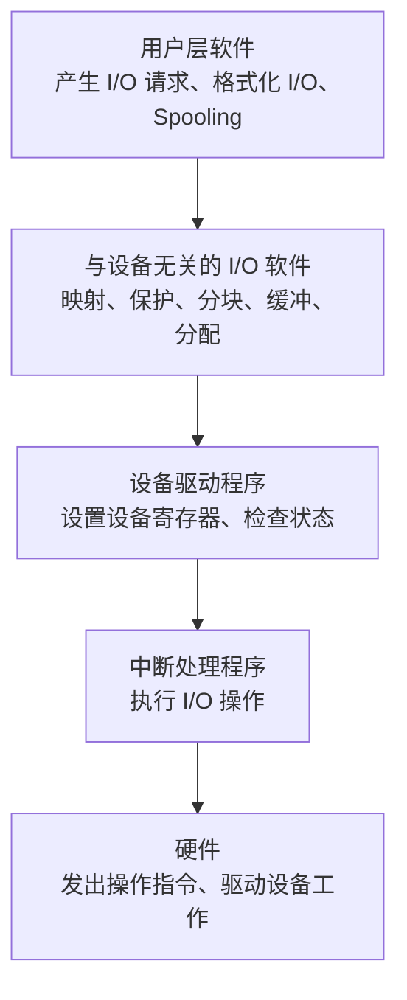

| 层次 | 主要功能 |
| ---- | -------- |
| 用户层 I/O 软件 | 产生 I/O 请求、格式化 I/O、Spooling（库函数、假脱机） |
| 与设备无关的 I/O 软件 | 设备命名/映射、保护、分块、缓冲、设备分配与回收、统一接口、差错控制 |
| 设备驱动程序 | 设置设备寄存器、检查设备状态，将抽象请求转为具体命令 |
| 中断处理程序 | 执行 I/O 操作，处理设备完成中断 |
| 硬件 | 发出操作指令、驱动设备工作 |

#### 设备驱动程序

驱动程序的功能：接收上层发来的抽象 I/O 请求，转换为具体要求后发送给设备控制器，启动设备执行。

特点：

- 是实现与设备无关软件和设备控制器直接通信、转换的程序
- 与设备控制器及 I/O 设备特性紧密相关
- 与 I/O 设备所采用的 I/O 控制方式紧密相关
- 基本部分固化在 ROM 中；允许可重入

设备处理方式（三种）：

- 为每类设备设置一个进程，专门执行该类设备的 I/O 操作
- 在整个系统中设置一个 I/O 进程，执行各类设备的 I/O 操作
- 不设专门处理进程，只为各类设备设置相应的设备驱动程序

设备驱动程序的处理过程：

1. 将抽象要求转换为具体要求
2. 对服务请求进行校验
3. 检查设备的状态
4. 传送必要的参数
5. 启动 I/O 设备

#### 与设备无关的 I/O 软件与设备独立性

为提高 OS 的可适应性和可扩展性，在驱动程序之上设置**与设备无关的 I/O 软件**（设备独立性软件），以实现**设备独立性（设备无关性）**。

> **设备独立性**：应用程序独立于具体使用的物理设备。引入**逻辑设备名**（抽象设备名，如 `/dev/printer`），系统将逻辑设备名转换为物理设备名，从而可实现 **I/O 重定向**（更换设备而不必改变应用程序）。

与设备无关软件的共有操作：

- 提供设备驱动程序的统一接口
- 缓冲管理
- 差错控制
- 独占设备的分配与回收
- 提供独立于设备的逻辑数据块

#### 用户层的 I/O 软件

大部分 I/O 软件在 OS 内部，仍有一小部分在用户层：

- **库函数**：C 语言/UNIX 中系统调用与库函数几乎一一对应；Win32 API
- **系统调用**：应用程序经系统调用间接调用 OS 中的 I/O 过程（用户态→内核态→返回）
- **假脱机（Spooling）系统**

### 设备分配

#### 设备分配中的数据结构

| 数据结构 | 全称 | 作用 | 关键内容 |
| -------- | ---- | ---- | -------- |
| SDT | 系统设备表 | 记录系统中全部设备 | 设备类型、设备标识符、DCT 指针、驱动程序入口 |
| DCT | 设备控制表 | 每台设备一张，记录设备情况 | 设备类型、设备标识符、状态(忙/闲)、指向 COCT 的指针、设备队列队首指针 |
| COCT | 控制器控制表 | 每个控制器一张 | 控制器标识符、状态、与控制器连接的通道表指针、队列首/尾指针 |
| CHCT | 通道控制表 | 每个通道一张 | 通道标识符、状态、与通道连接的控制器表首址、队列首/尾指针 |

> 四张表的关联关系：`SDT → DCT → COCT → CHCT`，自顶向下逐级定位设备所属的控制器和通道。

#### 设备分配考虑的因素与算法

- 设备的固有属性：独占设备、共享设备、虚拟设备采用不同分配策略
- 分配算法：先来先服务（FCFS）、优先级高者优先
- 安全性考虑：安全分配方式（破坏"请求和保持"，不易死锁）、不安全分配方式（需做安全性检查）

#### 独占设备的分配程序

基本分配步骤：**分配设备（查 SDT→DCT）→ 分配控制器（查 COCT）→ 分配通道（查 CHCT）**。三者均空闲时方可启动 I/O。

改进方向：增加设备独立性（使用逻辑设备名）、考虑多通路情况。

#### 逻辑设备名到物理设备名的映射（LUT）

**逻辑设备表 LUT（Logical Unit Table）** 用于将逻辑设备名映射为物理设备名，包含：逻辑设备名、物理设备名、设备驱动程序入口地址。

设置方式：

- 整个系统一张 LUT
- 每个用户一张 LUT

### SPOOLing（假脱机）技术与虚拟设备

为缓和 CPU 高速性与 I/O 设备低速性间的矛盾，引入脱机输入/输出技术。**SPOOLing（Simultaneous Peripheral Operations On-Line）** 即在联机情况下实现的同时外围操作（假脱机技术）：用程序模拟外围控制机，使外围操作与 CPU 处理同时进行。

#### SPOOLing 系统的组成

| 组成部分 | 位置 | 作用 |
| -------- | ---- | ---- |
| 输入井 | 磁盘 | 模拟脱机输入的磁盘，暂存输入设备送来的数据 |
| 输出井 | 磁盘 | 模拟脱机输出的磁盘，暂存用户程序的输出数据 |
| 输入缓冲区 | 内存 | 暂存输入设备送来的数据，再传送到输入井 |
| 输出缓冲区 | 内存 | 暂存输出井送来的数据，再传送给输出设备 |
| 输入进程 Spi | — | 模拟脱机输入外围控制机：输入设备→输入缓冲区→输入井，CPU 需要时从输入井读入内存 |
| 输出进程 Spo | — | 模拟脱机输出外围控制机：内存→输出井，设备空闲时→输出缓冲区→输出设备 |
| 井管理程序 | — | 控制作业与磁盘井之间的信息交换 |

#### SPOOLing 系统的工作流程（以共享打印机为例）

1. 假脱机管理进程在磁盘缓冲区（输出井）申请空闲盘块，将打印数据送入暂存
2. 为用户进程申请一张空白的用户请求打印表，填入打印要求，挂到假脱机文件队列上
3. 打印机空闲时，假脱机打印进程从队首取出一张请求打印表
4. 按表中要求将数据从输出井经内存缓冲区送到打印机打印
5. 打印完再查看队列，非空则重复，队列空则进程阻塞，待新请求到来时唤醒

#### SPOOLing 系统的特点

- 提高了 I/O 的速度
- 将独占设备改造为共享设备
- 实现了虚拟设备功能（多用户共享一台物理打印机，每个用户都感觉独占）

> **守护进程（daemon）**：方案改进时，可取消假脱机管理进程，为打印机建立一个守护进程，由它执行原假脱机管理进程的部分功能；守护进程是**允许使用打印机的唯一进程**。

### 缓冲区管理

引入缓冲的主要原因：

- 缓和 CPU 与 I/O 设备间速度不匹配的矛盾
- 减少对 CPU 的中断频率，放宽对 CPU 中断响应时间的限制
- 解决数据粒度不匹配的问题
- 提高 CPU 与 I/O 设备之间的并行性

#### 缓冲技术对比

| 缓冲类型 | 缓冲区数 | 处理一块数据耗时 | 特点 |
| -------- | -------- | ---------------- | ---- |
| 单缓冲 | 1 | `Max(C, T) + M` | 输入与传送不能并行 |
| 双缓冲（缓冲对换） | 2 | 约 `Max(C, T)` | 装满一区转向另一区，可并行 |
| 循环（环形）缓冲 | 多个 | — | 输入输出速度悬殊时改善效果 |
| 缓冲池 | 公用多个 | — | 多进程共享，利用率高 |

记号约定：`T` 为把一块数据从磁盘读入缓冲区的时间，`M` 为缓冲区数据送到用户工作区的时间，`C` 为 CPU 处理一块数据的时间。

##### 单缓冲（Single Buffer）

每当用户进程发出 I/O 请求，OS 在主存为之分配一个缓冲区。

> 单缓冲处理一块数据的时间为 `Max(C, T) + M`。`T > C` 时约为 `M + T`；反之约为 `M + C`。

##### 双缓冲（Double Buffer）

输入时先送入第一缓冲区，装满后转向第二缓冲区；同时 OS 从第一缓冲区移出数据送用户进程并由 CPU 计算。

> 双缓冲处理一块数据的时间可粗略认为是 `Max(C, T)`；若 `C > T` 则 CPU 不必等待设备输入。

##### 环形缓冲区（Circular Buffer）

输入输出速度相差悬殊时，双缓冲效果不理想，引入多缓冲组织为循环缓冲。

输入缓冲区分三类，并设三个指针：

| 缓冲区类型 | 含义 | 对应指针 |
| ---------- | ---- | -------- |
| R（空缓冲区） | 用于装输入数据的空缓冲 | `Nexti`：输入进程下次可用的空缓冲区 |
| G（满缓冲区） | 已装满数据的缓冲 | `Nextg`：计算进程下一个可用缓冲区 |
| C（现行工作缓冲区） | 计算进程正在使用的缓冲 | `Current`：正在使用的缓冲区 |

主要过程：`Getbuf`（取缓冲区供进程使用并修改指针）、`Releasebuf`（释放缓冲区）。

> 进程间同步问题：当 `Nexti` 追赶上 `Nextg`（输入太快，无空缓冲），或 `Nextg` 追赶上 `Nexti`（计算太快，无满缓冲）时需同步处理。

##### 缓冲池（Buffer Pool）

系统较大时循环缓冲消耗内存大、利用率不高，引入公用缓冲池，供若干进程共享。

缓冲池的三个队列：

- 空闲缓冲队列 emq：空缓冲区链成的队列
- 输入队列 inq：装满输入数据的缓冲区链成的队列
- 输出队列 outq：装满输出数据的缓冲区链成的队列

四种工作缓冲区：收容输入、提取输入、收容输出、提取输出。

通过 `Getbuf`/`Putbuf` 过程对队列操作，既可实现互斥又可保证同步。

#### 缓冲（Buffer）与缓存（Cache）的区别

| 维度 | 缓冲 Buffer | 缓存 Cache |
| ---- | ----------- | ---------- |
| 目的 | 缓和速度/粒度不匹配 | 加快重复访问速度 |
| 数据 | 可保存数据项唯一的现有版本 | 仅保存别处数据项的更快副本 |
| 例子 | I/O 缓冲区 | CPU 缓存、磁盘缓存、光驱缓存 |

> 有时同一内存区既可以是缓冲，也可以是缓存。

### 磁盘性能与磁盘调度

#### 磁盘的结构

- **盘面（磁头）**：每个盘片分一个或两个盘面，每面一个读写磁头
- **磁道（柱面）**：每个盘面分若干条磁道；所有盘面同半径磁道构成柱面
- **扇区**：每条磁道分若干个大小相同的扇区，每个扇区相当于一个盘块（数据块），通常存 512B 数据

> 每条磁道上存储相同数目的二进制位，故内层磁道密度高于外层。

磁盘类型：

- 固定头磁盘：每磁道一个磁头，并行读写，速度快，用于大容量磁盘
- 移动头磁盘：每盘面一个磁头需移动寻道，串行读写，速度较慢，广泛用于中小型磁盘

#### 磁盘容量计算

> 容量 = 磁头数 × 柱面数 × 每磁道扇区数 × 每扇区字节数（每扇区 512B）

- 1.44MB 软盘：`2 × 80 × 18 × 512B = 1.44MB`
- 40GB 硬盘：`16(磁头) × 19710(柱面) × 255(扇区) × 512B ≈ 40GB`

#### 磁盘访问时间 Ta

磁盘访问时间由三部分组成：


| 分量 | 公式/说明 |
| ---- | --------- |
| 寻道时间 Ts | `Ts = m × n + k`，n 为移过磁道数，m 为常数（一般盘 0.2、高速盘 ≤0.1），k 约 2ms；一般温盘 5~30ms |
| 旋转延迟 Tτ | 指定扇区转到磁头下的时间；5400r/min 时平均 `Tτ = ½ × 1/(5400/60)s ≈ 5.56ms` |
| 传输时间 Tt | `Tt = b /(r × N)`，b 为读写字节数，r 为每秒转数，N 为每磁道字节数 |

> 寻道时间和旋转延迟基本与读写数据多少无关，通常占据访问时间的大头，是磁盘调度优化的重点。

访问时间计算示例（4KB 块，5400 RPM，5ms 平均寻道，1Gb/s 传输率，0.1ms 控制开销）：

```
Ta = 5ms（寻道） + 5.56ms（旋转延迟） + 0.04ms（传输） + 0.1ms ≈ 10.7ms
```

#### 磁盘调度算法

由于访问磁盘时间主要是寻道时间，**磁盘调度的目标是使平均寻道时间最小**。

| 算法 | 思想 | 优点 | 缺点 |
| ---- | ---- | ---- | ---- |
| FCFS | 按请求先后次序 | 公平、简单，不会饥饿 | 未优化寻道，平均寻道时间长 |
| SSTF | 选离当前磁道最近的请求 | 寻道性能优于 FCFS | 可能导致进程"饥饿"，不保证全局最优 |
| SCAN（电梯） | 沿当前方向移动，到端点再折返 | 兼顾方向，防饥饿 | 对刚被扫过的磁道响应慢 |
| CSCAN | 单向扫描，到端点直接返回起点（返回不处理） | 等待时间更均匀 | 返回空程开销 |
| C-LOOK | CSCAN 的改进，只到该方向最远请求处即折返 | 减少无效移动 | — |
| NStepSCAN | 队列分成多个长 N 的子队列，子队列内 SCAN，队列间 FCFS | 防止"磁臂粘着" | — |
| FSCAN | NStepSCAN 简化为两个队列：当前队列 SCAN，扫描期间新请求推迟到下次 | 防止"磁臂粘着"，实现简单 | — |

> **SSTF**：选择要求访问的磁道与当前磁头距离最近的进程，使每次寻道时间最短，但不保证平均寻道时间最短。
>
> **SCAN（电梯算法）**：不仅考虑距离，更优先考虑磁头当前的移动方向，磁臂在磁盘上来回扫描，沿途响应请求。
>
> **CSCAN**：将柱面视为环链（首尾相连），磁头单向处理请求，到端点立即返回起点且返回途中不处理请求，提供比 SCAN 更均匀的等待时间。
>
> **"磁臂粘着"现象**：某进程反复请求对同一磁道的 I/O，导致磁臂长期停留；NStepSCAN 与 FSCAN 通过分队列予以避免。


---

## 第八章：文件管理

### 文件和文件系统

#### 数据项、记录与文件

文件系统采用三级数据结构组织数据，从小到大为：数据项 → 记录 → 文件。

| 层次 | 英文 | 含义 |
| ---- | ---- | ---- |
| 数据项（字段） | Data Item / Field | 描述对象某种属性的最小单位。分为**基本数据项**（不可再分）和**组合数据项**（由若干基本数据项组成） |
| 记录 | Record | 一组相关数据项的集合，描述对象某方面的属性。其中能唯一标识一条记录的数据项称为**关键字（Key）**，如学号、"学号+课程号" |
| 文件 | File | 具有文件名的一组相关元素的集合，是文件系统中**最大的数据单位**，描述一个对象集 |

> 文件的主要属性：文件类型、文件长度、文件的物理位置、文件的建立时间等。

#### 文件分类

文件按不同标准可分为多种类型：

| 分类标准 | 类型 |
| -------- | ---- |
| 按用途 | 系统文件、用户文件、库文件 |
| 按数据形式 | 源文件（Source）、目标文件（Object，`.obj`）、可执行文件（Executable） |
| 按存取控制属性 | 只执行文件、只读文件、读写文件 |
| 按组织形式与处理方式 | 普通文件、目录文件、特殊文件（设备文件） |
| 按是否有结构 | 有结构文件（记录式）、无结构文件（流式） |

> 文件名后附加的字符称为**扩展名（Extension）**，用于标识文件类型。

#### 文件的逻辑结构与物理结构

| 维度 | 逻辑结构 | 物理结构 |
| ---- | -------- | -------- |
| 视角 | 用户观点看到的组织形式 | 系统在外存上的存储组织形式 |
| 别名 | 文件组织 | 文件的存储结构 |
| 影响因素 | 与用户的使用方式有关 | 与存储介质性能、外存分配方式有关 |

> 文件的逻辑结构和物理结构都会影响文件的检索速度。

#### 文件系统的层次结构

文件系统模型自底向上分为三个层次：

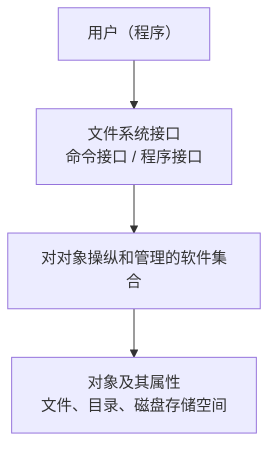

"对对象操纵和管理的软件集合"内部又分层：

1. **I/O 控制层**：最底层，即设备驱动程序层
2. **基本文件系统层**：处理内存与磁盘之间数据块的交换
3. **基本 I/O 管理程序**：完成与磁盘 I/O 有关的事务
4. **逻辑文件系统**：处理与记录、文件相关的操作

文件系统的功能：文件存储空间管理、文件目录管理、逻辑地址到物理地址的转换、文件读写管理、文件共享与保护。

#### 文件操作

| 类别 | 操作 |
| ---- | ---- |
| 最基本操作 | 创建文件、删除文件、读文件、写文件、设置文件读/写位置 |
| 打开与关闭 | **open**：将文件从外存拷贝到内存**打开文件表**的一个表目中；**close**：把文件从打开文件表的表目中删除 |
| 其他操作 | 重命名、改文件拥有者、查询文件状态、创建/删除目录 |

> 引入"打开/关闭"机制的目的：避免每次访问文件都重复检索目录，提高效率。

---

### 文件的逻辑结构

按是否有结构，文件分为两大类：

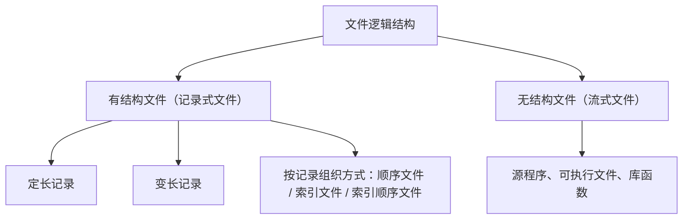

- **有结构文件（记录式文件）**：由若干记录构成，分定长记录和变长记录。
- **无结构文件（流式文件）**：以字符流构成，如源程序、可执行文件、库函数。

#### 顺序文件（Sequential File）

记录按某种顺序排列，有两种排列方式：

| 排列方式 | 说明 | 检索 |
| -------- | ---- | ---- |
| 串结构 | 按记录存入的时间先后排序，顺序与关键字无关 | 检索费时（只能顺序查找） |
| 顺序结构 | 指定一个字段为关键字，所有记录按关键字排序 | 可用折半查找、插值查找、跳步查找等高效算法 |

**优缺点：**

- 优点：有利于大批量记录的读写，存取效率最高；可存储在顺序存储设备（磁带）上。
- 缺点：查找/修改单个记录性能差；增加或删除记录困难。

**记录寻址：**

| 寻址方式 | 访问方式 | 定长记录 | 变长记录 |
| -------- | -------- | -------- | -------- |
| 隐式寻址 | 顺序访问 | 第 i 个记录地址 = 起始 + i×L | 需依次读取前面记录长度累加 |
| 显式寻址 | 直接/随机访问 | 由记录位置直接算地址 Addr = i×L | 难以直接定位，需借助关键字或索引 |

> 定长记录文件第 i 条记录的地址为 `i × L`（L 为记录长度），可直接随机存取；变长记录文件必须顺序扫描，难以直接存取。

#### 索引文件（Index File）

为**变长记录文件**建立一张索引表，索引表按关键字排序，每个表项含（关键字/索引号、记录长度 m、指向记录的指针 ptr）。

```
索引表                逻辑文件
┌────┬────┬─────┐    ┌────┐
│ 0  │ m0 │ ptr ├───>│ R0 │
│ 1  │ m1 │ ptr ├───>│ R1 │
│ 2  │ m2 │ ptr ├───>│ R2 │
│ .. │ .. │ ..  │    │ .. │
└────┴────┴─────┘    └────┘
```

- 优点：实现了不定长（变长）记录文件的随机检索，加快检索速度。
- 缺点：索引表占用额外存储空间。
- 多索引表：可为每一个可能成为检索条件的域各配置一张索引表。

#### 索引顺序文件（Indexed Sequential File）

对顺序文件的改进，新增两个特征，克服了变长记录文件不便于直接存取的缺点：

1. 引入文件索引表 → 实现随机访问；
2. 增加溢出文件 → 记录新增、删除和修改的记录。

它保留顺序文件的核心特征（记录按关键字顺序组织），同时支持快速检索。

**检索效率对比（记录数 N）：**

| 组织方式 | 平均查找记录数 |
| -------- | -------------- |
| 顺序文件 | N/2 |
| 一级索引顺序文件 | √N |
| 两级索引顺序文件 | (3/2)·N^(1/3) |

> 一级索引顺序文件检索效率比顺序文件约提高 √N / 2 倍。

#### 直接文件与哈希文件

| 类型 | 原理 |
| ---- | ---- |
| 直接文件 | 关键字本身决定记录的物理地址，通过键值转换得到地址 |
| 哈希文件（Hash File） | 利用 Hash 函数将记录键值转换为记录地址；需处理哈希冲突 |

---

### 文件的物理结构（外存分配方式）

文件的物理结构指文件在外存上的存储组织形式，常见三种分配方式：连续分配、链接分配、索引分配。

#### 连续分配（Continuous Allocation）

为每个文件分配一组**相邻接**的盘块。目录项中记录起始块号和长度。

- 优点：顺序访问速度快；支持随机访问（地址 = 起始块号 + 偏移）。
- 缺点：要求连续空间，产生**外部碎片**；不便于文件动态增长。

#### 链接分配（Linked Allocation）

为文件分配的盘块可以离散，通过指针链接。分隐式链接与显式链接。

| 类型 | 指针存放位置 | 特点 |
| ---- | ------------ | ---- |
| 隐式链接 | 每个盘块末尾设指针指向下一盘块 | 只支持顺序访问，随机访问慢；指针占用空间，可靠性差（一个指针损坏后续全失） |
| 显式链接（FAT） | 把所有盘块指针集中到内存中的**文件分配表 FAT**（File Allocation Table） | 检索在内存进行，访问速度快；支持随机访问；FAT 常驻内存占空间 |

> FAT 表整个磁盘仅设一张，开机时调入内存。目录项只需记录文件首块号，沿 FAT 链即可找到全部盘块。

#### 索引分配（Indexed Allocation）

为每个文件建立一张**索引表（索引块）**，表中登记该文件全部盘块的块号。目录项指向索引块。

| 类型 | 说明 | 适用 |
| ---- | ---- | ---- |
| 单级索引 | 一个索引块存放文件所有盘块号 | 小文件 |
| 多级索引 | 索引块再指向下一级索引块（类似多级页表） | 大文件 |
| 混合索引 | 同时采用直接地址 + 一/二/三级间接索引（UNIX inode） | 兼顾大小文件 |

**UNIX inode 混合索引（以 13 个地址项为例）：**

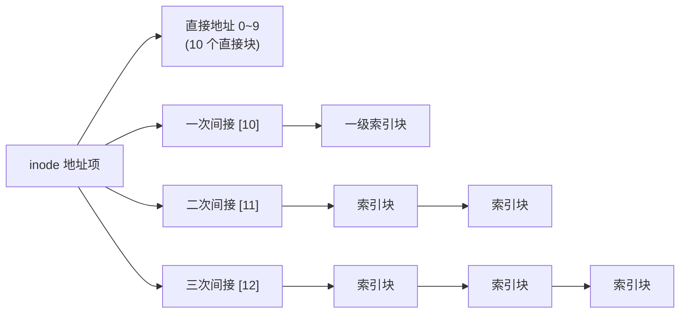

- 直接地址：直接指向数据块，访问小文件最快；
- 一次间接：指向一个索引块，索引块再指向数据块；
- 二次/三次间接：逐级扩展，支持超大文件。

**三种物理结构对比：**

| 方式 | 是否离散 | 随机访问 | 碎片 | 文件增长 | 主要缺点 |
| ---- | -------- | -------- | ---- | -------- | -------- |
| 连续分配 | 否 | 支持，快 | 外部碎片 | 困难 | 需连续空间 |
| 链接分配 | 是 | 隐式不支持/显式支持 | 无外部碎片 | 容易 | 隐式不能随机访问；指针开销 |
| 索引分配 | 是 | 支持 | 无外部碎片 | 容易 | 索引块占额外空间 |

---

### 文件目录

目录是一种数据结构，用于标识文件及其物理地址，实现对文件的有效管理。

**对目录管理的要求：** 实现"按名存取"、提高检索速度、支持文件共享、允许文件重名。

#### 文件控制块 FCB

**文件控制块（File Control Block, FCB）**是管理和控制文件的数据结构，与文件一一对应。一个 FCB 即一个**文件目录项**；文件目录是 FCB 的集合，目录本身也被看作一个文件（**目录文件**）。

FCB 包含的信息分三类：

| 类别 | 内容 |
| ---- | ---- |
| 基本信息类 | 文件名、文件物理位置、文件逻辑结构、文件物理结构 |
| 存取控制信息类 | 文件主的存取权限、核准用户的存取权限、一般用户的存取权限 |
| 使用信息类 | 建立日期与时间、上次修改日期与时间、当前使用信息 |

#### 索引结点 inode

为减少检索目录时的磁盘访问次数，将**文件名**与**文件描述信息**分开，文件描述信息单独用**索引结点（index node, inode / i 节点）**保存（UNIX 方案）。目录项仅保留"文件名 + inode 指针"。

| 类型 | 内容 |
| ---- | ---- |
| 磁盘索引结点 | 文件拥有者标识符、文件类型、文件存取权限、文件物理地址、文件长度、文件连接计数、文件存取时间 |
| 内存索引结点 | 索引结点编号、状态、访问计数、文件所属文件系统逻辑设备号、链接指针 |

> **引入 inode 的收益示例**：FCB 为 64B、盘块 1KB，则每盘块存 16 个 FCB；640 个 FCB 占 40 盘块，平均查找一个文件需启动磁盘 20 次。引入 inode 后每个目录项仅 16B（14B 文件名 + 2B inode 指针），每盘块存 64 项；640 项仅占 10 盘块，平均查找需启动磁盘 5 次——**降为原来的 1/4**。

#### 目录结构

| 结构 | 特点 | 优点 | 缺点 |
| ---- | ---- | ---- | ---- |
| 单级目录 | 所有文件在同一目录中 | 最简单 | 查找慢、不允许重名、不便共享 |
| 两级目录 | 主文件目录（MFD）+ 用户文件目录（UFD），每个用户一个目录 | 检索快、不同用户可重名、可隔离 | 不便于文件共享 |
| 树形目录 | 多级层次结构，含根目录、子目录、数据文件 | 检索快、管理与保护方便、支持重名 | 共享不便（一个文件只有一条路径） |
| 无环图目录（DAG） | 允许一个文件/子目录有多个父目录 | 便于文件共享 | 删除/计数管理复杂（需链接计数） |

**树形目录的路径名：**

- **绝对路径名**：从根目录开始的路径，如 `/spell/mail/prog`；
- **相对路径名**：从**当前目录（工作目录）**开始的路径。

#### 目录操作

创建目录、删除目录（区分是否删除非空目录）、移动目录、改变（切换）目录、链接操作、查找操作。

#### 目录查询技术

| 方法 | 原理 | 限制 |
| ---- | ---- | ---- |
| 线性检索法 | 顺序检索，逐级查找路径中各目录项（如查找 `/usr/ast/mbox`） | 简单但慢 |
| Hash 方法 | 将文件名变换为目录索引值，直接定位 | 模式匹配（`*` `?`）时无法使用；需处理冲突 |

---

### 文件共享

文件共享允许多个用户共用同一文件，节省存储空间。基于有向无环图（DAG）实现，主要有两种方式。

#### 基于索引结点的共享（硬链接 Hard Link）

允许一个文件有多个父目录，各目录项指向**同一个索引结点**，inode 中设置**链接计数 count**。

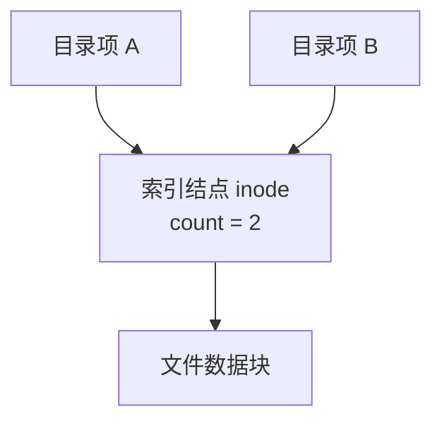

- 创建硬链接时 count + 1，删除一个链接时 count − 1；
- 仅当 count = 0 时才真正删除文件数据；
- 问题：若文件主删除文件，count 减 1 但文件仍存在，文件主仍被记账，存在归属问题。

#### 基于符号链接的共享（软链接 / 符号链接 Symbolic Link）

允许文件有多个父目录，但仅有一个为**主父目录**，其余通过**符号链接**指向。Linux 创建命令：`ln -s 源文件 目标文件`。

符号链接文件中存放的是**被链接文件的路径名**。

| 维度 | 硬链接 | 软链接（符号链接） |
| ---- | ------ | ------------------ |
| 实现 | 共享同一 inode，靠链接计数 | 独立文件，存放目标路径名 |
| 跨文件系统 | 不支持 | 支持 |
| 链接目录 | 一般不允许 | 允许 |
| 删除源文件 | 文件仍存在（count>0） | 留下**悬空指针**（dangling），软链接失效 |
| 访问开销 | 小 | 大（需多次读盘解析路径，增加启动磁盘频率） |

> 符号链接的优点：不会出现"文件拥有者删除共享文件后留下悬空指针被他人误用"的归属问题；缺点：每次访问可能多次读盘，开销大。

---

### 文件保护

#### 影响文件安全的因素与措施

| 影响因素 | 对应措施 |
| -------- | -------- |
| 人为因素 | 存取控制机制 |
| 系统因素 | 系统容错技术 |
| 自然因素 | 建立后备系统（备份） |

#### 保护域与访问权

- **访问权（Access Right）**：一个进程能对某对象执行操作的权利，表示为（对象名，权集），如 (F1, {R/W})。
- **保护域（Protection Domain）**：进程对一组对象访问权的集合。
  - 进程与域**一一对应** → 静态联系方式（静态域）；
  - 进程与域**一对多** → 动态联系方式。

#### 访问矩阵（Access Matrix）

用矩阵描述系统的访问控制：**行代表域，列代表对象**，每一项为该域对该对象的访问权。

**访问矩阵的扩展（修改规则）：**

| 权限 | 作用 |
| ---- | ---- |
| 切换权（Switch, S） | 允许进程从一个保护域切换到另一个域 |
| 复制权（Copy, *） | 将某域拥有的访问权扩展到同一列（同一对象）的其他域 |
| 所有权（Owner, O） | 可增加或删除同一列中其他域对该对象的访问权 |
| 控制权（Control） | 改变同一行（同一域）中各项访问权，即改变某域对不同对象的访问权 |

#### 访问矩阵的实现

访问矩阵通常是**稀疏矩阵**，按行或按列压缩存储：

| 方式 | 划分依据 | 结构 | 说明 |
| ---- | -------- | ---- | ---- |
| 访问控制表 ACL（Access Control List） | 按**列（对象）**划分 | 每个对象一张表，删除空项，由（域，权集）组成 | 当对象是文件时，ACL 存放在文件的 FCB 中 |
| 访问权限表（Capability List 能力表） | 按**行（域）**划分 | 每个域一张表 | 描述一个用户对文件的一组操作权限 |

> 实际系统中，UNIX/Linux 采用简化的**权限位**（rwx，分 owner/group/other 三组共 9 位）；Windows 采用完整的 ACL。

---

### Linux 文件系统实例

#### 虚拟文件系统 VFS

**虚拟文件系统（Virtual File System, VFS）**隐藏各种硬件（本地存储、远程网络存储）的具体细节，将文件系统操作与各具体文件系统的实现分离，为所有设备提供**统一接口**，使 Linux 可支持数十种不同文件系统。

VFS 支持的四个主要对象：

| 对象 | 英文 | 描述 |
| ---- | ---- | ---- |
| 超级块 | superblock | 对一个文件系统的描述 |
| 索引节点 | inode | 对一个文件**物理属性**的描述 |
| 目录项 | dentry | 对一个文件**逻辑属性**的描述 |
| 文件 | file | 对当前进程已打开文件的描述 |

#### ext2 文件系统

ext2 文件系统由超级块、组描述符、位图、inode 表、数据块等组成：

| 组成部分 | 作用 |
| -------- | ---- |
| 超级块 | 记录整个文件系统的信息 |
| 组描述符 | 描述每个组块的开始与结束 block 号 |
| 块位图（位示图） | 用一个二进制位表示数据块是否空闲 |
| 索引节点位图 | 用一个二进制位表示 inode 是否被使用 |
| 索引节点表 | 每个 inode 固定 128B，一个文件占一个 inode，文件数量受 inode 数量限制 |
| 数据块 | 每个数据块只放一个文件的数据，块大小支持 1KB / 2KB / 4KB |

---

### 附：本章要点速查

#### 文件存储空间管理方法（综合）

文件存储空间（外存空闲块）的管理常用以下方法：

| 方法 | 原理 | 优缺点 |
| ---- | ---- | ---- |
| 空闲表法 | 为所有空闲区建一张空闲表，记录（首块号，块数），属连续分配 | 适合连续分配；空闲区多时表大 |
| 空闲链表法 | 将空闲块/空闲盘区拉成一条链（空闲盘块链 / 空闲盘区链） | 实现简单；分配回收效率较低 |
| 位示图法（Bitmap） | 用一个二进制位对应一个盘块，0/1 表示空闲/占用 | 占用空间小，可常驻内存，便于查找连续块 |
| 成组链接法 | 空闲表法与空闲链表法结合，将空闲块分组，组间用栈式链接（UNIX 采用） | 兼顾效率与空间，适合大型文件系统 |

> 位示图盘块号换算：若位示图按行列编号，盘块号 b = n×(i−1) + j（n 为每行位数，i 行 j 列），反之可由 b 求行列。

#### 打开文件机制

系统维护两级打开文件表：

| 表 | 位置 | 作用 |
| -- | ---- | ---- |
| 系统打开文件表 | 内核（整个系统一张） | 登记所有被打开文件的 inode 信息及打开计数，多个进程共享同一表项 |
| 用户打开文件表 | 每个进程一张（PCB 中） | 记录本进程打开的文件，表项含读写指针、访问权限及指向系统打开文件表的指针 |

> open 操作流程：检索目录 → 找到 FCB/inode 调入内存系统打开文件表 → 在用户打开文件表建立表项 → 返回文件描述符（fd）。后续读写均通过 fd 进行，无需再次检索目录。

#### 文件读写过程

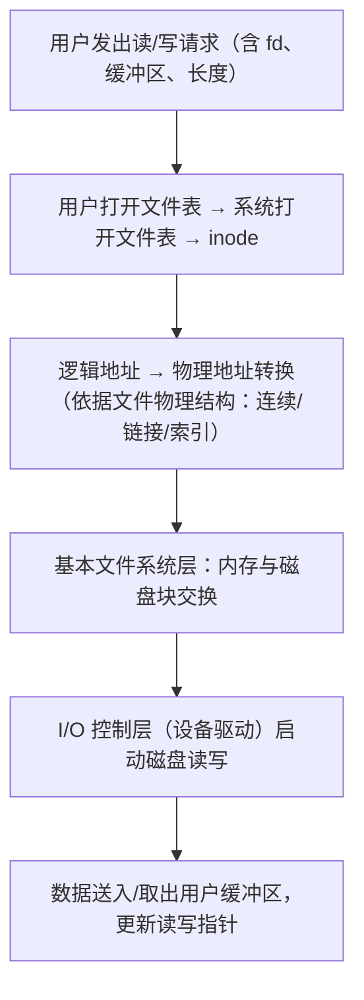

#### 高频考点

- 三种物理结构（连续/链接/索引）的随机访问能力、碎片、寻址方式对比
- FAT 显式链接 vs 隐式链接的区别
- UNIX inode 混合索引的寻址与最大文件大小计算
- 引入 inode 减少磁盘访问次数的计算
- 硬链接 vs 软链接（符号链接）的区别与悬空指针问题
- 索引顺序文件的检索效率（√N、(3/2)N^(1/3)）
- 文件存储空间管理四法（位示图盘块号换算）
- ACL（按列）vs 访问权限表（按行）

#### 易混淆概念

- 逻辑结构 vs 物理结构
- 顺序文件 vs 索引文件 vs 索引顺序文件
- 隐式链接（FAT 之前）vs 显式链接（FAT）
- 硬链接 vs 软链接
- FCB vs inode
- 系统打开文件表 vs 用户打开文件表
- 空闲表法 vs 空闲链表法 vs 位示图 vs 成组链接法


---

## 第九章：磁盘存储器管理

磁盘（Disk）是当前最主要的外存（辅存）设备，文件的物理结构、外存的组织方式与磁盘的物理特性、访问效率密切相关。本章围绕磁盘的结构与访问、磁盘调度、I/O 速度优化、磁盘冗余阵列与容错、存储新技术等展开。

### 磁盘的结构

#### 物理结构（盘面、磁道、扇区、柱面、磁头）

磁盘由若干个**盘片（Platter）**叠装在主轴上高速旋转构成，每个盘片有上下两个**盘面（Surface）**，每个盘面对应一个**磁头（Head）**。

| 概念             | 英文      | 含义                                                       |
| ---------------- | --------- | ---------------------------------------------------------- |
| 盘面             | Surface   | 盘片的一个面，每面一个磁头                                  |
| 磁道             | Track     | 盘面上的同心圆，由外向内编号；数据按磁道存储                |
| 扇区             | Sector    | 磁道被划分成的弧段，是磁盘读写的**最小物理单位**（如 512B）|
| 柱面             | Cylinder  | 所有盘面上**半径相同的磁道**构成的集合                      |
| 磁头             | Head      | 读写磁道数据的部件，每个盘面一个                            |

> 数据寻址通常用 **(柱面号 Cylinder, 磁头号 Head, 扇区号 Sector)** 三元组（CHS 寻址）确定一个扇区。为减少寻道，文件数据应优先在**同一柱面**内连续分配——同一柱面切换磁头无需移动磁臂。

磁盘容量计算：

$$\text{磁盘容量} = \text{磁头数} \times \text{每面磁道数} \times \text{每道扇区数} \times \text{扇区字节数}$$

#### 磁盘类型（固定头磁盘与移动头磁盘）

| 类型       | 英文            | 磁头配置                       | 特点                                         |
| ---------- | --------------- | ------------------------------ | -------------------------------------------- |
| 固定头磁盘 | Fixed-head Disk | 每条磁道一个磁头，磁头不移动    | 无寻道时间，访问快、成本高，用于大容量高速盘 |
| 移动头磁盘 | Movable-head Disk | 每盘面一个磁头，磁头随磁臂移动 | 需寻道，结构简单、价格低，普通硬盘均属此类   |

按记录方式还可分为**硬盘（HDD）**与**软盘**；按是否密封分为温彻斯特盘等。

### 磁盘访问时间

一次磁盘 I/O 的访问时间 $T_a$ 由三部分组成：

$$T_a = T_s + T_r + T_t$$

| 分量         | 英文                | 含义                                       |
| ------------ | ------------------- | ------------------------------------------ |
| 寻道时间 $T_s$ | Seek Time         | 磁头移动到目标磁道（柱面）所需时间          |
| 旋转延迟 $T_r$ | Rotational Latency| 目标扇区旋转到磁头下方所需时间              |
| 传输时间 $T_t$ | Transfer Time     | 数据读写（传输）所需时间                    |

#### 各分量公式

- **寻道时间**：$T_s = m \times n + s$，其中 $n$ 为跨越的磁道数，$m$ 为每移动一道的时间常数，$s$ 为启动磁臂时间。
- **旋转延迟**：平均旋转延迟为旋转半周的时间。若转速为 $r$（转/秒），则
$$T_r = \frac{1}{2r}$$
- **传输时间**：读 $b$ 字节，每道 $N$ 字节，转速 $r$，则
$$T_t = \frac{b}{rN}$$

#### 计算示例

> 设磁盘转速 $r = 7200\ \text{rpm} = 120\ \text{转/秒}$，平均寻道时间 $T_s = 8\ \text{ms}$，每磁道 $N = 512\times 1000\ \text{B}$，读取 $b = 4\text{KB}$ 数据。
>
> - 平均旋转延迟：$T_r = \dfrac{1}{2 \times 120}\ \text{s} = 4.17\ \text{ms}$
> - 传输时间：$T_t = \dfrac{4096}{120 \times 512000}\ \text{s} \approx 0.067\ \text{ms}$
> - 总访问时间：$T_a = 8 + 4.17 + 0.067 \approx 12.24\ \text{ms}$

可见**寻道时间和旋转延迟是主要瓶颈**，传输时间占比很小，因此磁盘调度算法的核心目标是**减少寻道时间**。

### 磁盘调度算法

当多个 I/O 请求等待服务时，系统按某种策略决定服务顺序，以减小平均寻道时间（移动磁道数）。

> **示例公共条件**：磁头当前位于 **100** 号磁道（刚处理完 100），磁盘共 0~199 道。请求队列（到达先后）为：
> **55, 58, 39, 18, 90, 160, 150, 38, 184**

#### 1. 先来先服务 FCFS（First-Come First-Served）

按请求到达的先后顺序服务，公平、简单，但未优化寻道，平均寻道距离长。

服务顺序：100 → 55 → 58 → 39 → 18 → 90 → 160 → 150 → 38 → 184
移动磁道数 = 45+3+19+21+72+70+10+112+146 = **498**

#### 2. 最短寻道时间优先 SSTF（Shortest Seek Time First）

每次选择**距当前磁头最近**的请求服务。寻道性能优于 FCFS，但可能使远端请求**饥饿（Starvation）**，且磁头来回摆动。

从 100 出发，依次选最近：100 → 90 → 58 → 55 → 39 → 38 → 18 → 150 → 160 → 184
移动磁道数 = 10+32+3+16+1+20+132+10+24 = **248**

#### 3. 扫描算法 SCAN（电梯算法）

磁头沿一个方向移动，途中顺序服务所有请求，到达**最边缘**后反向，如同电梯。避免饥饿，性能较好。

设当前向**磁道号增大**方向移动：100 → 150 → 160 → 184 → **199**(端点) → 90 → 58 → 55 → 39 → 38 → 18
移动磁道数 = (199−100) + (199−18) = 99 + 181 = **280**

#### 4. 循环扫描 CSCAN（Circular SCAN）

只在**单一方向**服务，到达一端后直接快速返回起点（返程不服务），再次单向扫描。使各磁道**响应时间更均匀**。

向增大方向：100 → 150 → 160 → 184 → 199 → (返回)0 → 18 → 38 → 39 → 55 → 58 → 90
移动磁道数 = (199−100) + (199−0) + (90−0) = 99 + 199 + 90 = **388**

#### 5. LOOK 与 C-LOOK

SCAN/CSCAN 的改进：磁头**不必到达物理端点**，只移动到该方向上**最远的请求**处即掉头/返回。

- **LOOK**：向增大方向走到 184 即掉头，不到 199。
移动磁道数 = (184−100) + (184−18) = 84 + 166 = **250**
- **C-LOOK**：到 184 后直接返回到该方向最小请求 18，再单向服务。
移动磁道数 = (184−100) + (184−18) + (90−18) = 84 + 166 + 72 = **322**

#### 6. N-Step-SCAN（分步扫描）

将请求队列分成若干长度为 N 的**子队列**，按 FCFS 处理各子队列，每个子队列内部用 SCAN。处理某子队列时新到的请求放入下一子队列，从而**避免磁臂粘着（Arm Stickiness）**——防止 SSTF/SCAN 因新请求不断到达同一磁道而长期停留。

#### 7. FSCAN

N-Step-SCAN 的简化，只用**两个队列**：扫描当前队列时，所有新到请求放入另一队列，待当前队列处理完后再处理新队列。同样可消除磁臂粘着。

#### 算法对比

| 算法        | 是否优化寻道 | 是否会饥饿 | 是否磁臂摆动 | 特点                         |
| ----------- | ------------ | ---------- | ------------ | ---------------------------- |
| FCFS        | 否           | 否         | 是           | 公平简单，效率最低           |
| SSTF        | 是           | **是**     | 是           | 寻道短，远端请求饥饿         |
| SCAN        | 是           | 否         | 否（单向）   | 电梯式，性能与公平兼顾       |
| C-SCAN      | 是           | 否         | 否           | 响应时间均匀                 |
| LOOK/C-LOOK | 是           | 否         | 否           | SCAN/CSCAN 改进，不到端点    |
| N-Step-SCAN | 是           | 否         | 否           | 分组，防磁臂粘着             |
| FSCAN       | 是           | 否         | 否           | 双队列，防磁臂粘着           |

> 本例移动磁道数对比（参考）：FCFS 498 > C-SCAN 388 > C-LOOK 322 > SCAN 280 > LOOK 250 > SSTF 248。实际工程多采用 **SCAN/LOOK 系列**。

### 提高磁盘 I/O 速度的途径

磁盘 I/O 速度远低于内存访问速度，已成为系统瓶颈。主要思路：磁盘高速缓存 + 其他优化方法。

#### 磁盘高速缓存（Disk Cache）

在**内存**中为磁盘盘块开辟一个缓冲区，保存某些盘块的副本。访问磁盘时先查缓存：命中则直接读取；未命中才启动磁盘读入并送入缓存。

设计需考虑的问题：

- **数据交付方式**：
  - 数据交付（Data Delivery）：把缓存中的数据复制到请求进程的内存区。
  - 指针交付（Pointer Delivery）：只把指向缓存中数据的指针交给进程，省去复制。
- **置换算法**：常用 LRU、Clock（最近未用）、最少使用（LFU）等。
- **周期性写回磁盘**：LRU 下常用盘块可能长期不写回，断电会丢数据。UNIX 设后台进程（如 `update`/`syncer`）周期性把脏块写回磁盘。

#### 其他提高 I/O 速度的方法

| 方法           | 英文            | 思想                                                         |
| -------------- | --------------- | ------------------------------------------------------------ |
| 提前读         | Read-ahead      | 读当前块时预测顺序访问，提前把下一盘块读入缓冲区             |
| 延迟写         | Delayed-write   | 数据先留在缓冲区标记延迟写，被再次访问可直接用，稍后才写回   |
| 优化物理块分布 | —               | 同一文件的盘块安排在同一/相邻磁道，减少磁头移动距离          |
| 虚拟盘         | RAM Disk        | 用内存空间仿真磁盘（RAM 盘），访问快但断电即失，适合临时数据 |

### 廉价磁盘冗余阵列 RAID

RAID（Redundant Array of Inexpensive/Independent Disks）用一台阵列控制器统一管理一组磁盘驱动器，组成大容量磁盘系统。

核心技术：**并行交叉存取（Striping）**——将一个盘块的数据分成若干子块，分散存到不同磁盘的相同位置；读写时各磁盘并行传输，大幅减少传输时间。

优点：**容量大、I/O 速度快（并行）、可靠性高（冗余）、性价比高**。

#### RAID 级别对比

| 级别   | 名称           | 技术特点                               | 冗余/容错        | 磁盘利用率           |
| ------ | -------------- | -------------------------------------- | ---------------- | -------------------- |
| RAID 0 | 条带（Stripe） | 数据分块条状分散到多盘，无冗余         | **无**容错       | 100%，性能最高       |
| RAID 1 | 镜像（Mirror） | 数据完全复制到另一组盘                 | 容错强           | 50%                  |
| RAID 2 | 海明码         | 位级条带 + 海明纠错码                  | 可纠错           | 较低，已少用         |
| RAID 3 | 位/字节级 + 专用校验盘 | 数据条带 + 一块专用奇偶校验盘   | 容单盘故障       | 较高                 |
| RAID 4 | 块级 + 专用校验盘 | 块级条带 + 一块专用校验盘           | 容单盘故障       | 校验盘成瓶颈         |
| RAID 5 | 块级 + 分布校验 | 数据与**校验信息分散**到各盘          | 容单盘故障       | $(N-1)/N$，最常用    |
| RAID 6 | 双重分布校验   | 两份独立校验，分散存放                 | **容两盘**故障   | $(N-2)/N$            |

> 常用组合还有 **RAID 10（1+0，先镜像再条带）**：兼顾高性能与高可靠。RAID 5 在性能、容量与可靠性间取得良好平衡，应用最广。

### 提高磁盘可靠性的技术（磁盘容错）

**容错技术**通过设置冗余部件提高系统可靠性。磁盘容错（SFT, System Fault Tolerance）分为三级。

#### 第一级容错技术 SFT-I

最基本，防止**磁盘表面缺陷**导致的数据丢失：

- **双份目录和双份 FAT**：一份为主、一份为备份，损坏时用备份恢复。
- **热修复重定向（Hot Fix）**：划出磁盘容量的一小部分（约 2%~3%）作热修复重定向区，发现缺陷扇区时把待写数据改写到该区。
- **写后读校验（Read-after-Write）**：每写一个数据块后立即读回，与内存中保留的原数据比较，一致则成功，否则重写。

#### 第二级容错技术 SFT-II

防止**磁盘驱动器/控制器故障**：

- **磁盘镜像（Disk Mirroring）**：同一控制器下增设一个完全相同的驱动器，写主盘时同步写备份盘，两盘位像图相同。容错但利用率降为 50%。
- **磁盘双工（Disk Duplexing）**：两个驱动器分别接到两个独立的控制器上，互为镜像。各盘有独立通道，可**并行读写**，且控制器故障也能容错。

#### 第三级：基于集群系统的容错技术（SFT-III）

集群（Cluster）是一组互连的自主计算机组成的统一系统，主要工作模式：

| 模式           | 描述                                                       | 系统利用率/特点         |
| -------------- | ---------------------------------------------------------- | ----------------------- |
| 双机热备份     | 主服务器运行，备份机监视，主故障时立即接替                 | 易实现、支持远程，效率约 50% |
| 双机互为备份   | 两台均在线各自工作，互为备份                               | 效率高，可扩至多台      |
| 公用磁盘模式   | 多台机连一台公用磁盘，按卷使用，某机故障则重配调度替代     | 消除复制开销，减少网络/服务器开销 |

#### 后备系统（Backup）

保存暂时不用但仍有价值的数据，常用设备：磁带机、硬盘、光盘驱动器。

### 存储新技术

#### 传统存储系统架构

| 架构  | 全称                       | 特点                                                 |
| ----- | -------------------------- | ---------------------------------------------------- |
| DAS   | 直连式存储 Direct-Attached | 经总线适配器直连主机，无网络设备参与                 |
| NAS   | 网络附加存储 Network-Attached | 提供**文件级**访问，用 NFS、SMB/CIFS 等协议        |
| SAN   | 存储区域网络 Storage Area Network | 经光纤交换机搭建专用存储网络，提供**块级**访问 |

#### 新型存储系统

- **分布式存储**：C/S 架构、P2P 架构。
- **云存储**：由第三方运营商提供的在线存储系统。

#### 硬盘新技术

- **机械硬盘 HDD**：传统磁记录 CMR、叠瓦式 SMR、热辅助磁记录 HAMR、双磁头驱动臂 Mach.2。
- **固态硬盘 SSD（Solid State Drive）**：用固态电子存储芯片阵列制成，无机械寻道、**无寻道与旋转延迟**、抗震、低功耗、随机访问快。类型：
  - 基于闪存（Flash）的 SSD（最常见）；
  - 基于 DRAM 的 SSD；
  - 基于 3D XPoint 类的 SSD。

> SSD 注意点：闪存有**擦写次数寿命限制**，需**磨损均衡（Wear Leveling）**与 **TRIM** 指令优化；按页读写、按块擦除。

### 引导块与坏块管理

#### 引导块（Boot Block）

磁盘第一个扇区（如 **MBR**，主引导记录）存放**引导程序（Bootstrap）**。开机时 ROM 中的固化代码读取引导块，由引导块装入操作系统内核完成系统启动。含引导程序与引导信息的磁盘称为**系统盘/引导盘**。

#### 坏块管理（Bad Block）

磁盘使用中会出现物理损坏的**坏块/坏扇区**，常见处理方式：

- **简单标记**：在 FAT/位示图中把坏块标记为"已占用/坏"，不再分配（软扇区法）。
- **扇区备用（Sector Sparing / 扇区转移）**：磁盘控制器预留备用扇区，发现坏块后用备用扇区**替换**并维护重定向映射（与 SFT-I 的热修复重定向思想一致）。
- **扇区滑动（Sector Slipping）**：将坏块之后的数据依次后移到下一扇区。

---

> **本章高频考点**
> - 磁盘访问时间三要素与公式：$T_a = T_s + T_r + T_t$，平均旋转延迟 $=\dfrac{1}{2r}$。
> - 各磁盘调度算法给定请求序列**计算移动磁道数**并排序对比（FCFS/SSTF/SCAN/CSCAN/LOOK/CLOOK）。
> - SSTF 的**饥饿**问题；N-Step-SCAN、FSCAN 解决**磁臂粘着**。
> - RAID 0/1/5/6/10 的技术特点、容错能力与磁盘利用率。
> - 磁盘容错三级技术（双份 FAT、热修复、写后读校验；磁盘镜像 vs 磁盘双工；集群模式）。
> - 提高 I/O 速度：磁盘高速缓存、提前读、延迟写、优化物理块分布、虚拟盘。


---

## 第十章：多处理机操作系统

多处理机系统（multiprocessor system）采用并行技术令多个 CPU 同时运行，使系统总体计算能力远超单 CPU 系统。安装在多处理机系统上的操作系统称为多处理机操作系统（multiprocessor OS）。

### 10.1 多处理机系统的引入

#### 引入原因

| 原因 | 说明 |
| --- | --- |
| CPU 时钟频率问题 | 依靠提高时钟频率提升运算速度的方法已接近物理极限 |
| 增加系统吞吐量 | 处理机数目增加，系统处理能力相应增强 |
| 节省投资 | 达到相同处理能力时，n 个处理机的系统比 n 台独立计算机更省费用 |
| 提高系统可靠性 | 具备系统重构功能，单个处理机故障后可重构并继续运行 |

#### 多处理机系统的类型

**（1）按 CPU 间耦合的紧密程度划分**

| 类型 | 互连方式 | 特点 |
| --- | --- | --- |
| 紧密耦合（tightly coupled） | 高速总线或高速交叉开关 | 共享内存与 I/O 设备；可全局共享存储器，也可每个 CPU 仅访问其对应的存储器模块 |
| 松弛耦合（loosely coupled） | 通道或通信线路 | 每台计算机独立工作，各配 OS 管理本地资源，必要时经通信线路交换信息 |

> 紧密耦合的实现方式有两种：① 多处理机共享内存系统和 I/O 设备，每个 CPU 均可访问整个存储器；② 将内存划分为若干可独立访问的存储器模块，每个 CPU 仅访问其所对应的存储器模块。

**（2）按所用 CPU 是否相同划分**

| 类型 | 说明 |
| --- | --- |
| 对称多处理机（SMP，symmetric multiprocessor） | 各 CPU 在功能和结构上完全相同；当前绝大多数多处理机系统属此类 |
| 非对称多处理机（ASMP，asymmetric multiprocessor） | 含多种类型 CPU，功能结构各异；只有一个主处理器，其余为从处理器 |

### 10.2 多处理机系统的结构

#### 10.2.1 统一内存访问（UMA）结构

统一内存访问（uniform memory access，UMA），又称一致性内存访问。各 CPU 功能结构相同、无主从之分，属 SMP 系统。

> UMA 的核心特征：每个 CPU 均可访问不同模块中的存储器单元，且对每个存储器单元的读写速度都相同。

UMA 有四种典型结构：

| 结构 | 要点 | 优缺点 |
| --- | --- | --- |
| 单总线 SMP | 多 CPU 与集中存储器经公用总线相连，均可访问不同存储器模块 | 缺点：伸缩性有限，竞争总线形成总线瓶颈；解决方案：为每个 CPU 配置高速缓存 |
| 多总线 SMP | 所有 CPU 共享一个高速缓存，并各有一个本地私有存储器 | 缓解总线瓶颈；但提高了对编译器的要求，增加编程难度 |
| 单级交叉开关 SMP | 经 N×N 交叉开关阵列将 CPU 与存储器节点互连 | 交叉开关成本为 $N^2$（N 为端口数），限制了在大规模系统中的应用 |
| 多级交换网络 SMP | 经多级交换网络互连，所有资源对每个 CPU 共享 | 硬件昂贵，CPU 数目不宜过多（一般 100 个以内） |

> 单级交叉开关：在 N×N 阵列中，每行每列同时只能有一个交叉点开关处于"开"状态；为支持并行存储访问，CPU—存储器联接时每一行可同时接通多个交叉点开关，每一列只能接通一个。

> 四种 SMP 结构的共同特征是**共享**：系统所有资源（内存、I/O 等）对每个 CPU 均共享；多条到每个存储器模块的路径减少了阻塞概率、分散了流量、提高了访问速度。

#### 10.2.2 非统一内存访问（NUMA）结构

非统一内存访问（nonuniform memory access，NUMA），又称非一致存储访问。访问时间会因存储字的位置不同而变化。全局共享存储器与各 CPU 本地存储器共同构成全局地址空间，可被所有 CPU 访问。

NUMA 的特点：

- 所有共享存储器在物理上分布式、逻辑上连续，其集合即全局地址空间；
- 每个 CPU 都可访问整个系统内存，但访问所用指令不同；
- 每个 CPU 访问本地存储器的速度远高于访问共享存储器或远程节点存储器（远地内存）的速度。

**CC-NUMA 结构（Cache-Coherent NUMA）**

为减少 CPU 对远程内存的访问，可为每个 CPU 配备专属高速缓存，这样的结构称为 CC-NUMA。

- 将每个 CPU 的若干高速缓存单元组成高速缓存块，并为每个 CPU 配置一张**高速缓存块目录表**，记录和维护各缓存块的位置与状态；
- 每条访存指令先查目录表，判断目标存储单元是否已存在于某缓存块中，再进行相应操作（移入缓存、读取缓存、变换缓存块节点、修改目录表等）。

> CC-NUMA 主要问题：访问远地内存的时延远超本地内存，因此 CPU 数量增加时，系统性能无法线性增加。

### 10.3 多处理机操作系统的特征与分类

#### 10.3.1 特征

| 新特征 | 含义 |
| --- | --- |
| 并行性 | 进程间同时存在并行执行与并发执行两种关系 |
| 分布性 | 任务的分布、资源的分布、控制的分布 |
| 处理机间通信和同步性 | 不同处理机间的同步与通信，实现机制远比单处理机复杂 |
| 可重构性 | 资源故障时能自动切除故障资源、换上备份资源并重构系统，保证继续工作 |

#### 10.3.2 功能

- **进程管理**：相互合作的进程可能运行在不同处理机甚至不同机器上，通信涉及处理机间通信。
- **进程调度**：主要考虑如何实现负载的平衡。
- **进程同步**：既要解决并发执行的同步问题，又要解决多处理机并行执行引发的同步问题。
- **进程通信**：实现合作进程间的信息交换。
- **存储器管理**：包含三类专门机构——
  - 访问冲突仲裁机构：多处理机进程竞争同一存储器模块时，按规则决定谁可立即访问、谁须等待；
  - 数据一致性机制：共享内存数据出现在多个本地存储器时，保证数据一致性；
  - 地址变换机构：将虚拟地址转换为物理地址，并确定访问的是本地还是远地存储器。
- **文件管理**：集中式（集中存于某一处理机统一管理）、分散式（各处理机管理自己的文件系统）、分布式（文件分布于不同处理机但逻辑上为整体，用户无须了解物理位置）。
- **系统重构**：资源故障时自动切除并换上备份；无备份则降级运行；故障机上的进程与可用资源可安全迁移到正常处理机继续执行。

#### 10.3.3 类型

| 类型 | 工作方式 | 优点 | 缺点 | 适用场景/实例 |
| --- | --- | --- | --- | --- |
| 主从式（master-slave） | OS 始终运行于主处理机，记录所有处理机的属性状态，将从处理机视作可调度资源并分配任务；从处理机无调度功能，只运行被分配的任务 | 易于实现 | 资源利用率低、安全性差 | 负载不重、从处理机少且性能远低于主处理机的 ASMP 系统 |
| 独立监督式（独立管理程序系统） | 每个处理机各有自己的管理程序（内核）和专用资源，各自服务自身需要、管理自己的资源、分配任务 | 自主性强、可靠性高 | 实现复杂、存储空间开销大、处理机负载不平衡 | 实例：IBM 370/158 等 |

### 10.4 多处理机操作系统的进程同步

#### 10.4.1 集中式同步方式与分布式同步方式

**中心同步实体**：同步实体（硬件锁、信号量、进程等）若满足——① 具有唯一的名字且为彼此需同步的所有进程所知；② 任一时刻任一进程都可访问它——则称为中心同步实体。

| 方式 | 特征 | 缺点 |
| --- | --- | --- |
| 集中式同步算法 | 仅由中心控制节点判定选择一个进程执行；判定所需全部信息集中于中心控制节点 | 可靠性差、易形成瓶颈 |
| 分布式同步算法 | 所有节点信息相同、仅基于本地信息判定、担负相同职责与工作量；通常单节点故障不会导致系统崩溃 | —— |

> 中心进程方式：中心（协调）进程保存所有用户的存取权限、冲突图等信息；进程进入临界区需收发"请求—回答—释放"三类消息。为提高可靠性，中心进程可以浮动。

**适用场景**：单处理机系统和共享存储器多处理机系统基本采用集中式；分布式系统采用分布式；松散耦合多处理机系统（含计算机网络）一部分用集中式、一部分用分布式。

#### 10.4.2 自旋锁（spin lock）

在多处理机系统中，总线由多个处理机竞争共享，须引入对总线互斥的机制。自旋锁大量应用于存在总线资源竞争的系统，但不局限于总线竞争。

利用自旋锁实现总线互斥的方法：在总线上设一个自旋锁，最多被一个内核进程持有；需读写存储单元前先请求自旋锁；若锁被占用，进程一直"旋转"循环测试锁状态直至可用；若未被占用则立即获得并继续执行，读写完成后释放。

> 自旋锁与信号量的主要差别：自旋锁可避免调用进程发生阻塞，效率高于信号量机制。

自旋锁类型：普通自旋锁、读写自旋锁、大读者自旋锁。基本形式：

```
spin_lock(&lock);
临界区代码;
spin_unlock(&lock);
```

#### 10.4.3 读-复制-更新锁（RCU，read-copy-update）

引入：读写问题中若写进程在写、所有读进程均阻塞，写时间过长会严重影响读进程。

解决方法：改变写方式——写操作时先读文件，将内容复制到一个副本，仅对副本修改；修改完成后整体写回原文件。对受 RCU 保护的共享文件，无论读者还是写者都以读的方式访问。

- 写回时机：在所有读者完成读任务后再将修改后的文件写回。
- 优点：实质是改进的读写自旋锁；读者不会被阻塞；无需为共享文件设置同步机构。

#### 10.4.4 二进制指数补偿算法

基本思想：为每个 CPU 测试锁的 TSL 指令设置延迟执行时间，其下次执行在延迟时间后进行，延迟时间按一个 TSL 指令执行周期的二进制指数方式增加。

- 优点：可明显降低总线上的数据流量；
- 缺点：不能及时发现锁的空闲，造成浪费。

#### 10.4.5 待锁 CPU 等待队列机构

用于解决锁空闲问题。核心思想：为每个 CPU 配置一个私有锁变量和一个记录下一个待锁 CPU 的待锁清单，存于其私有高速缓存中；多个 CPU 需互斥访问共享数据结构时，若该结构已被占用，则为第一个未获锁的 CPU 分配锁变量并附在占用者的待锁清单末，依此类推，直至第 n 个待锁 CPU 进入临界区。

#### 10.4.5（续）定序机构

为对系统中所有特定事件排序，系统应设定序机构。

- **时间邮戳定序机构**：要求系统具有唯一的、由单一物理时钟驱动的物理时钟体系。功能：① 对所有特殊事件（资源请求、通信等）加印时间邮戳；② 每种特殊事件只用唯一时间邮戳；③ 据时间邮戳定义所有事件的先后顺序。配以相应算法可实现不同处理机进程的同步。
- **事件计数**：使用一个称为定序器的整型量为所有特定事件排序。

#### 10.4.6 面包店算法（bakery algorithm）

最早的分布式同步算法，利用事件排序对所有请求访问临界资源的事件排序，按先来先服务次序处理。

算法描述：

1. 进程 $P_i$ 请求资源时，把请求消息 $request(T_i,i)$ 排入自己的请求队列，同时发送给其他所有进程；
2. 进程 $P_j$ 收到 $request(T_i,i)$ 后，发回 $reply(T_j,j)$，并把该请求放入自己的请求队列；
3. 当满足以下两条件时，允许 $P_i$ 进入临界区：① 其请求消息已处于请求队列最前面；② 已收到所有其他进程发来的、时间戳均晚于 $(T_i,i)$ 的回答消息；
4. 释放资源时，$P_i$ 从队列中撤销请求消息，并发送打上时间戳的释放消息 $release$ 给其他进程；
5. 进程 $P_j$ 收到 $release$ 后，撤销自己队列中原 $P_i$ 的请求消息。

#### 10.4.7 令牌环算法（token ring algorithm）

属分布式同步算法。

- 先将所有进程组成一个逻辑环；
- 在系统中设置一个象征存取权力的令牌（特定格式报文），在逻辑环中不断循环传递；
- 只有获得令牌的进程才有权进入临界区访问共享资源；
- 令牌唯一，任一时刻只有一个进程持有，从而实现互斥访问；
- 不足：较难检测和判断令牌的丢失或破坏。

### 10.5 多处理机操作系统的进程调度

#### 10.5.1 调度性能的评价因素

| 指标 | 含义 |
| --- | --- |
| 任务流时间 | 完成任务所需的时间 |
| 调度流时间 | 系统中所有处理机上任务流时间的总和 |
| 平均流时间 | 调度流时间除以任务数 |
| 处理机利用率 | 该处理机任务流时间之和除以最大有效时间单位 |
| 加速比（speedup） | 各处理机忙时间之和除以并行工作时间，用于度量加速程度 |
| 吞吐量 | 单位时间内系统完成的任务数，可用任务流的最小完成时间度量 |

> 加速比中：各处理机忙时间之和相当于单处理机工作时间；并行工作时间相当于从第一个任务开始到最后一个任务结束所用的时间。

#### 10.5.2 进程分配方式

**SMP 操作系统：静态/动态分配**

| 方式 | 含义 | 优点 | 缺点 |
| --- | --- | --- | --- |
| 静态分配 | 进程从开始执行直至完成都固定分配到一个处理机 | 进程调度开销小 | 各处理机忙闲不均 |
| 动态分配 | 仅设一个公共就绪队列，分配时可将进程分到任一处理机 | 消除忙闲不均 | 松散耦合系统中调度开销明显增加 |

**ASMP 操作系统：主从式**

进程调度仅由主机执行。优点：系统处理较简单；缺点：主机故障将导致整个系统瘫痪；克服方法：利用多台而非一台处理机来管理整个系统。

#### 10.5.3 进程（线程）调度方式

| 方式 | 思想 | 优点 | 缺点 |
| --- | --- | --- | --- |
| 自调度（self-scheduling） | 设一公共就绪队列，处理机空闲时取一进程/线程运行；调度算法可沿用单机算法（FCFS、最高优先权、抢占式最高优先权） | 只要有任务就不会空闲，不会忙闲不均 | 瓶颈问题、低效性、线程切换频繁 |
| 成组调度（gang scheduling） | 将一个进程中的一组线程分配到一组处理机上执行 | 减少线程阻塞与切换；显著降低调度频率与开销；性能优于自调度，被广泛应用 | —— |
| 专用处理机分配 | 应用执行期间专门为其分配一组处理机，每个线程配一个处理机 | 适用于并发程度相当高的系统 | 造成处理机严重浪费 |
| 动态调度 | 允许进程执行期间动态改变其线程数目，OS 与应用程序共同决策 | 优于成组调度与专用处理机分配 | 开销大 |

> 成组调度为应用程序分配处理机时间有两种方式：面向所有应用程序平均分配、面向所有线程平均分配。

> 动态调度中 OS 的调度任务主要限于处理机分配，遵循原则：空闲则分配、新作业绝对优先、保持等待、释放则分配。

#### 10.5.4 死锁的分类、检测与解除

**死锁类型**

| 类型 | 成因 |
| --- | --- |
| 资源死锁 | 竞争可重复使用资源（打印机、磁带机、存储器等）时，进程推进顺序不当所致 |
| 通信死锁 | 分布式系统中，不同节点进程因收发报文竞争缓冲区，陷入既不能发送又不能接收的僵持状态 |

**死锁检测**

| 检测方式 | 要点 |
| --- | --- |
| 集中式检测 | 每台处理机有一张进程资源图；中心处理机配置整个系统的进程资源图并设检测进程；检测到环路时中止环中一个进程以解除死锁 |
| 分布式检测 | 各竞争资源进程相互协作实现检测；无须专门的全局检测进程；每个节点都设一个死锁检测进程 |

> NUMA 结构多处理机 OS 的死锁检测通信开销较大，实际应用中往往采取死锁预防方式。


---

## 第十一章：虚拟化和云计算

### 虚拟化的基本概念

虚拟化（Virtualization）是指将实体计算机的物理资源抽象成逻辑资源，并基于这些逻辑资源构建与实体计算机架构类似、功能等价的逻辑计算机，这些计算机称为虚拟机（Virtual Machine，VM）。

> **虚拟化技术**：采用纯软件或软硬件结合的相关方法与技术，实现计算机物理资源的**模拟、隔离与共享**。

虚拟化通过引入一个新的虚拟化层——虚拟机监视器（VMM），在一台物理机上模拟出一个或多个虚拟机。

#### 虚拟化的引入与发展

- 虚拟化思想诞生于 20 世纪 60 年代，本质是**分离软硬件以产生更好的系统性能**。
- 最早应用于 IBM 大型计算机，目的是在多用户间共享资源、提高资源利用率和应用程序灵活度。
- 近年来随分布式和云计算技术的迅速发展，虚拟化技术再次兴起。

典型发展脉络：

| 阶段 | 代表 | 说明 |
| ---- | ---- | ---- |
| 早期大型机 | VM/370（现代化身 z/VM） | 核心为 VMM，在裸机上运行并具备多道程序功能，向上提供若干虚拟机；配会话监控系统 CMS 供分时用户交互使用 |
| PC 时代（20 世纪 90 年代） | VMware Workstation（主机 OS 上）、VMware ESX / Citrix XenServer（主机上直接运行） | 开始在 PC 机上支持虚拟机 |
| 语言级虚拟机 | Java 虚拟机 JVM（Sun 发明） | 有自己的硬件架构（处理器、堆栈、寄存器）和指令系统，屏蔽具体 OS 平台信息，使字节码可跨平台运行 |

> JVM 优点：字节码可经互联网传输到任何有 Java 解释器的计算机上执行；解释器会对输入的字节码进行安全性检查，在保护环境下执行，防止程序窃取数据或进行有害操作。

#### 虚拟化的好处

- **灵活性**：计算机资源可被随意拆分、组合，以适应不同场景的业务需求。
- **隔离性**：①硬件与软件之间的隔离；②软件与软件之间的隔离。各虚拟机执行的敏感指令只影响自己的 CPU、内存等资源，无法影响其他虚拟机的核心资源；一台虚拟机感染病毒或崩溃时不会影响同一物理机上的其他虚拟机。
- **资源利用率**：每台虚拟机可运行不同 OS，服务于一个客户，可按客户需求配置计算资源，提高资源利用率。

#### 虚拟化的必要条件

虚拟化技术按架构分类：

| 类型 | 架构 | 说明 |
| ---- | ---- | ---- |
| Type 1 VMM（hypervisor） | 裸金属架构 | VMM 直接运行在硬件之上 |
| Type 2 VMM | 寄居架构 | VMM 运行在主机 OS 之上 |

两类关键指令：

- **特权指令（privileged instruction）**：只能在内核态下运行的指令。
- **敏感指令（sensitive instruction）**：一组操作特权资源的指令，如 I/O 指令、改变内存管理单元状态的指令、读/写时钟与中断等寄存器的指令等。

> **可虚拟化条件**：当且仅当**敏感指令是特权指令的子集**时，机器才是可虚拟化的。

- IBM VM/370 具有此特性（可虚拟化）。
- Intel x86 体系结构不具有此特性，因此 x86 是不可虚拟化的，不支持 Type 1 VMM。
- 2005 年起 Intel 和 AMD 在处理机上引进虚拟化技术：Intel 虚拟机（Intel VT）、AMD 安全虚拟机 SVM（AMD Pacific CPU 上），基本思想是**创建容器以使虚拟机可在其内运行**。

### 虚拟化技术

#### 虚拟机监视器 VMM

虚拟机监视器（VMM 或 hypervisor）是虚拟化技术中的虚拟化层，用来实现对计算机硬件资源的**模拟、隔离和共享**。

##### Type 1 VMM 与 Type 2 VMM 对比

| 维度 | Type 1 VMM（裸金属型） | Type 2 VMM（宿主型） |
| ---- | ---------------------- | -------------------- |
| 与硬件关系 | 直接运行在硬件之上，紧贴硬件层，直接管理硬件 | 作为应用程序运行在主机 OS 上，通过主机 OS 访问硬件 |
| 层级 | 直接监管上层虚拟机 | 与硬件隔了一层 OS |
| 性能 | 高 | 较低（管理流程更复杂，效率降低） |
| 安全性/隔离性 | 优 | 下降 |
| 稳定性 | 优 | 较差 |
| 便捷性 | 较低 | 安装、使用、卸载方便，不影响主机 OS 运行 |
| 适用场景 | 企业用户、服务器 | PC 场景 |
| 典型软件 | 早期 Xen、VMware vSphere ESXi、Citrix XenServer、内核虚拟机（KVM） | VMware Workstation、VirtualBox、Virtual PC |

> 二者**本质区别在于对硬件的控制能力**（即 VMM 在系统中的层级）。

- 早期 Xen 属于**半虚拟化**方案；ESXi、XenServer、内核虚拟机等都属于**硬件辅助的全虚拟化**实现方案。
- 内核虚拟机：基于 Linux 内核实现的 VMM。
- Type 2 VMM 常见软件都支持基于硬件辅助的全虚拟化实现。

#### 虚拟化的实现方法

| 实现方法 | 核心思想 | 是否改客户机 OS | 优缺点 / 代表 |
| -------- | -------- | --------------- | ------------- |
| 全虚拟化（full virtualization） | 纯软件实现，VMM 为虚拟机模拟硬件环境，接收虚拟机的硬件请求并转发到真正硬件上；含解释执行、动态翻译、扫描与修补等 | 无须更改（虚拟环境与真实物理机同质） | 兼容性好，性能低下；代表：快速模拟器 QEMU |
| 半虚拟化（para-virtualization，又称协同虚拟化） | 客户机 OS 能意识到自己处于虚拟化环境，部分硬件抽象与真实硬件不同（不满足同质性） | 需修改以适配环境 | 免除 VMM 模拟指令开销，提高 CPU 利用效率；缺点是修改 OS 带来额外工作量，技术支持和维护有问题 |
| 硬件辅助虚拟化 | 开发新硬件特性以简化虚拟化 | —— | 降低 VMM 实现复杂度，复杂操作可用专用指令让硬件自动执行，提升运行效率与稳定性 |

> **半虚拟化实现机制**：修改供虚拟机使用的硬件抽象以避开硬件虚拟化漏洞，并在客户机 OS 中加入虚拟化指令，使其可请求 VMM 帮助访问硬件；客户机 OS 中不可虚拟化的指令被修改为可直接与虚拟化层交互的**超级调用（hypercalls）**。

硬件辅助虚拟化要点：

- 第一代技术：Intel 的 **VT-x** 和 AMD 的 **AMD-V**，两者都针对特权指令为 CPU 添加了一个执行模式，即 VMM 运行在新增的**根模式（root mode）**下。
- 可与全虚拟化结合，如基于 Arm v8.4 体系结构的鲲鹏处理器加入了异常级别设计、指令集扩展及专用寄存器等硬件支持。

#### CPU 虚拟化

CPU 虚拟化：VMM 不允许虚拟机直接控制物理 CPU，而是为其虚拟出与物理 CPU 同质的**虚拟 CPU（vCPU）**，虚拟机运行于虚拟 CPU 之上。需实现对**指令、异常和中断**的模拟。

> 指令执行原则：**普通 CPU 指令直接执行**以保证计算性能；**敏感指令由 VMM 模拟执行**以保证安全（陷入-模拟）。

软件模拟虚拟化的三种技术：

| 技术 | 说明 |
| ---- | ---- |
| 解释执行 | 虚拟机所须执行的每一条指令都经 VMM 实时解释执行 |
| 扫描与修补 | 扫描虚拟机所须执行的代码，保留普通指令并修补敏感指令 |
| 二进制翻译 | VMM 在虚拟机启动时，预先将后续可能用到的代码翻译并存储在缓冲区中 |

硬件辅助虚拟化：加入新的虚拟化专用指令，降低虚拟化复杂性。

##### 中断、异常与上下文切换

- **中断和异常的模拟**：包括中断源的模拟、中断控制器的模拟、异常的模拟。
  - 由虚拟机在低特权级运行特权指令造成的异常：陷入 VMM 处理并返回虚拟机期望的正确结果。
  - 由虚拟机自身程序问题导致指令出错引发的异常：VMM 须严格按 CPU 数据手册定义的异常产生条件和处理规则给予响应。
- **上下文切换**：切换虚拟机运行时 CPU 各寄存器的状态。
  - 软件切换：VMM 维护一块内存保存各虚拟机上下文，先将当前所有寄存器值存入内存，再读取即将运行虚拟机挂起前所保存的寄存器值并加装。
  - 硬件切换：硬件提供便于虚拟机上下文切换的专用数据结构和指令。

#### 内存虚拟化

内存虚拟化类似于现代 OS 提供的虚拟存储器，需维护**两级内存映射**：

- 客户机 OS 负责从虚拟地址到虚拟机物理内存地址的映射，但不能直接访问实际机器内存。
- VMM 负责将客户物理内存映射到实际的机器内存上。

实现机制：**扩展页表（EPT/NPT）** 与 **影子页表（shadow page table）**。

#### I/O 虚拟化

I/O 虚拟化是指管理虚拟设备与共享物理硬件之间 I/O 请求的路由选择。四种方式：**全设备模拟、半虚拟化、直接 I/O、硬件辅助**。

| 方式 | 说明 |
| ---- | ---- |
| 全设备模拟 | 在软件中复制一个设备的所有功能或总线结构，该软件作为虚拟设备处于 VMM 中 |
| 半虚拟化 | 分离式驱动模型：**前端驱动**负责管理客户机 OS 的 I/O 请求，**后端驱动**负责管理真实 I/O 设备并复用不同虚拟机的 I/O 数据 |
| 直接 I/O | 使虚拟机直接访问设备硬件，主要应用于主机较多的大规模网络中 |

#### 多核虚拟化

虚拟机与多核技术结合，可使用户在软件中指定可用的处理机数量。与虚拟化单核相比，虚拟化多核处理器更加复杂，目前正处于发展阶段：

- 允许硬件设计者获得处理器核底层细节的抽象，它位于 ISA 之下且不需要 OS 或 VMM 的修改（Wells 等人提出）。
- 除在一个或多个核上支持分时共享外，还可用多余的核进行**空间共享**，将单/多线程作业长时间分配给独立的核组（基于片上多核处理器）。

### 云计算

#### 云计算的引入与发展

云计算最初源于互联网公司的**成本控制**——尽可能合理利用每一个硬件、最大程度发挥机器性能。随着业务增长，如何管理维护成千上万台服务器、如何解决海量数据存储，引出了"云"和云计算。

发展三阶段：

| 阶段 | 时间 | 特征 |
| ---- | ---- | ---- |
| 发展前期 | 2006 年之前 | 虚拟化、并行计算、网格计算等相关技术各自发展 |
| 技术发展阶段 | 2006~2009 年 | 云计算、云模式、云服务概念受到厂家与标准组织关注，结合传统技术使体系日趋完善 |
| 高速发展阶段 | 2010 年至今 | 得到政府和企业高度重视与认同，技术与应用飞速发展 |

#### 云计算的定义

> **NIST 定义**：云计算是一种采用按计算资源使用量进行付费的模式，来提供可用、便捷、按需的网络访问服务的技术。用户进入可配置的计算资源共享池（含网络、服务器、存储设备、应用软件及服务等）后，只须投入很少的管理工作或与服务供应商进行很少的交互，即可快速获得这些资源。

- **狭义云计算**：指 IT 基础设施的交付和使用模式，即通过网络以按需、易扩展的方式获得所需**资源**。
- **广义云计算**：指服务的交付和使用模式，即通过网络以按需、易扩展的方式获得所需**服务**。

#### 云计算的基本特征

1. **按需自助服务**：消费者无须同服务供应商交互即可在需要时得到自助的计算资源。
2. **无处不在的网络访问**：用户可借助不同客户端通过标准应用进行网络访问以获取可用服务。
3. **共享资源池**：根据需求动态划分或释放不同的物理资源和虚拟资源，供应商以**多租户**模式提供服务。
4. **快速弹性**：能快速、弹性地提供和释放资源的能力。
5. **服务可计量**：通过计量方法对服务类型自动控制、对资源（网络、服务器、存储设备等）优化使用。

#### 虚拟机迁移

虚拟机迁移是指系统在不间断服务的情况下，将虚拟机从主机 A 迁移到主机 B。

按方向分类：

| 类型 | 含义 |
| ---- | ---- |
| P2V | 物理机到虚拟机的迁移 |
| V2V | 虚拟机到虚拟机的迁移 |
| V2P | 虚拟机到物理机的迁移 |

V2V 迁移分为静态迁移与动态迁移：

| 维度 | 静态迁移（常规/离线迁移） | 动态迁移（在线迁移） |
| ---- | ------------------------- | -------------------- |
| 状态 | 虚拟机关机或暂停时迁移 | 不间断运行，分手动和自动两种 |
| 设计目标 | —— | 最小化三个指标：微小的停机时间、最低的网络带宽消耗、合理的总迁移时间；不因资源竞争中断同物理机上其他活跃服务 |
| 步骤 | ①复制镜像与配置文件 → ②复制到目标目录 → ③激活配置文件 → ④开启电源启动 | ①开始迁移 → ②传输内存 → ③挂起虚拟机并复制最后的内存数据 → ④提交并激活新主机 |

#### 授权和检查

软件授权目的：在保护软件不被盗版的同时，为开发商创造更方便、更灵活的销售模式。

- 大部分软件基于每个处理器进行授权；虚拟机不会直接授权。
- 以 Windows Server 2012 R2 为例：**标准版**许可证只允许物理机运行两个虚拟机；**数据中心版**许可证下同一物理机可运行的虚拟机数量不受限制。
- 在云计算中，授权主要用于**身份认证与访问管理**。

### 实例：虚拟机软件

| 软件 | 类型/基础 | 特点 |
| ---- | --------- | ---- |
| VMware Workstation | Type 2 | 兼容 Intel x86 体系结构，允许同时创建并运行多个 x86 虚拟机，每个虚拟机可运行其安装的 OS（Windows、Linux、BSD 等） |
| KVM（kernel-based virtual machine，内核虚拟机） | 基于 Linux 内核的 Type 1 | 通过加载新模块使 Linux 内核变成虚拟机管理层；要求主机为 x86 且硬件支持虚拟化（Intel VT 或 AMD-V），并用经修改的 QEMU 作为上层控制软件；可在不改变镜像的情况下同时运行多个虚拟机并个性化配置硬件，支持 Linux、FreeBSD、Solaris、Windows、Mac OS 等多种客户机 OS |


---

## 第十二章：保护和安全

### 安全环境

#### 保护与安全的区别

> **保护（Protection）**：能够对攻击、入侵和损害系统的行为进行防御或监视的设施。
> **安全（Security）**：对系统完整性和数据安全性的可信度衡量。

实现"安全环境"是**目标**，而保护是为了实现该目标所采取的**方法和措施**。

#### 实现"安全环境"的主要目标（CIA）

| 目标 | 英文 | 含义 | 对应的威胁 |
| ---- | ---- | ---- | ---------- |
| 数据机密性 | Confidentiality | 将机密数据置于保密状态，仅允许被授权用户访问系统信息，避免数据暴露 | 攻击者窃取系统机密信息使其暴露 |
| 数据完整性 | Integrity | 未经授权的用户不能擅自篡改系统中保存的数据 | 攻击者擅自修改数据使其被破坏（数据篡改） |
| 系统可用性 | Availability | 保证计算机资源可供授权用户随时访问，系统不拒绝服务 | 攻击者扰乱系统使其瘫痪而拒绝服务 |

#### 系统安全的评价标准

- **通用准则（CC，Common Criteria）**：信息技术安全评价通用准则，已成为国际标准。
- **TCSEC（橙皮书）**：1983 年美国国防部颁布的历史上第一个计算机安全评价标准，因封皮为橙色而简称"橙皮书"，其最核心文件即 TCSEC。

##### TCSEC 安全等级划分

TCSEC 将计算机系统安全程度划分为 **4 类（D、C、B、A）共 7 个等级（D、C1、C2、B1、B2、B3、A1）**，安全性由低到高。

| 类别 | 等级 | 名称/特征 | 实例 |
| ---- | ---- | --------- | ---- |
| D | D | 最低安全类别，又称安全保护欠缺级；无法达到其他 3 类标准的均归为 D 类 | MS-DOS |
| C | C1 | 仅高于 D 类；要求 OS 使用保护模式和用户登录验证，赋予用户**自主访问控制权**（允许用户指定他人对自己文件的使用权限） | 大部分 UNIX 系统 |
| C | C2 | 受控存取控制级；在 C1 基础上增加**个体层访问控制** | 当前广泛使用的安全软件 |
| B | B1 | 具有 C2 全部安全属性；为每个可控用户和对象贴上**安全标注** | |
| B | B2 | 具有 B1 全部安全属性；要求采用自上而下的**结构化设计方法**并可检验，对隐蔽信道进行安全分析 | |
| B | B3 | 具有 B2 全部安全属性；必须包含用户和组的**访问控制表**、足够的安全审计与灾难恢复能力 | |
| A | A1 | 要求系统具有**强制存取控制**和**形式化模型**技术，能证明模型正确且实现与保护模型一致 | |

---

### 数据加密技术

#### 数据加密原理

> 加密是一种密写科学，用于把系统中的数据（称为**明文 Plaintext**）转换为**密文 Ciphertext**，使攻击者即使截获被加密的数据也无法了解其内容，从而保护信息安全。

数据加密技术包括：数据加密、数据解密、数字签名、签名识别、数字证明等。

##### 数据加密模型的 4 个组成部分

| 组成 | 符号 | 含义 |
| ---- | ---- | ---- |
| 明文 | P | 被加密的文本 |
| 密文 | Y | 加密后的文本 |
| 加密/解密算法 | E_Ke / D_Kd | 实现明文↔密文转换的公式、规则或程序 |
| 密钥 | K | 加密和解密算法中的关键参数 |

> **密码编码**：设计密码技术。**密码分析**：破译密码技术。两者合起来称为**密码学（Cryptography）**。

#### 基本加密方法

| 方法 | 原理 | 特点 |
| ---- | ---- | ---- |
| 易位法（置位法） | 按一定规则重新安排明文中的比特或字符**顺序**形成密文，字符本身不变 | 分比特易位（简单易行、可硬件实现，用于数字通信）和字符易位（用密钥对明文易位） |
| 置换法（替代法） | 按一定规则用一个字符去**置换（替代）**另一个字符形成密文 | 很容易被破译 |

> 置换法示例：以密钥 `QWERTYUIOPASDFGHJKLZXCVBNM` 将 26 个英文字母映像到另外 26 个字母，可将 `attack` 加密为 `QZZQEA`。

#### 对称加密算法与非对称加密算法

| 维度 | 对称加密算法 | 非对称加密算法（公开密钥算法） |
| ---- | ------------ | ------------------------------ |
| 密钥关系 | 加密与解密使用**相同密钥**，或知道 Ke 即可推导出 Kd | 加密密钥 Ke 与解密密钥 Kd **不同**，且难以由 Ke 推导出 Kd |
| 密钥公开 | 不可公开 | 可将其中一个密钥公开成为**公开密钥** |
| 处理速度 | 快 | 慢 |
| 密钥管理 | 复杂 | 简单 |
| 代表算法 | DES（数据加密标准） | RSA 类公钥算法 |

> 当前通常**同时应用两种算法**：利用公开密钥技术传递对称密码，利用对称密钥技术对实际传输的数据进行加密和解密。

#### 数字签名与数字证明书

##### 数字签名（Digital Signature）

在利用计算机网络传送报文时，可将公开密钥法用于电子（数字）签名，以代替传统手写签名。需满足 3 个条件：

1. 接收者能够核实发送者对报文的签名；
2. 发送者事后不能抵赖其对报文的签名；
3. 接收者无法伪造对报文的签名。

数字签名方法：

| 方法 | 过程 |
| ---- | ---- |
| 简单数字签名 | 发送者 A 用私用密钥 Kda 对明文 P 加密形成 D_Kda(P) 传给 B；B 用 A 的公开密钥 Kea 解密得到 E_Kea[D_Kda(P)]=P |
| 保密数字签名 | A 与 B 都具有密钥，在简单数字签名基础上再加密和解密，实现保密 |

##### 数字证明书（数字证书）

> 由大家都信得过的**认证机构 CA** 为公开密钥发放的公开密钥证明书（又称数字证明书），用于证明通信请求者的身份。

国际电信联盟（ITU）制定的 **X.509 标准**规定了数字证明书的内容：用户名称、发证机构名称、公开密钥、公开密钥的有效日期、数字证明书的编号、发证者的签名。

---

### 用户验证

> **用户验证（验证 / 识别 / 认证）**：当用户登录多用户计算机时，OS 对其进行验证，以确定被验证对象（人或事）是否真实。验证技术的应用通常作为保障网络安全的**第一道防线**。

验证主要依据 3 方面信息确定身份：

| 依据 | 含义 | 示例 |
| ---- | ---- | ---- |
| 所知 | 用户所知道的信息 | 登录名、口令 |
| 所有 | 用户所具有的东西 | 身份证、信用卡 |
| 用户特征 | 用户所具有的特征（尤其生理特征） | 指纹、声纹、DNA |

#### 口令验证技术

提高口令安全性的方法：

- 口令应适当长；
- 口令应包含多种字符；
- 口令机制应具有自动断开连接功能；
- 系统不应将口令回送；
- 系统应记录和报告用户登录情况。

> 系统产生的口令往往不便于记忆；用户自定的口令通常容易记忆，但容易被攻击者猜中。

##### 一次性口令与挑战-响应

| 技术 | 原理 |
| ---- | ---- |
| 一次性口令 | 口令使用一次后即更换；用户提供一张口令表记录使用的口令序列，系统设指针指示下次登录应使用的口令 |
| 口令文件 | 保存合法用户口令和特权的文件；保证其安全性最有效的方法是利用**加密技术**，并妥善保管已加密的口令文件 |
| 挑战-响应验证 | 用户选一算法并告知服务器；登录时服务器发来随机数，用户按算法运算后将结果作为口令，服务器比较自算结果，相同则允许登录 |

#### 基于物理标志的验证技术

| 技术 | 说明 |
| ---- | ---- |
| 基于磁卡的验证 | 将磁卡上数据读入计算机验证用户是否合法；可增设口令机制，验证磁卡时要求输入口令 |
| 基于 IC 卡的验证 | IC 卡类型有存储器卡、微处理器卡、密码卡；可采用挑战-验证等不同验证机制 |

#### 生物识别验证技术

利用人体具有的、不可模仿的、难以伪造的特定生物标志进行验证，可靠性很高。

被选用的生理标志应具有 3 个条件：

1. 足够的可变性；
2. 应保持稳定，不会经常发生变化；
3. 不易被伪装。

常用生理标志：指纹、眼纹、声音、人脸。

- **对生物识别系统的要求**：性能需求（很强的抗欺骗和防伪造能力）、易于被用户接受、成本合理。
- **生物识别系统的组成**：生物特征采集器、注册部分、识别部分。
- **指纹识别系统**：核心为**指纹传感器**（采集指纹图像的硬件），其采集质量直接影响指纹图像质量；光学式和压感式应用较广。

---

### 来自系统内部的攻击

> **内部攻击**：攻击来自系统内部。**外部攻击**：攻击来自系统外部。

内部攻击的两种方式：

| 方式 | 说明 |
| ---- | ---- |
| 以合法用户身份直接攻击 | 攻击者获得或假冒合法用户身份，利用其权限读取、修改、删除文件或破坏其他资源 |
| 通过代理功能间接攻击 | 攻击者将代理程序置入被攻击系统的应用程序中，应用执行调用到代理程序时即执行预设的破坏任务 |

早期常用的内部攻击方式：窃取尚未清除的有用信息、尝试明文规定不允许的操作、通过非法系统调用搅乱系统、在 OS 中增添陷阱门、使系统自己封杀校验口令程序、骗取口令。

#### 恶意软件分类

> **恶意软件（Malware）**：攻击者专门编制的、用来对系统进行破坏的程序。

| 类别 | 特征 | 实例 |
| ---- | ---- | ---- |
| 独立运行类 | 可通过 OS 调度执行 | 蠕虫、僵尸 |
| 寄生类 | 本身不能独立运行，需寄生在某个应用程序中 | 逻辑炸弹、特洛伊木马、病毒 |

#### 逻辑炸弹与陷阱门

##### 逻辑炸弹（Logic Bomb）

> 实例：程序员在 OS 中预先放入破坏程序，只要每天输入口令就不发作；一旦被解雇得不到口令，逻辑炸弹即被引爆，执行破坏性程序。

逻辑炸弹"爆炸"的条件：**时间引发、事件引发、计数器引发**。

##### 陷阱门 / 后门（Trap Door）

> 陷阱门是一段代码，同时也是进入一个程序的**隐蔽入口点**。借助陷阱门，程序员可不经过安全检查即对程序进行访问，跳过正常的验证过程。

> 实例：使用登录名 `zzzzz` 时，无论用什么口令都能成功登录。

#### 特洛伊木马与登录欺骗

| 攻击 | 说明 |
| ---- | ---- |
| 特洛伊木马（Trojan Horse） | 嵌入到有用程序中的、隐蔽的、危害安全的程序；执行时引发隐蔽代码执行，产生难以预期的后果 |
| 登录欺骗（Login Spoofing） | 攻击者编写欺骗登录程序显示"Login:"，骗取用户输入的登录名和口令并写入文件，随后触发真正的登录程序，用户以为输入有误而重新输入 |

> 特洛伊木马实例：将木马隐藏在新游戏程序中送给系统操作员，操作员玩游戏时系统处于高特权模式，木马继承高特权从而能访问并复制口令文件。

#### 缓冲区溢出（Buffer Overflow）

> C 语言编译器存在漏洞，如对数组**不进行边界检查**，攻击者可利用此漏洞进行攻击。

```c
int i;
char C[1024];
i = 12000;
C[i] = 0;        // 数组范围 1024，下标却为 12000，编译时未检查
```

---

### 来自系统外部的攻击

#### 病毒、蠕虫和移动代码

| 恶意软件 | 定义 | 与病毒的区别 |
| -------- | ---- | ------------ |
| 病毒（Virus） | 一段程序，能把自己附加到其他程序之中，不断自我复制并感染其他程序，借助被感染的程序和系统传播 | — |
| 蠕虫（Worm） | 与病毒相似，也能自我复制并传染其他程序 | 本身是完整程序，能作为独立进程运行，**不需寄生**；传播性没有病毒强；由**引导程序和蠕虫本身**两部分组成 |

##### 移动代码（Mobile Code）

> 如果一个程序在运行时能在不同机器之间来回迁移，则称为移动代码。它占用进程内存空间、作为合法用户一部分运行并拥有用户访问权限，因此不能保证系统安全，需要防范。

防范移动代码的方法：

| 方法 | 基本思想 |
| ---- | -------- |
| 沙盒法（Sandbox） | 采用隔离方法，把虚拟地址空间分为若干大小相同的区域（沙盒），不可信程序放入沙盒运行；若企图访问沙盒外数据或跳转到沙盒外地址，系统即停止其运行 |
| 解释法 | 对移动代码采取解释执行；可信代码（来自本地硬盘）按正常处理，不可信代码（如来自互联网）放入沙盒限制运行 |

#### 计算机病毒的特征与类型

- **特征**：(1) 寄生性 (2) 传染性 (3) 隐蔽性 (4) 破坏性。
- **类型**：文件型病毒、内存驻留病毒、引导扇区病毒、宏病毒、电子邮件病毒。

#### 病毒的隐藏方式

| 方式 | 具体做法 |
| ---- | -------- |
| 伪装 | 通过压缩法伪装；通过修改日期和时间伪装 |
| 隐藏 | 隐藏于目录和注册表空间；隐藏于程序的页内零头里；更改磁盘分配的数据结构；更改坏扇区列表 |
| 多形态 | 插入多余的指令；对病毒程序进行加密 |

#### 病毒的预防与检测

**预防**：定期备份重要软件和数据到外部介质、使用高安全性 OS、使用正版软件、购买性能优良的反病毒软件、不轻易打开来历不明的电子邮件、定期用反病毒软件检查硬盘及 U 盘。

**检测方法**：

| 方法 | 原理 |
| ---- | ---- |
| 基于病毒数据库的检测 | 建立病毒数据库，扫描硬盘上的可执行文件进行比对 |
| 完整性检测 | 确信硬盘"干净"后，先计算每个文件及目录中相关文件的检查和写入检查和文件；检测时重新计算并比较，不匹配则表明文件已感染 |

---

### 可信系统

> **安全策略**：根据系统对安全的需求所定义的一组规则及相应描述。
> **安全模型**：用于精确描述系统的安全需求和策略，应精确、简单、容易理解，且不涉及安全功能的具体实现细节。

#### 访问矩阵模型与信息流控制模型

##### 访问矩阵模型（Access Matrix，也称保护矩阵）

- 系统中每个**主体（用户）**拥有矩阵中的一行；
- 每个**客体**（程序、文件或设备）拥有矩阵中的一列；
- 矩阵中的交叉项表示某主体对某客体的**存取权限集**；
- 决定在任何**域（Domain）**中的进程可以执行的操作。

##### 信息流控制模型

> 信息流控制模型是对访问矩阵模型的补充，用于监管信息在系统中流通的有效路径，控制信息流从一个实体沿安全路径流向另一实体。

**Bell-La Padula 模型**：最广泛使用的信息流控制模型。信息分为 4 等：无密级、秘密级、机密级、绝密级。只要严格执行两项规定即可确保信息安全流动：

1. **不能上读**：在密级 k 层运行的进程，只能读相同或更低密级层中的对象；
2. **不能下写**：在密级 k 层运行的进程，只能写相同或更高密级层中的对象。

#### 可信计算基（TCB，Trusted Computing Base）

> 可信系统的核心是可信计算基 TCB，包含用于检查所有与安全有关访问的**访问监视器**，以及存放许多安全相关信息的**安全核心数据库**。

TCB 的功能：

1. 硬件方面与一般计算机系统相似，只是少了一些不影响安全性的 I/O 设备；
2. 配置 OS 最核心功能：进程创建、进程切换、内存映射、部分文件管理及设备管理；
3. **访问监视器**：要求所有与安全有关的问题都集中在一处进行检查。

##### 安全核心数据库

在 TCB 中配置安全核心数据库，存放安全相关信息：

- **访问控制模型**：实现对用户访问文件的控制，列出每个主体的访问权限和每个对象的保护属性；
- **信息流控制模型**：控制信息流从一个实体沿安全路径流向另一实体。

**访问监视器**基于主体和被访问对象的安全参数控制访问，实现有效的安全接入控制，要求做到：**完全仲裁、隔离、可证实性**。

#### 设计安全操作系统的原则

1. 微内核（安全内核）原则；
2. 隔离原则；
3. 策略与机制分离原则；
4. 部分硬件实现原则；
5. 安全入口原则；
6. 分层设计原则。


---

## 附：考试要点速查

### 重要公式汇总

| 主题 | 公式 |
| ---- | ---- |
| 平均周转时间 | $\bar{T} = \dfrac{1}{n}\sum (T_i^{\text{完成}} - T_i^{\text{提交}})$ |
| 平均带权周转时间 | $\bar{W} = \dfrac{1}{n}\sum \dfrac{T_i}{T_{si}}$（$T_{si}$ 为服务时间） |
| 高响应比 | $R = 1 + \dfrac{\text{等待时间}}{\text{服务时间}}$ |
| 松弛度（LLF） | $L = \text{必须完成时间} - \text{运行时间} - \text{当前时间}$ |
| 银行家 Need | $\text{Need}[i,j] = \text{Max}[i,j] - \text{Allocation}[i,j]$ |
| 分页有效访问时间（无快表） | $EAT = 2 \times t_{\text{访存}}$ |
| 分页有效访问时间（有快表） | $EAT = a\cdot(t_{TLB}+t_{mem}) + (1-a)\cdot(t_{TLB}+2 t_{mem})$ |
| 请求分页有效访问时间 | $EAT = (1-p)\cdot t_{mem} + p\cdot t_{\text{缺页}}$（$p$ 为缺页率） |
| 缺页率 | $f = \dfrac{\text{缺页次数}}{\text{访问总次数}}$ |
| 磁盘访问时间 | $T_a = T_s + T_r + T_t = T_s + \dfrac{1}{2r} + \dfrac{b}{rN}$ |
| 单/双缓冲耗时 | 单缓冲：$Max(C,T)+M$；双缓冲：$Max(C,T)$ |

### 各章高频考点

- **第 1 章**：OS 四大特征（并发/共享/虚拟/异步）及关系；多道批处理 vs 分时 vs 实时；用户态/内核态与切换三途径；宏内核 vs 微内核；系统调用过程。
- **第 2 章**：进程三态/五态/七态及转换条件；PCB 内容与组织方式；进程控制原语；进程 vs 线程；ULT/KLT 与多线程映射模型。
- **第 3 章**：调度算法计算（FCFS、SJF/SRTN、HRRN、RR、优先级、MFQ）；死锁四个必要条件；银行家算法 + 安全性算法；资源分配图化简与死锁定理。
- **第 4 章**：同步四准则；软件算法违反的准则；PV 操作经典问题（生产者-消费者、读者-写者、哲学家进餐、吸烟者）；管程；自旋锁。
- **第 5 章**：装入与链接方式；动态分区分配算法（FF/BF/WF/NF）与碎片；分页地址变换 + 快表 EAT；分段 vs 分页；段页式。
- **第 6 章**：虚拟存储器特征；请求分页缺页中断与地址变换；页面置换算法（OPT/FIFO+Belady/LRU/Clock）计算缺页次数；抖动与工作集。
- **第 7 章**：四种 I/O 控制方式（程序/中断/DMA/通道）对比；I/O 软件五层结构；SPOOLing 假脱机；缓冲管理与耗时计算；设备分配数据结构。
- **第 8 章**：文件逻辑结构；外存分配方式（连续/链接/索引、UNIX inode 寻址）；目录结构与文件共享（硬/软链接）；空闲空间管理（位示图/成组链接法）。
- **第 9 章**：磁盘访问时间计算；磁盘调度算法（FCFS/SSTF/SCAN/CSCAN/LOOK）移动磁道数计算；RAID 0~6；磁盘高速缓存与提速方法。
- **第 10 章**：紧/松耦合与 UMA/NUMA；多处理机 OS 类型（主从/独立监督/对称）；多处理机同步与调度（成组调度、亲和性、自旋锁）。
- **第 11 章**：VMM Type1 vs Type2；全虚拟化/半虚拟化/硬件辅助；内存虚拟化（影子页表/EPT）；虚拟机迁移；云计算特征。
- **第 12 章**：CIA 三目标；加密（对称 vs 非对称、数字签名、数字证书）；用户验证三依据；恶意程序（病毒/蠕虫/木马）；访问矩阵与可信系统。

### 易混淆概念辨析

| 概念对 | 区别要点 |
| ------ | -------- |
| 并发 vs 并行 | 并发：同一时间间隔内交替；并行：同一时刻多处理机同时 |
| 进程 vs 程序 vs 线程 | 程序静态；进程是资源分配单位；线程是调度分派单位 |
| 互斥 vs 同步 | 互斥=间接制约（排他）；同步=直接制约（协作有序） |
| 自旋锁 vs 互斥锁 | 自旋锁忙等、适合短临界区/多处理机；互斥锁会阻塞 |
| 死锁 vs 饥饿 vs 不安全状态 | 死锁=循环等待；饥饿=长期得不到资源；不安全状态≠一定死锁 |
| 用户级线程 vs 内核级线程 | ULT 切换快但一阻全阻；KLT 真并行但开销大 |
| 宏内核 vs 微内核 | 宏内核性能好但庞大；微内核可靠安全但 IPC 开销大 |
| 分页 vs 分段 | 页=物理单位、大小固定、一维地址；段=逻辑单位、大小可变、二维地址 |
| 逻辑地址 vs 物理地址 | 逻辑地址面向程序，经地址变换映射为物理地址 |
| 抖动 vs 缺页 | 缺页是正常事件；抖动是频繁缺页导致 CPU 利用率骤降 |
| 连续 vs 链接 vs 索引分配 | 连续支持随机存取但有碎片；链接无碎片但只能顺序；索引支持随机但有索引开销 |
| SCAN vs CSCAN | SCAN 双向扫描；CSCAN 单向扫描、回程不服务，响应更均匀 |
| 保护 vs 安全 | 保护=系统内部访问控制（机制）；安全=防范外部威胁（策略） |
| 对称加密 vs 非对称加密 | 对称：同一密钥、快；非对称：公钥/私钥、慢、可数字签名 |

---

> **复习建议**：第 3、5、6、9 章计算题（调度、地址变换、页面置换、磁盘调度）务必动手演算；第 4 章 PV 代码要能默写经典问题；第 1、2、10、11、12 章以概念对比与简答为主。
